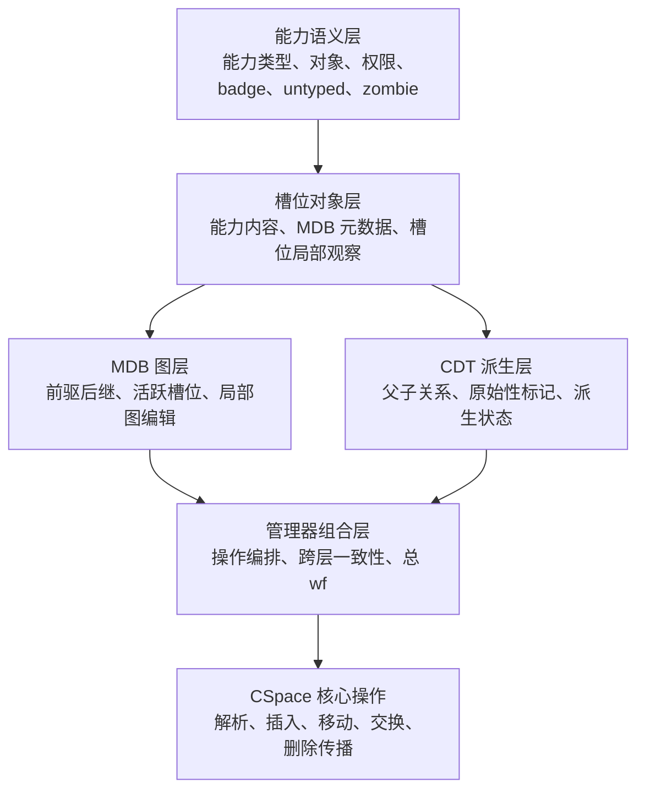

# 基于 Verus 的 reL4 能力空间核心层形式化验证研究

## 摘要

微内核将更多服务移交给用户态组件，因而具有更清晰的结构边界和更小的可信计算基，也更适合作为高可信论证对象。对 seL4/reL4 这类能力系统微内核而言，能力空间（Capability Space，CSpace）并不是普通的表结构：它既管理能力槽位中的内容，也维护派生关系、路径解析以及删除回收等关键行为。一旦该模块出现错误，访问控制语义就可能被直接破坏。基于这一考虑，本文选取 reL4 的 CSpace 模块作为研究对象，讨论如何用 Verus 验证这类“局部改动、全局受约束”的核心操作。

本文在 seL4 能力语义与 Verus 系统验证方法的基础上，构建由能力语义、槽位对象、MDB 图关系、能力派生树和管理器组合层构成的抽象模型，设计覆盖能力内容、前驱后继一致性、派生关系、badge 语义、untyped 子约束和 zombie 约束的不变量体系，并采用分层后状态方法组织核心操作证明。

本文完成的主要结果落在 CSpace 管理器核心层。现阶段，`resolve_address_bits` 所代表的解析路径、`cte_insert`/`cte_move`/`cte_swap` 所代表的局部更新路径，以及 `delete_one`/`delete_all`/`revoke` 所在的删除传播路径，已经能够放在同一套分层证明组织下讨论。其中，解析与局部更新已经得到覆盖槽位语义、MDB 图后状态、CDT 派生状态以及管理器层 `wf` 恢复的机械化结果；删除传播路径则形成了围绕阶段化契约、部分正确性和 `wf` 保持的证明结果。全文还结合代码规模统计、`l4v` 规模参照、运行时形态观察，以及 `spike` 平台上的验证与测试结果，对这些成果作了评估。本文的结论有意收在管理器核心层，不把公共封装接口、系统调用级行为和整内核端到端验证一并算作已经完成的部分。

关键词：形式化验证；微内核；能力空间；Verus

## ABSTRACT

Microkernels are suitable for high-assurance system construction because of their clear protection boundaries and relatively small trusted computing base. In a capability-based microkernel, the Capability Space (CSpace) manages capability slots, derivation relations, path resolution, deletion, and revocation. Its correctness directly affects access-control semantics. Since CSpace operations usually perform local slot mutations while preserving global properties such as MDB consistency, derivation-tree structure, badge rules, untyped-child constraints, and zombie invariants, testing alone is insufficient to explain their correctness.

This thesis studies the CSpace component of the reL4 kernel and develops a Verus-based method for modeling and verifying its manager-level core. The work constructs a layered abstract model around capability semantics, slot objects, MDB graph relations, capability derivation trees, and manager-level composition. It also defines invariants for capability contents, predecessor-successor consistency, derivation relations, badge semantics, untyped constraints, and zombie-related conditions. Based on these definitions, the thesis organizes proofs with a layered post-state method.

The result is a substantial verification artifact for the reL4 CSpace manager-level core. Path resolution, local updates, and deletion propagation are brought into one layered proof framework. The resolution, local-update, and deletion lines already have mechanical results for slot-local semantics, MDB graph postconditions, CDT derivation-state postconditions, staged contracts, and manager-level `wf` recovery. The thesis further evaluates the artifact through code-size statistics, a size reference against extracted l4v CSpace materials, proof-erasure-oriented runtime-shape analysis, and verification and testing results on `spike`. The claim is bounded to the CSpace manager-level core, rather than all public wrappers, syscall-level behavior, or whole-kernel end-to-end properties.

KEY WORDS: Formal Verification; Microkernel; Capability Space; Verus

## 目录

摘要

ABSTRACT

1 绪论

1.1 研究背景与意义

1.2 相关研究现状

1.3 本文要解决的问题

1.4 论文结构安排

2 背景与相关技术基础

2.1 微内核与能力系统基础

2.2 seL4、reL4 与能力空间语义传统

2.3 Rust、RustBelt 与 Verus

2.4 Verus 的系统验证特点

2.5 本章小结

3 研究对象、范围与关键问题

3.1 验证对象与模块职责

3.2 研究范围与分析对象

3.3 能力空间验证的关键问题

3.4 本文方案与研究边界

4 形式化方法设计

4.1 总体验证思路

4.2 分层抽象模型

4.3 管理器状态表示

4.4 不变量体系

4.5 证明义务分解

4.6 循环与帧条件处理

4.7 边界建模与桥接策略

5 验证实现

5.1 实现对象与组织方式

5.2 路径解析验证实现

5.3 局部更新操作验证实现

5.4 删除传播操作验证实现

5.5 本章小结

6 验证结果、分析与讨论

6.1 评估目标与指标

6.2 代码与证明规模统计

6.3 与 l4v 的规模参照

6.4 运行时形态观察

6.5 构建、验证与测试结果

6.6 结果分析

6.7 结论边界

6.8 接口与系统级扩展

6.9 研究局限

6.10 后续展望

结论

致谢

参考文献

附录

## 1 绪论

### 1.1 研究背景与意义

内核中的错误难以通过局部补丁方式被充分隔离，因为其影响范围往往会直接扩展到系统整体的隔离边界、资源控制和异常处理逻辑。也正因为如此，操作系统内核长期以来一直是形式化验证最具代表性的应用对象之一。seL4 的工作之所以被普遍视为里程碑，并不只是因为其证明规模大，更因为它给出了从抽象规范到实现代码的完整论证路线：SOSP 2009 展示了从高层抽象到 C 实现的机器检查功能正确性证明[1]，TOCS 2014 则进一步把功能正确性、访问控制、二进制级连接和时序分析等结果组织成较完整的系统级论证[2]。这一传统对本文的直接启发在于：内核验证的关键不在于给系统加上一层笼统的“可信”描述，而在于识别其中语义负载最高且最容易牵动全局约束的核心模块，并对其行为作出可机械检查的说明。

在这一背景下，能力系统之所以值得单独讨论，是因为它把对象引用、权限传播和资源管理集中到了同一套机制之中。L4 到 seL4 的演进已经说明，微内核的抽象边界并不是先验给定的，而是在性能、最小化和可验证性等目标共同作用下逐步形成的[3]。落实到 seL4 的 CSpace，访问对象并不依赖单一全局命名空间，而是通过 capability、CNode、槽位以及派生链的组合来完成[4]。因此，CSpace 的正确性不仅关系到“对象能否被找到”，也关系到“权限是否会沿着错误路径被复制、移动或保留”。正是因为它同时具有数据结构层和安全语义层的双重含义，CSpace 才成为本文关注的核心对象。

仅从功能正确性主线出发，能力系统的重要性已经十分明显；而 seL4 关于完整性和授权封闭性的进一步结果[5]又说明，能力机制并非只是实现访问控制时附带使用的一组数据结构，而是高层安全语义能够成立的关键前提。与此同时，将证明继续向编译后程序推进的工作[6]也表明，源代码层面的结论并不足以自动外推到更低层实现，不同层之间的连接关系同样需要被显式论证。综合这两类工作可以得到一个更清楚的判断：CSpace 并不是适合停留在局部函数层面讨论的边缘模块，而是微内核可信论证中的核心组成部分。

与此同时，系统软件的实现语言也在变化。Rust 确实在内存安全和底层控制之间提供了比 C/C++ 更有吸引力的平衡，但这并不等于“换成 Rust 之后，功能正确性问题就自动消失”。RustBelt[7]恰好说明了这一点：Rust 的安全承诺要成立，本身就需要严肃的语义基础，尤其是在 `unsafe` 和底层系统代码大量出现的时候。对本文更实际的意义在于，Verus 进一步把规格、证明和执行代码放进了同一套 Rust 语法环境里[8][9]。这样一来，像 CSpace 这种既有真实运行时代码、又有复杂全局约束的模块，就不必在“工程代码”和“证明代码”之间来回切换表述，验证工作也更容易贴着真实实现展开。

reL4 正是在这样的背景下出现的。它延续 seL4 传统，同时将微内核与高可信系统研究主线带入 Rust 语言环境。围绕语义负载较重的 CSpace 子系统建立一套 Verus 形式化建模与验证框架，能够检验 seL4/l4v 语义经验在 Rust/Verus 生态中的迁移可行性，也为内核 Rust 重写过程中从“代码安全”走向“行为可信”提供方法支点。进一步向系统调用级和更广义系统层验证扩展所需的结构基础，也可以在这一过程中同步准备。

### 1.2 相关研究现状

围绕高可信内核与系统验证的研究，现有工作大致可以归纳为五条彼此相关的主线：微内核功能正确性与安全性质验证、跨层语义连接与实现保持、Rust 语言语义基础、Verus 平台及其系统化案例，以及权能访问控制的直接验证工作。本文的研究对象位于这五条主线的交叉位置，因此有必要分别加以梳理。

第一条主线是以 seL4 为代表的微内核功能正确性与安全性质验证。SOSP 2009 的 seL4 功能正确性证明[1]给出了从抽象规范到 C 实现的经典论证路线，TOCS 2014 则进一步把功能正确性、访问控制、二进制语义保持和系统初始化等结果整合到统一的系统级论证框架中[2]。从 L3 到 seL4 的经验总结[3]又说明，微内核之所以适合形式化验证，不只是因为代码规模相对可控，更因为最小化结构、能力系统和性能目标在设计之初就被共同纳入了抽象边界。seL4 的完整性与授权封闭性证明[5]进一步表明，能力系统不仅是实现访问控制的一组内核数据结构，也是高层安全语义能够成立的重要支点。就研究传统而言，这一主线已经确立了“微内核能力系统值得做强语义验证”的基本共识。

第二条主线关注的是“高层证明如何继续向下连接”。Translation validation for a verified OS kernel[6]并不直接讨论能力空间本身，却提出了一个对本文十分重要的问题：即便抽象规范和源代码层的语义关系已经建立，编译、链接以及更底层实现过程仍然可能成为结论外推时的薄弱环节。它提醒研究者在描述验证结果时必须明确区分不同层次的保证范围。这一点对本文尤为重要，因为本文并不主张整内核端到端验证，而是把最强结论有意限定在 CSpace 管理器核心层。

第三条主线是 Rust 语言语义基础及其验证工具。RustBelt[7]从语言理论层面回答了 Rust 的安全性主张依赖哪些形式语义前提，尤其说明了 `unsafe` 与底层库设计不能被简单视为类型系统之外的“工程细节”。在此基础上，Verus 的代表性工作[8][9]把问题进一步推进到系统验证平台层：研究者可以在同一套 Rust 语法环境中表达执行代码、规格和证明，并借助 SMT、ghost 状态和线性资源机制处理更复杂的程序性质。与传统“先写代码、再翻译到另一种逻辑语言中验证”的流程相比，这种做法更适合围绕真实代码基逐步建立规格和证明。

第四条主线是 Verus 生态下的大规模系统化案例。Hance 的博士论文[10]讨论了并发系统代码验证的组织方法；IronFleet[11]虽然早于 Verus，但其“状态机精化 + 程序逻辑”的结合方式深刻影响了后来的系统验证实践。随后，IronSync[12]、PoWER[13]、CortenMM[14]、Atmosphere[16][17]以及 VeriSMo[18]分别在并发推理、崩溃一致性、内存管理、Rust 内核和安全模块等方向展示了统一验证平台的工程潜力。就本文的问题意识而言，这一系列工作最重要的启示不是某篇论文中的局部技巧，而是一个更稳定的判断：Verus 已经开始具备支撑中大规模系统子模块验证的现实条件[19][20]。因此，在 Rust/Verus 生态中讨论 reL4 CSpace，不再只是方法上的试探，而是可以嵌入现有系统验证主线的研究选择。

第五条主线是与权能访问控制直接相关的验证工作。在中文研究语境中，徐家乐等人针对某微内核操作系统的权能访问控制模块，使用 Coq 与并发精化分离逻辑 CSL-R，验证了权能 API 函数与抽象规范之间的精化关系[21]。该工作一方面表明，权能访问控制模块本身就是一个足以独立成题的高复杂度验证对象；另一方面也说明，权能空间树结构维护、复杂嵌套数据结构、一致性不变式以及递归删除路径，确实构成了这一问题域中的共性难点。与之相比，本文并不从 API 级精化关系切入，而是选择在 Rust/Verus 代码基中围绕 manager core 建立分层后状态组织，并将解析、局部更新和删除传播放入同一证明框架下讨论。

表 1-1 相关工作与本文定位比较

| 工作方向 | 主要对象 | 工具或框架 | 是否直接覆盖 CSpace 核心操作 | 是否讨论删除传播/可信边界 | 本文相对该方向的新增点 |
| --- | --- | --- | --- | --- | --- |
| seL4/l4v 功能正确性与安全性质[1][2][5] | 微内核抽象规范、C 实现与安全性质 | Isabelle/HOL 及相关证明体系 | 从系统语义上覆盖能力系统，但不面向 reL4 Rust 代码直接展开 | 是 | 将其能力语义强度与边界口径迁移到 reL4 的 Rust/Verus 代码基 |
| translation validation[6] | 已验证内核的编译后程序连接 | HOL4/二进制验证路线 | 不以 CSpace 为中心 | 强调实现连接边界 | 将“边界必须显式说明”的原则落到 CSpace 核心层的论文口径与评估设计 |
| Verus 与 Rust 验证基础[7][8][9] | Rust 语言基础与系统代码验证平台 | RustBelt、Verus | 不直接给出 CSpace 级案例 | 主要提供工具与逻辑能力 | 把通用 Rust/Verus 验证能力收束到能力空间这一高语义密度内核子系统 |
| Verus 系统案例[12][13][14][16][17] | 并发、存储、内存管理、Rust 内核 | Verus 生态 | 一般不直接覆盖 reL4 CSpace | 较多讨论模块化组织与可信边界 | 给出面向 CSpace 的分层后状态组织、边界控制和评估证据组合方式 |
| 权能访问控制中文相关工作[21] | 微内核权能访问控制模块、API 规范与精化关系 | Coq、CSL-R | 是，但对象和验证层次不同 | 是 | 从 Rust/Verus 代码基出发，将论证重点转到 manager core 的分层后状态与核心操作组织 |
| 本文 | reL4 `sel4_cspace` 管理器核心层 | Rust + Verus，语义校准参照 seL4/l4v | 是 | 是 | 在真实 reL4 代码基中同时回答验证边界、证明组织与评估证据三类问题 |

综合来看，现有研究已经分别回答了“能力系统值得验证”“验证结果如何分层表述”“Rust/Verus 能否承载系统代码验证”以及“权能访问控制验证有哪些共性难点”等问题[1][2][5][8][9][21]。但在 reL4 这样的 Rust 微内核代码基中，仍缺少一条把这些问题真正收束起来的 CSpace 核心层研究主线：即既保持 seL4 语义口径，又贴合当前执行代码形态；既能覆盖解析、局部更新和删除传播三类差异明显的操作，又能清楚划定 manager core、对外封装层与系统级外推之间的边界；既能给出方法设计和证明组织，也能对结果强度、规模代价、运行时形态和兼容性给出成体系评估。本文即围绕这一缺口展开。

### 1.3 本文要解决的问题

基于上述缺口，本文所要回答的核心问题是：在 Rust/Verus 生态下，reL4 的 CSpace 核心操作能够验证到何种程度，以及应当采用何种证明组织方式，才能既保持 seL4 语义上的强度，又不脱离当前 Rust 代码的真实结构。围绕这一问题，本文主要聚焦以下四个方面。

1. 本文准备验证 reL4 CSpace 的哪一部分，结论边界应划到哪里。
2. 能力语义、槽位语义、MDB 图语义、CDT 派生语义和管理器组合语义，应如何组织成统一的分层模型。
3. `resolve_address_bits` 代表的路径解析、`cte_insert`/`cte_move`/`cte_swap` 代表的局部更新，以及删除传播这三类差异很大的操作，能否放到同一套证明框架里处理。
4. 本文最后得到的结果究竟有多强，付出了多大实现与证明代价，运行时代码形态和系统兼容性又该怎样评估。

之所以把问题集中在这四点，是因为能力空间验证同时面临四类困难：一是能力槽位既承载内容语义，又通过 MDB 和派生关系与其他槽位紧密耦合，局部更新很容易牵动全局约束；二是解析、插入、交换、删除等路径在控制流和后置条件上差异明显，不能简单套用同一模板；三是异常值、位域视图和运行时桥接等低层表示问题始终存在，必须明确可信边界；四是本科论文还需要把方法、实现、结果和评估组织成清楚的整体叙述。

### 1.4 论文结构安排

全文共六章。第 1 章说明研究背景、相关工作并提出本文要解决的问题。第 2 章介绍能力系统、seL4/reL4、RustBelt 与 Verus 等技术基础。第 3 章开始进入本文工作，界定验证对象、研究范围与关键问题，并说明后文讨论所采用的边界。第 4 章说明本文采用的形式化方法设计，包括分层抽象模型、不变量体系和证明组织方式。第 5 章介绍路径解析、局部更新和删除传播三类操作的验证实现。第 6 章集中给出机械化验证结果、规模统计、运行时形态观察、测试结果，以及相应的结果分析、结论边界、研究局限和后续展望。

## 2 背景与相关技术基础

### 2.1 微内核与能力系统基础

微内核的核心思想是把必须在特权态完成的最小机制保留在内核内，把更多策略和服务移交给用户态组件。这种做法可以缩小可信计算基，也有利于隔离、组合和验证[3]。在这一设计中，能力系统承担了对象引用、访问控制和资源传播的统一表达。与传统全局命名方案不同，能力对象（capability）带有对象指向、权限与附加语义，是一种受控引用；只有持有适当能力的主体才能对对象执行相应操作[4]。

在 seL4 及其衍生系统中，能力空间通常由一组 CNode 递归组织而成，每个 CNode 又包含多个能力槽位。按照 seL4 手册的术语，槽位既保存能力内容，也保存与派生、可撤销性和遍历相关的元数据[4]。从抽象语义上看，CSpace 至少包含三层同时存在的关系：一是单个槽位内部的能力内容语义，二是由派生父子关系表达的来源语义，三是由 MDB 前驱后继链接表达的遍历和维护语义。已有权能访问控制验证工作也同样把“树结构上的权能空间”和“复杂嵌套数据结构”视为核心难点[21]。因此，讨论 CSpace 正确性时，不能只检查单个槽位写入是否正确，还必须同时说明这些跨槽位关系是否继续成立。

从内核操作语义上看，CSpace 中最常见的行为大体可分为四类。第一类是能力关系判断，如 `same_region_as`、`same_object_as`、`is_cap_revocable`，它们定义了不同能力在区域、对象和撤销语义上的等价与差异。第二类是地址解析与查找，如 `resolve_address_bits`，这类操作决定能力路径如何沿着 CNode 层次被解释，并在 guard 不匹配、radix 非法或根能力不满足条件时产生相应故障。第三类是局部更新操作，如 `cte_insert`、`insert_new_cap`、`cte_move` 和 `cte_swap`，它们不仅修改目标槽或源槽，还会同步改变若干相邻节点和派生关系。第四类是删除与回收操作，如 `delete_one`、`delete_all`、`reduce_zombie` 和 `revoke`，它们往往涉及阶段推进、子树收缩和反复删除[4]。本文后文对解析、局部更新和删除传播的组织，正是建立在这四类基础操作划分之上。

从验证角度看，CSpace 的突出特征集中体现为“局部修改、全局约束”。一次操作真正写入的槽位通常很少，但它可能同时影响可达路径、父子派生、badge 语义、活跃槽位集合以及删除生命周期。以插入为例，代码上往往只涉及目标槽和少量邻居；但如果 `mdb_prev` 或 `mdb_next` 修补错误，后续沿链遍历得到的结构就会整体失真。以删除为例，代码上可能表现为逐步清空槽位、处理 zombie 或递归删除子派生链；但只要父子关系或空槽约束维护不完整，问题往往会在后续 `revoke` 或一致性恢复阶段暴露出来[1][2][4]。因此，对 CSpace 的形式化验证必须同时回答两个问题：变更发生在何处，以及未直接变更的全局语义为什么仍然成立。

### 2.2 seL4、reL4 与能力空间语义传统

seL4 的重要性不仅在于它被证明了，还在于它明确回答了“什么值得证明、证明应强到什么程度”这一问题。SOSP 2009 将功能正确性界定为实现始终遵循高层抽象规范[1]，TOCS 2014 又进一步区分了功能正确性、访问控制、二进制语义保持以及更高层系统分析的不同层次[2]。这一传统为本文提供了直接参照：当讨论 reL4 CSpace 的“核心层验证”时，所指应是能力空间核心操作层的语义与不变量保持，而不是整内核端到端等价。

从 L3 到 seL4 的经验总结还表明，微内核设计始终需要在代码规模、性能、可维护性与可解释性之间寻找平衡[3]。能力系统之所以位于这一传统的中心，是因为它同时承载对象访问控制、资源传播和授权边界表达。seL4 手册对 CNode、能力、查找、复制、移动、派生与回收等概念的规范化描述[4]，为本文界定能力空间的对象语义和操作职责提供了直接依据。reL4 的价值，则在于把这套成熟语义传统带入 Rust 语言环境。Rust 改变了实现载体和安全边界，却不自动给出能力空间的功能正确性结论，因此仍需要显式规格与证明。在本文中，seL4/l4v 的主要作用是校准能力关系、不变量以及前后置条件的语义强度，而不是要求 Rust/Verus 代码在外形上模仿 Isabelle/HOL 的 monadic 结构。

### 2.3 Rust、RustBelt 与 Verus

Rust 之所以受到系统软件研究关注，在于它同时提供低级控制能力和相对强的静态安全保障。所有权、借用、生命周期以及对数据竞争的静态约束，使 Rust 在很多场景中比 C/C++ 更适合作为高可信系统软件实现语言。然而，Rust 的类型系统主要保证内存与借用安全，并不能自动导出“某个算法满足抽象规范”“某个状态机保持全局不变量”之类更强的功能正确性结论[7]。

RustBelt[7]对 Rust 的形式化基础进行了系统论证。它说明，Rust 的安全承诺并不是免费的；对于使用 `unsafe` 的库和底层实现，仍然需要给出可验证的语义条件。对于本文而言，RustBelt 的价值主要在于提供一个认识框架：Rust 有助于减少某类底层错误，但能力空间这类高语义密度子系统，仍需独立规格和逻辑证明。换句话说，语言层安全并不能替代模块级功能正确性论证，这一点在权能访问控制这类需要同时处理树结构、一致性约束和删除传播的模块上尤其明显[21]。

Verus 的出现使这一目标更具可操作性。Verus OOPSLA 2023 论文[8]展示了如何在 Rust 语法中统一表达执行代码、规格和证明，并借助线性幽灵类型推理权限、资源与指针相关性质。Verus SOSP 2024 论文[9]进一步强调了平台化与工程实践意义：通过整合多个系统案例，Verus 试图降低系统验证对专用逻辑和超高人工成本的依赖。它既保留了 Rust 对真实系统开发的亲和性，也提供了足够强的逻辑表达能力来承载复杂不变量与模块化证明。

对于能力空间这类工作，Verus 的吸引力主要在于，它能够把规格、执行代码和证明组织在同一语言环境中，并以较高自动化程度支撑中等规模系统子模块验证[8][9]。这与本文的任务高度匹配：围绕真实 Rust 代码基展开，同时显式控制复杂不变量。

### 2.4 Verus 的系统验证特点

从系统验证角度看，Verus 至少有两个与本文密切相关的特点。第一，它允许在 Rust 语法环境中同时表达执行代码、规格和证明，因此研究者可以围绕真实系统代码逐步加入前后置条件、循环不变式、局部引理和抽象状态，而不必先把代码整体翻译到另一套专用规范语言中。第二，它提供 ghost 状态、tracked 资源和模块化证明机制，能够较自然地表达“局部更新如何保持全局约束”这一类系统验证问题[8][9]。这恰好对应了 CSpace 的基本结构特征：解析路径需要与抽象语义对齐，局部更新需要说明邻接关系和派生语义恢复，而删除传播则需要在阶段推进中保持一致性不变式。

除了表达能力外，Verus 近年的工程实践也说明它不再只是面向小型算法的研究工具。IronSync[12]、PoWER[13]、CortenMM[14] 和 Atmosphere[16][17] 分别展示了 Verus 在并发系统、崩溃一致性、内存管理和内核方向上的应用潜力。这些案例并不直接给出 CSpace 的现成证明模板，但它们共同说明：统一的 Rust 验证平台已经可以承载较大规模系统子模块的规格组织、局部证明和跨模块组合。本文选择 Verus，并不是为了复刻已有工作中的具体逻辑结构，而是因为它在工程实践层面已经足以支撑真实代码基中的复杂状态验证。

### 2.5 本章小结

本章介绍了能力系统与微内核验证传统，以及 Rust、RustBelt 和 Verus 的相关技术背景。前述内容说明，CSpace 本身是一个语义负载很高的核心模块，而 Verus 则为在 Rust 代码基上组织规格、证明与执行代码提供了现实工具基础。基于这些背景，后文将进一步转入本文的验证对象、研究范围和方法设计。

## 3 研究对象、范围与关键问题

### 3.1 验证对象与模块职责

本章据此界定在真实 reL4 代码基中 CSpace 的验证对象、研究范围和成果边界。

本文的直接验证对象是 reL4 代码基中的 `sel4_cspace` 模块。这里所说的“验证对象”并不只是一个代码目录，而是指围绕能力空间核心操作建立起来的一组相互配合的执行路径、抽象状态和证明义务。为降低单层证明结构带来的复杂度，本文将该模块组织为更明确的分层结构：`cap` 负责能力自身语义，`mdb_node` 负责最底层链字段表示，`cte_t` 负责槽位对象及其局部观察与局部操作语义，`mdb` 负责 MDB 图关系和相关全局语义，`cdt` 负责能力派生树与 `is_original`，能力空间管理器则负责在这些层之上组合出最终的能力空间操作和总 `wf`。这种组织不仅调整了文件结构，也重分配了证明责任：各层分别承担自身语义，管理器层负责最终组合，从而避免所有语义细节都被压回单一证明层。

`sel4_cspace` 在内核中的作用可以概括为两个相互耦合的方面。其一，它维护能力槽位的内容与链接结构，使能力的创建、复制、移动、交换和删除都能保持派生语义一致。其二，它提供能力查找与地址解析逻辑，并为更高层系统调用和对象管理流程提供基础能力操作语义。因此，CSpace 同时具有“数据结构维护模块”和“访问控制语义枢纽”两种角色。

如果把 reL4 看作一个更大验证目标，那么 `sel4_cspace` 位于一个非常关键的位置。它既比底层位域、内存读写或体系结构适配层更接近抽象系统语义，又比系统调用总调度层更集中、更容易定义清晰边界。因此，将其作为本文研究对象，既可以体现对真实内核关键机制的把握，又能在范围可控的前提下形成较高密度的形式化工作量。新的分层方式还使本文能够把“能力语义”“MDB 结构语义”“派生树语义”和“管理器组合语义”分开讨论，从而为后续继续细化操作证明提供更稳定的结构基础。

### 3.2 研究范围与分析对象

本文从“分层对象”“证明层次”和“操作类型”三个维度界定研究范围。分层对象用于说明能力语义、槽位对象、MDB 图结构、CDT 派生关系和管理器组合语义分别落在哪些语义模块中；证明层次用于区分管理器核心层结论、对外封装层结论和更高层系统结论；操作类型用于说明哪些代表性行为已被纳入本文分析。这样的范围界定方式，既对应了本文在工程实现中的模块组织，也对应了后文在论文写作中的论证层次：先明确研究对象，再明确最强结论的边界，最后说明哪些操作足以代表本文所关心的方法问题。

表 3-1 验证层次、对象与结论口径总览

| 层次 | 主要对象 | 本文中的位置 | 可支撑的结论口径 |
| --- | --- | --- | --- |
| `cap` 层 | capability 自身语义、对象/权限/badge/untyped/zombie 信息 | 能力语义基础层 | 已存在稳定抽象，但仍与上层操作语义耦合 |
| `cte_t` 层 | 槽位对象、槽位局部观察、局部方法 | 新架构下的重要承载层 | 已具备独立语义角色，不再只是兼容封装接口 |
| `mdb` 层 | MDB 图结构、线性次序摘要、活跃槽位摘要 | 新架构下的独立结构证明层 | 分层边界已形成，并可支撑核心更新操作后的全局良构性证明 |
| `cdt` 层 | 派生树父子关系、原始性标记、派生状态转移 | 新架构下的独立派生语义层 | 状态转移责任已显式化 |
| 管理器层 | 核心操作编排、总 `wf` 组合器 | 本文主体论证层次 | 是核心层结论边界 |
| 对外接口层 | 公共封装接口、CNode 相关系统调用入口 | 与核心层相关，但不作为本文主结论层 | 仍需后续继续对齐与扩展 |

在操作类型上，本文仍将能力空间核心行为划分为四组。第一组是能力基础关系与查询操作，包括区域等价、对象等价、可回收性、最终能力判断等，它们为更复杂操作提供判定基础。第二组是查找与解析操作，以 `resolve_address_bits` 为代表，这一组决定能力路径如何被解释以及错误如何产生。第三组是局部更新操作族，包括 `cte_insert`、`insert_new_cap`、`cte_move` 和 `cte_swap`，它们代表能力空间中最典型的局部结构编辑。第四组是删除与回收操作族，包括 `delete_one`、`delete_all`、`set_empty`、`reduce_zombie` 和 `revoke`，它们共同构成能力清理、传播删除和派生树收缩的复杂路径。

本文在后文出现 `cte_insert`、`insert_new_cap`、`cte_move` 和 `cte_swap` 时，若未特别标注，主要指 `CSpaceManager` 上的核心层方法。与之相连的 kernel 转发入口和兼容封装层在运行时上保持关联，但证明强度不同：本文主结论落在 `CSpaceManager::*`，不把外层封装自动视为已完成验证的对外接口。

表 3-2 将论文中的抽象层次与现有工程模块对应起来，使各层的位置、职责与结论口径可以直接追踪。

表 3-2 论文抽象层与现有工程模块对应关系

| 论文层次 | 主要工程模块 | 主要职责 | 可支撑的结论口径 |
| --- | --- | --- | --- |
| 能力语义层 | `capability` | 能力种类、对象、权限、badge、untyped 与 zombie 语义投影 | 作为 CSpace 证明的能力语义基础，仍含底层视图可信边界 |
| 槽位对象层 | `cspace::cte` | `cap + mdb_node` 的槽位视图、局部派生、最终能力和子节点判断 | 已成为独立槽位对象层，承担槽位局部规格与桥接义务 |
| MDB 图层 | `cspace::mdb` | `MdbTable`、活跃槽位摘要、前驱后继、insert/remove/move/swap 图原语 | 是局部更新证明的主要结构层，已拥有独立状态与证明职责 |
| CDT 派生层 | `cspace::cdt` | `parent_of`、`is_original`、派生树结构与操作后状态 | insert/move/swap/delete 的派生树保持义务已显式化 |
| 管理器规格层 | `cspace::manager::spec` | 总 `wf`、跨层语义、操作关系、删除相关规格 | 承担 CSpace 管理器核心层主结论的规格定义 |
| 管理器执行层 | `cspace::manager::impl_*` | insert/move/swap/delete/revoke 等核心执行路径 | 执行代码与幽灵/证明代码贴近组织，作为核心操作载体 |
| 管理器证明层 | `cspace::manager::proof` | 分层恢复、MDB/CDT 分阶段恢复、管理器组合证明 | 支撑管理器层 `wf` 恢复和操作后语义组合 |
| 解析层 | `cspace::resolve` | `resolve_address_bits`、抽象解析规格、故障分支对应 | 目前最完整的查找/循环型证明路线 |
| 内核连接层 | `cspace::kernel` 与兼容封装层 | 面向 kernel 的入口、管理器实例化桥接与兼容自由函数封装层 | 与核心层相连，但不作为本文最强结论层 |

### 3.3 能力空间验证的关键问题

CSpace 相比普通数据结构更难验证，根本原因在于它同时承载对象语义、授权语义和拓扑语义。

首先，能力内容本身具有细粒度语义。不同能力种类指向不同对象，带有不同权限位、badge 信息和对象相关参数；有些能力之间可以看作同一区域的不同视图，有些能力则在 `same_object_as` 下等价但在授权传播上又存在差异。验证时需要判断的不只是“能力是否被复制到了某处”，还包括复制、移动或删除之后，关于区域、对象、badge 与可撤销标记的语义是否仍然成立。

其次，槽位间结构约束高度紧耦合。MDB 的前驱与后继关系、派生父子关系以及原始/可撤销之类的附加标记，使得单个槽位的正确性无法脱离邻接槽位来说明。一次 `cte_move` 看上去只是把能力从源槽位挪到目标槽位，但如果旧邻居、目标槽位原状态或来源父子关系处理不当，整个派生链就会失真。`cte_swap` 更是把这种复杂度提升到两个局部子图同时更新的程度。

第三，删除路径比插入和移动更容易把证明拖进复杂中间态。以 `delete_one` 为例，它通常不会一步完成，而是要经历空槽化、finalise、zombie 约简和子节点处理等几个阶段；到了 `delete_all` 和 `revoke`，又会把这种阶段推进放进循环里，反复作用在一批相关槽位上。对这类操作，只比较“删之前”和“删完之后”远远不够，证明里还得交代每个阶段已经处理到哪里、哪些局部语义已经收回、哪些部分还在等待下一步推进。中文相关工作在权能访问控制验证中同样把树结构维护、递归删除和全局一致性作为主要难点[21]，这一点与本文在删除传播路径上遇到的问题高度一致。

最后，系统代码中总存在抽象证明和运行时表示之间的缝隙。异常值如何映射、某个底层观察如何被提升为抽象槽位视图、某些体系结构相关能力如何被纳入逻辑边界，这些问题若处理不当，要么使可信边界过大，要么使证明被大量低层细节拖垮。本文的一个核心目标，正是在可控范围内把这些缝隙整理为明确且有限的可信边界。

### 3.4 本文方案与研究边界

基于上述问题，本文把研究范围明确限定在“reL4 CSpace 分层重构后的核心操作层”。这里的“核心操作层”主要指能力空间内部的查询、解析、局部编辑和删除传播路径；后文的论述重点放在 `CSpaceManager` 边界内的核心语义组织，并结合 `cte_t`、`mdb`、`cdt` 与管理器之间的分工展开分析。之所以作出这一限定，是因为在当前阶段直接追求系统调用级或整内核级结论，会使证明复杂度迅速转移到接口桥接、长期状态一致性和体系结构相关细节上，从而削弱对 CSpace 核心语义本身的观察能力。

具体来说，本文主要把 `resolve_address_bits`、`cte_insert`、`insert_new_cap`、`cte_move`、`cte_swap`、`delete_one`、`delete_all`、`set_empty`、`reduce_zombie` 和 `revoke` 作为核心分析对象。这些操作构成能力空间中典型的读、写、交换和删除行为，也是后文方法设计、验证实现和结果评估的主要承载对象。

在这一范围内，本文所说的“管理器核心层结论”，仅指 `CSpaceManager::*` 边界内、以 `self.wf()` 为核心组织的分析和证明结果。面向 kernel 的封装层、兼容自由函数入口，以及长期管理器视角与真实运行时状态的一致性，不自动计入本文的最强结论，而是作为后续扩展时需要继续处理的问题。与文献[21]中以 API 抽象规范和精化关系为主的验证边界相比，本文把边界进一步收敛到 manager core 内部，以换取对分层语义组织和核心操作证明结构的更细致刻画。

表 3-3 概括本文后文讨论所采用的研究边界。

表 3-3 本文讨论范围、依赖前提与超出范围

| 本文后文主要讨论的范围 | 依赖前提 | 超出范围 |
| --- | --- | --- |
| `CSpaceManager` 边界内的 `resolve`、局部更新与删除核心路径，以及与之直接相关的方法设计、实现和评估 | 低层运行时观察、局部桥接结点、面向 kernel 的封装层语义，以及长期管理器与真实运行时状态的一致性仍作为明确边界保留 | 对外封装层强契约、系统调用级连接、整内核端到端论证 |

据此，本文将后文重点放在核心层内部的方法设计、验证实现和结果评估上；对外封装层强契约、系统调用级连接以及更长期的一致性问题，则留作后续继续扩展的方向。

## 4 形式化方法设计

### 4.1 总体验证思路

在前述范围界定基础上，本章进一步建立统一的 Verus 分层模型，用于组织能力语义、槽位语义、MDB 图语义、CDT 派生语义和管理器组合语义。本章的核心任务不是再次罗列工程模块，而是说明本文为什么采用当前的验证结构，以及这一结构怎样把研究问题转化为可执行的规格与证明义务。

reL4 CSpace 的复杂度并不来自单个字段读写，而来自能力内容、图结构、派生关系和删除生命周期同时存在。若把这些语义全部压到单一管理器层，证明结构会迅速失去可复用性，局部更新、图恢复和派生树恢复之间的责任界线也会变得模糊；若直接追求整内核端到端证明，核心问题又会被接口桥接、体系结构差异和长期运行时一致性细节淹没。基于这一判断，本文采用分层验证架构组织 CSpace 核心层，并把“在正确语义层支付复杂度”作为方法设计的基本原则。

该架构遵循四项相互配合的设计原则。第一，语义和契约强度仍以 seL4/l4v 为校准基线，因此能力关系、删除语义和不变量强度不能为了适应工具而被明显削弱。第二，证明组织不机械复刻 Isabelle/HOL 的 monadic 外形，而是利用 Verus 在 Rust 环境中表达执行代码、规格与证明的能力，以贴近当前 reL4 代码结构。第三，验证对象收束于 CSpace 管理器核心层，从而把公共封装层和系统调用层留在清晰的外推范围内。第四，复杂状态按语义归属拆分到槽位对象层、MDB 图层、CDT 层和管理器组合层，使帧条件和局部变化邻域只承担辅助说明，而不再充当整条证明主叙事。

从方法论上看，这一选择既不同于把所有语义都收敛到单层状态机中的写法，也不同于先建立完整 refinement tower 再回看核心操作的路线。本文更关心的是：在当前 Rust/Verus 工程条件下，如何先把解析、局部更新和删除传播这三类核心行为稳定放进同一证明框架，并为后续接口级外推保留清楚的结构接口。因此，本章后续的抽象模型、不变量体系和证明义务分解，都服务于这一更具体的方法目标。

表 4-1 本文 CSpace 验证架构层次总览

| 架构层次 | 主要语义责任 | 在论文中的作用 |
| --- | --- | --- |
| 能力语义层 | 能力类型、对象、权限、badge、untyped 与 zombie 相关信息 | 为所有操作提供语义基准 |
| 槽位对象层 | 单个槽位的能力内容、局部元数据和局部观察 | 承担槽位局部后状态说明 |
| MDB 图层 | 前驱后继、活跃槽位、局部图编辑与结构恢复 | 承担拓扑结构恢复和图良构性 |
| CDT 派生层 | 父子派生关系、原始性标记和派生状态转移 | 承担能力派生树语义 |
| 管理器组合层 | 操作编排、跨层一致性和总 `wf` 恢复 | 构成本文核心层主结论边界 |

下图展示了本文采用的 CSpace 分层验证结构。图中下层负责解释具体能力和槽位关系，中间层分别处理 MDB 图结构与 CDT 派生关系，管理器层则把这些局部结论组合为能力空间核心操作的整体结论。

图 4-1 CSpace 分层验证结构



### 4.2 分层抽象模型

要验证能力空间，首先必须回答“系统状态在逻辑上是什么”。如果直接围绕运行时结构逐字段证明，很快就会陷入位域、指针和表示细节；如果抽象得过于粗糙，又无法表达派生关系、相邻链接和删除阶段语义。本文因此采用分层抽象思路，将能力空间状态划分为 `cap`、`mdb_node`、`cte_t`、`mdb`、`cdt` 和 `CSpaceManager` 等相互关联的抽象层。

在能力抽象层，本文保留对语义有决定作用的信息，如能力种类、对象标识、region、权限、badge、CNode 参数和 untyped 相关字段等，而不展开所有机器级表示。这样做的目的，是把“能力在系统语义上代表什么”从具体位布局中分离出来。对于很多证明目标而言，核心问题是能力的对象指向和派生属性，底层编码细节则进入可信边界或后续细化工作。

在 `mdb_node` 与 `cte_t` 层，本文把能力内容与 `mdb_prev`、`mdb_next`、`revocable`、`first_badged` 等元数据组合起来，形成可直接用于推理的槽位对象抽象。本文强调 `cte_t` 作为槽位对象的语义地位：它承载局部观察、`derive_cap`、`ensure_no_children`、`is_final_cap` 等槽位局部方法，是分层验证架构中证明责任重新分配的关键承载层。

在 `mdb` 与 `cdt` 层，本文分别把 MDB 图语义与能力派生树语义从单一管理器叙事中抽出。MDB 层负责解释能力槽位之间的前驱后继关系、线性遍历次序、活跃槽位集合以及局部编辑后的图结构恢复。CDT 层负责解释能力派生树中的父子关系、原始性标记以及操作后的派生状态变化。这种拆分使“链接结构”和“派生树关系”以显式语义层形式出现在正文里，也使管理器不必再承担全部局部结构恢复工作。

在全局管理器抽象层，本文仍用 `CSpaceManager` 聚合整个 CSpace 的槽位权限、zombie 集合以及总 `wf` 组合语义，但不再把它写成所有语义细节的唯一承载者。它负责的主要是组合：底层运行时执行先在各语义层建立后状态，再由管理器层恢复总的能力空间良构性。分层语义与整体正确性之间的关系，也因此集中在这一层表达。

### 4.3 管理器状态表示

`CSpaceManager` 的核心作用，是为能力空间建立一个便于说明“整体正确性”的视角。每个槽位的能力内容与链接信息、派生关系和邻接修补，最终都在管理器层的状态与谓词中重新汇合。

在本文的分层架构中，`CSpaceManager` 仍是核心层结论的默认边界，但它并不直接拥有所有局部语义。管理器负责聚合槽位权限、派生树状态、删除相关状态以及总 `wf` 组合结构；MDB 和 CDT 等下层语义对象分别保存自己的抽象状态；管理器只对最终组合和操作编排负责，避免重新承担所有下层后状态推理。

统一状态表示带来两点直接收益。第一，它避免了为每个操作单独发明一套局部语义。无论是 `resolve_address_bits` 的路径解析、`cte_move` 的槽位编辑，还是 `revoke` 的删除传播，都可以在同一个状态空间内讨论。第二，它使证明目标更加明确：每次操作开始于一个满足若干前提和 `wf` 的管理器状态，执行后先得到若干分层局部后状态，再通过管理器组合恢复总 `wf`。相比只看函数前后某两个变量是否相等，这种组织更能回答“全局结构是否保持一致”的问题，也更贴近现有代码的真实分工。

`CSpaceManager` 也不要求穷举所有内部定义。本文更强调抽象组织思想：通过统一状态对象和显式分层状态，把能力空间的内容语义、拓扑语义和删除语义一起纳入可推理空间，从而集中呈现模型作用和验证效果，而不必把注意力过度分散到某一版辅助证明函数的细节排列上。

### 4.4 不变量体系

本文的不变量体系由一组彼此支撑、可分层讨论的结构性与语义性约束组成。`wf` 在本文中表示若干稳定子性质的组合，而非不可拆分的大前提。在本文架构中，管理器层总 `wf` 由槽位权限、槽位域基础条件、MDB 结构性约束、CDT 结构性约束、空槽与活跃槽位对应、语义边约束、跨层一致性约束以及非 MDB 帧条件共同组成。

第一类是不为空与为空槽位的一致性约束。空槽不仅意味着能力为空，还意味着其链接信息和某些附加状态必须满足相容条件；非空槽则必须承载与能力类型相一致的内容视图。这类约束看似基础，却是所有插入、移动和删除操作能够正确区分“可写入位置”和“应清理位置”的前提。

第二类是 MDB 链接一致性约束。前驱与后继关系决定了派生相关槽位如何被遍历和修补，因此必须满足基本互指一致、边界合理以及局部邻接关系正确等条件。本文采用的架构把这些性质集中到 MDB 图结构层：该层维护线性顺序摘要、活跃槽位摘要、前后继互指关系以及非活跃槽位的分离约束。许多局部更新证明由 MDB 层先说明局部图编辑后的结构仍然良构，再由管理器将这一结构结论纳入总 `wf`，从而避免管理器逐字段恢复全部链接事实。

第三类是父子派生与权限传播相关不变量。插入、复制和 `revoke` 类操作不仅改变槽位内容，还改变能力之间的派生语义。因而，验证必须显式说明哪些槽位在操作后成为新的父子关系，哪些槽位保持原始标记，哪些 badge 或可撤销状态应被设置或保留。本文将这一部分明确归入 CDT 层：派生树状态、原始性标记和操作后的派生关系变化都拥有独立的语义承载位置，而不再隐含在大一统的管理器幽灵状态中。

第四类是 badge、untyped 与 zombie 相关约束。这些性质决定了能力空间带有对象生命周期和特殊资源语义，不能被简化为一般性引用图。尤其在删除相关操作中，zombie 的处理方式直接关系到操作能否安全阶段化推进，因此需要为其保留专门的不变量与契约词汇。本文将 badge 与 untyped 约束通过语义边和跨层关联条件纳入管理器组合层，并将 zombie 与删除收尾语义纳入核心层验证框架之中；后续工作主要是继续减少相关桥接结点，并把这部分结果向接口层外推。

落到工程实现里，上述不变量最后都收束到统一的 `wf` 谓词上。这里的 `wf` 不是一个单纯为了“最后写个总条件”而存在的大包裹，而是把各层已经说清楚的性质重新装配起来的总入口：`mdb` 层负责链接结构，`cdt` 层负责派生关系，其他跨层和帧保持条件再补上它们之间的连接。这样一来，在证明 `CSpaceManager` 的具体操作时，可以先分别得到各层的局部结果，再统一收回到 `wf`，而不必反复从头展开整套全局语义。

### 4.5 证明义务分解

Verus 的函数验证可以看作 Hoare 风格契约在 Rust 程序验证中的实现形式。本文并不重新介绍其一般规则，只保留与 CSpace 相关的抽象。对更新类操作而言，关键不在于三元组写法本身，而在于把操作后的复杂语义稳定分解到若干可组合的责任层中。

设 `M` 表示操作前的抽象能力空间状态，`M'` 表示操作后的状态，`op` 表示某个能力空间操作。本文将 CSpace 更新类操作的总体契约抽象为：

```text
{ wf(M) ∧ pre_op(M) }
    op
{ wf(M') ∧ post_op(M, M') }
```

其中 `wf(M)` 表示操作前能力空间满足全局良构性，`pre_op(M)` 表示该操作自身的调用前提，`post_op(M, M')` 描述操作后状态与操作前状态之间的关系。对于普通算法验证来说，`post_op` 往往只需要描述返回值或少量字段变化；但对于 CSpace，`post_op` 必须同时说明槽位内容、MDB 图结构、CDT 派生树以及跨层语义的一致性。因此，本文进一步将 `post_op` 分解为以下几类证明义务：

```text
post_op(M, M') =
    slot_post(op, M, M')
  ∧ mdb_post(op, M, M')
  ∧ cdt_post(op, M, M')
  ∧ cross_layer_ok(M')
  ∧ frame_ok(op, M, M')
```

表 4-2 CSpace 证明义务与 Verus 机制对应关系

| 证明义务 | 对应 Verus 机制 | CSpace 中的含义 |
| --- | --- | --- |
| 槽位后状态条件 `slot_post` | `ensures`、规格函数、证明引理 | 描述受影响槽位中的能力内容、空槽状态和局部元数据如何变化 |
| MDB 后状态条件 `mdb_post` | ghost/tracked 状态、图结构规格、证明引理 | 描述 MDB 前驱后继、局部邻域修补、活跃槽位和图良构性恢复 |
| CDT 后状态条件 `cdt_post` | ghost 状态、派生树规格、证明引理 | 描述父子派生关系、原始性标记和删除传播后的派生树状态 |
| 跨层一致性条件 `cross_layer_ok` | 管理器层 `ensures` 与组合引理 | 描述槽位内容、MDB 边、CDT 父子关系、badge/untyped/zombie 约束之间的一致性 |
| 帧保持条件 `frame_ok` | 不变性条件、有限变化邻域、循环不变式 | 描述未被操作影响的槽位、边和派生关系保持不变 |

下图进一步说明了这些证明义务之间的组合关系。局部操作首先产生操作后状态，随后分别落到槽位、MDB 图和 CDT 派生树三个语义层；跨层一致性与帧条件用于连接这些局部结论，最终恢复管理器层的全局良构性。

图 4-2 CSpace 更新类操作证明义务分解

```mermaid
flowchart LR
    A[操作前状态<br/>wf(M) 与调用前提]
    B[运行时操作执行]
    C[槽位后状态<br/>slot_post]
    D[MDB 图后状态<br/>mdb_post]
    E[CDT 派生树后状态<br/>cdt_post]
    F[跨层一致性<br/>cross_layer_ok]
    G[帧条件<br/>frame_ok]
    H[操作后状态<br/>wf(M') 与 post_op]

    A --> B
    B --> C
    B --> D
    B --> E
    C --> F
    D --> F
    E --> F
    F --> H
    G --> H
```

上式给出了 Verus 规格写法在本文中的抽象形态。对应到 Verus 中，`wf(M)` 和 `pre_op(M)` 通常出现在 `requires` 中，`wf(M')` 和各类后状态关系通常出现在 `ensures` 中，而槽位后状态条件 `slot_post`、MDB 后状态条件 `mdb_post`、CDT 后状态条件 `cdt_post` 等则由不同语义层的规格函数和证明引理承担。本文真正关心的，是这种分层后置条件如何稳定承载 CSpace 证明，而不是重复解释一般性的程序逻辑规则。

上述分解体现了本文对 Verus 逻辑基础的使用方式：底层仍是 Hoare 风格的前后置条件和循环不变式，但 CSpace 的后置条件由多个语义层共同构成。对于插入、移动和交换等局部更新操作，槽位后状态条件 `slot_post` 说明源槽、目标槽及相关槽位的局部状态变化；MDB 后状态条件 `mdb_post` 说明前驱后继和局部邻域图结构如何被修补；CDT 后状态条件 `cdt_post` 说明父子派生关系与原始性标记如何变化；帧保持条件 `frame_ok` 则说明有限变化邻域外的状态保持不变。最后，管理器层再通过跨层一致性条件 `cross_layer_ok` 和总 `wf` 组合规则，把这些局部结论重新汇合为完整的 CSpace 良构性。

以 `lemma_insert_preserves_manager_semantics_wf` 为例，其核心结构可以概括为：前提中同时要求旧管理器的 `wf`、新 MDB/CDT 的局部结构良构性以及新旧状态满足 `cte_insert_rel`；结论则要求恢复整个 `new_mgr.wf()`。证明主体再把恢复过程分配给 MDB 层恢复阶段、CDT 层恢复阶段和管理器层组合阶段。第 4 章中的槽位后状态条件、MDB 后状态条件、CDT 后状态条件与跨层一致性条件，与此形成一一对应的抽象层次。

在局部更新操作中，`insert` 最清楚地体现了上述分层形态：操作后状态先落到槽位局部语义，再落到 MDB 图结构后状态和 CDT 派生树后状态，最后由管理器层组合得到新的 `wf`。移动和交换操作在语义上属于同一类局部更新问题，但交换涉及两个非空槽位同时互换，需要处理更多点对点映射和相邻关系变化；因此，`insert` 最能代表该证明方法。

对于查找类操作，证明义务的形态有所不同。以 `resolve_address_bits` 为例，该操作不修改能力空间状态，其核心 Hoare 契约关注返回结果是否符合抽象查找语义，而非更新后 `wf` 恢复。可抽象为：

```text
{ wf(M) ∧ lookup_pre(M, root, path) }
    resolve_address_bits
{ result_matches_lookup_spec(M, root, path, result) }
```

由于 `resolve_address_bits` 包含循环，Verus 还需要循环不变式说明每次迭代时“已解析前缀、当前能力、剩余位数和抽象路径语义”之间的对应关系。查找类操作主要依赖 Hoare 风格的循环不变式，更新类操作则主要依赖 Hoare 风格后置条件的分层拆解。

对于删除和 `revoke` 类操作，证明义务同时包含更新类和循环类的特征。它们既要像局部更新操作一样说明槽位空槽化、MDB 修补和 CDT 收缩，也要像循环操作一样说明每一步删除传播都保持阶段性不变式。因此，删除核心路径的验证可写为：

```text
{ wf(M) ∧ delete_pre(M) }
    delete/revoke
{ wf(M') ∧ delete_post(M, M') }
```

其中 `delete_post` 进一步包含空槽化结果、zombie 约简结果、子树收缩结果以及未处理区域的帧保持条件。这样的表述既符合 Verus 的契约式验证方式，也能体现 CSpace 删除语义本身的复杂性。

本文的证明表达以 Verus 的 Hoare 风格契约为基础：`requires` 对应前置条件，`ensures` 对应后置条件，循环不变式处理迭代过程，proof 函数和 ghost/tracked 状态用于补充自动化证明。本文的工作重点，是将 CSpace 的复杂后置条件系统地分解为槽位层、MDB 层、CDT 层、跨层一致性和帧条件五类证明义务，并在管理器层组合恢复总 `wf`；新的程序逻辑规则并不在本文范围内。

### 4.6 循环与帧条件处理

在新的抽象规则之中，最具 CSpace 特征的部分是以层边界作为主骨架，并把帧条件退回到辅助位置。本文方法先把后状态交给正确语义层，再用帧条件说明哪些不相关部分没有被误伤，而不依赖单一全局变化集合解释大部分语义恢复。这种分工方式决定了局部更新操作的复杂度应由哪个层次承担。

以 `CSpaceManager::cte_insert`、`CSpaceManager::cte_move` 和 `CSpaceManager::cte_swap` 为例，这些局部更新操作的后状态可以自然拆分到三个语义层：`cte_t` 解释目标槽与源槽的局部条目状态，`mdb` 解释链接邻域的图后状态，`cdt` 解释 parent/original 的派生树后状态。缺少这种层边界视角时，管理器证明会再次退化为同时讨论局部槽位、邻接节点、badge 语义和派生树投影的混合体；层边界明确之后，帧条件只需要承担“其余不相关部分保持不变”的辅助职责。

局部变化区域这个概念仍有价值。对于局部更新操作来说，局部邻域仍然非常重要，因为 MDB 图层本身需要说明有限邻域内的前驱后继关系如何被修补；本文将该概念吸收到 MDB 图层的局部后状态语义之中，避免让它单独主导整条证明。

碰到循环型或阶段型操作时，这种分工会更明显。`resolve_address_bits` 的关键是每轮循环都要说清当前节点、剩余位数和抽象解析前缀之间的对应关系；`delete_all` 和 `revoke` 则更像是在反复推进一个“已经处理到哪里”的阶段状态。无论是哪一种，证明都要把“已经处理的部分”和“还没处理的部分”明确分开。`unchanged` 一类帧条件当然还会继续用到，但它们在这里主要是帮忙守住未修改区域，而不是替代对循环推进本身的解释。

### 4.7 边界建模与桥接策略

任何现实系统验证工作都必须处理可信边界问题。seL4 的经典成果并未否认编译器、汇编与硬件假设[1][2]；同样，本文也不回避能力空间验证中仍存在的底层边界。本节关注的不是这些边界会带来哪些局限，而是说明在方法设计中如何对它们进行建模和桥接；具体限制及其对结论外推的影响放到第 6.9 节集中讨论。

本文中的边界建模主要包括四类内容：少量底层运行时观察与值构造，例如异常状态映射、地址或槽位相关视图提取；槽位局部语义中的少量底层辅助结点；管理器组合层中的剩余桥接结点；以及体系结构相关或删除收尾相关细节。这些桥接的共同作用，是把运行时表示提升到抽象逻辑，同时避免高层 CSpace 语义直接依赖大块黑盒。

表 4-3 对本文保留的主要边界建模方式作出归纳。

表 4-3 边界类别与桥接处理方式

| 边界类别 | 典型内容 | 处理方式 | 对正文主结论的影响 |
| --- | --- | --- | --- |
| 运行时观察边界 | 少量槽位视图提取、异常状态读取、值构造 | 作为桥接层输入进入抽象逻辑 | 不替代高层证明，只负责连接表示与语义 |
| 槽位局部边界 | 派生、子节点检查、最终能力判定等局部语义结点 | 以局部契约显式保留 | 说明槽位对象层已成形，但仍有进一步细化空间 |
| 管理器组合边界 | 删除侧桥接、跨层组合、少量局部语义桥接 | 以分层后状态或局部契约形式保留 | 核心层结果已可支撑管理器层良构性保持证明，进一步限制主要来自接口级连接和桥接结点减少 |
| 体系结构/删除收尾边界 | 少量能力低层判定、特定架构细节、删除收尾桥接 | 暂保留为显式边界 | 不改变本文管理器层结论，但限制整内核级表述 |

这种设计的意义，在于让边界处理保持明确和有限，防止复杂问题被笼统地塞进黑盒。本文重点证明的部分集中在 `CSpaceManager` 层和核心操作层，低层桥接层只负责连接具体表示与抽象语义，不替代高层能力空间逻辑本身。

从方法上看，本文框架既继承经典内核验证传统，也吸收当代 Verus 系统验证实践。前者主要体现为语义与契约强度的校准：能力关系、查找语义、删除语义以及不变量分类都需要维持与 seL4/l4v 传统相当的严谨度。后者主要体现为证明工程：证明结构避免机械照搬到 Rust，转而围绕管理器状态、分层后状态、帧条件和直接执行式证明来组织。

表 4-4 列出本文使用 l4v 的主要校准点。本文采取的是以 `CSpace_A.thy` 和 `CSpace_AI.thy` 校准能力语义、操作情形和不变量强度，完整 l4v 式 refinement tower 不属于本文结论范围。

表 4-4 l4v 语义校准点与本文对应关系

| 校准对象 | l4v 侧主要作用 | 本文对应规格或证明位置 | 本文未主张的层次 |
| --- | --- | --- | --- |
| CSpace lookup/resolve | 校准 CNode 查找、guard/radix、lookup fault 情形 | `cspace/resolve/mod.rs`、`cspace/resolve/exec.rs` 中抽象解析规格与分支 lemma | 不主张从 Isabelle 抽象规范到 Rust 实现的完整 refinement tower |
| capability relation | 校准 same object/region、revocable、badge 等能力关系 | `capability/spec.rs`、`capability/raw.rs`、`cspace/manager/spec/common.rs` | 不主张覆盖所有架构能力的端到端位级证明 |
| CTE insertion/move/swap | 校准槽位写入、MDB 邻接修补、parent/original 关系 | `manager/impl_insert.rs`、`manager/proof/{insert,move_op,swap}.rs`、`mdb/table/*`、`cdt/proof.rs` | 不主张对外封装层已全部对齐 |
| delete/revoke | 校准删除传播、finalise、zombie 和子派生链处理语义 | `manager/impl_delete/*`、`manager/proof/delete.rs`、`manager/proof/finalise.rs` | 不主张 delete/revoke 的系统调用级完整终止与进展证明 |

这一方法也与 Verus 生态中的若干工作形成呼应。IronFleet[11]强调通过抽象状态机与程序逻辑结合来验证复杂系统；IronSync[12]强调把复杂并发系统切分为局部可自动化的证明单元；PoWER[13]则说明在统一工具上也能承载很强的系统性质；CortenMM[14]和 Atmosphere[16][17]展示了 Verus 在内存管理和内核方向的潜力。本文在能力空间上的实践延续了这一取向：先把复杂行为拆到合适抽象层，再用足够强的局部逻辑组合整体结论。

这些抽象规则并不要求具体实现固定为唯一架构。更重要的是，本文把 CSpace 核心语义从单层管理器叙事转成了可分层扩展的验证框架：槽位对象、MDB 图结构、派生树和管理器组合层各自承担明确责任，而桥接收缩、接口外推和系统集成可以继续沿这套结构推进。

## 5 验证实现

### 5.1 实现对象与组织方式

本章围绕三类代表性路径说明验证实现：`resolve_address_bits` 对应路径解析与循环不变式，`insert` 对应局部更新操作中的分层证明，删除核心路径对应阶段化契约与生命周期收尾语义。之所以可以用这三类案例代表本文所讨论的核心操作，是因为 `move` 与 `swap` 复用 `insert` 所代表的局部更新证明骨架，删除路径在此基础上进一步引入阶段划分与循环推进，而 `resolve_address_bits` 则补足了只读循环与故障分支对应这一类完全不同的证明义务。三者合在一起，正好覆盖循环解析、局部结构编辑和传播式删除三种主要证明形态。以下实现说明均在第 3.4 节界定的管理器核心层范围内展开。

图 5-1 给出了 CSpace 验证实现的目录结构与代表性入口。路径解析、局部更新和删除传播相关实现已经在 `sel4_cspace` 仓库中形成明确模块划分。

（此处插入图 5-1）

图 5-1 CSpace 验证实现目录与核心文件截图

表 5-1 概括核心操作与旧版参考实现之间的语义连续性；这里的“对照”主要指控制流、关键检查和关键修改顺序在 helper 展开后保持同一意图。

表 5-1 核心操作语义对照摘要

| 操作 | 在本文中的角色 | 与旧版实现保持一致的关键意图 | 主要限制 |
| --- | --- | --- | --- |
| `cte_insert` | 局部更新代表案例 | 空目标槽检查、目标槽写入、插入到源槽之后、修补相邻 MDB 关系 | 对外封装入口仍经兼容封装层桥接 |
| `insert_new_cap` | 插入线补充操作 | 读取 parent next、写入新能力、维护 parent/next 邻接关系 | 管理器实例化过程与对外封装契约未作为主结论 |
| `cte_move` | 带源槽清空的局部更新 | 目标槽继承源信息、源槽清空、邻居重定向到目标槽 | 结论限定在管理器层 `wf` 保持 |
| `cte_swap` | 双槽互换更新 | 双槽能力互换、双方邻居分别改指向新位置 | 相邻槽等复杂情形仍依赖下层图原语与组合证明 |
| `delete_all/delete_one/revoke` | 生命周期与传播删除路径 | `finalise` 后空槽化、删除槽时修补邻接关系、zombie 约简、对子派生链反复删除 | finalise/preemption/zombie 编码与循环终止性仍作为显式边界 |

表 5-2 进一步概括各操作在当前实现中的覆盖范围及其适用边界。

表 5-2 核心操作实现覆盖范围与适用边界

| 操作族 | 当前实现覆盖范围 | 主要依赖语义层 | 显式边界或未主张部分 |
| --- | --- | --- | --- |
| `resolve_address_bits` | 成功、提前停止与故障分支均已和抽象解析规格建立对应关系 | `resolve`、capability、管理器层 | 仍依赖 CNode 运行时视图、异常值构造和底层读取桥接 |
| `cte_insert` / `insert_new_cap` | 已形成操作后关系与管理器层 `wf` 保持 | `cte_t`、`mdb`、`cdt`、管理器层 | 不主张对外封装层已完成强契约对齐 |
| `cte_move` / `cte_swap` | 已形成局部更新后的管理器层 `wf` 保持 | `cte_t`、`mdb`、`cdt`、管理器层 | 相邻特例和接口级行为仍通过下层图原语与组合证明支撑 |
| `delete_one` / `set_empty` | 已形成单步删除后的安全性与管理器层 `wf` 保持 | 管理器层、`mdb` remove、删除契约 | `finalise` 与对象生命周期收尾仍含显式边界 |
| `delete_all` / `reduce_zombie` / `revoke` | 已形成阶段化契约、安全性与管理器层 `wf` 保持的机械化结果 | 管理器删除传播层、`cdt`/`mdb` 协同 | 不主张完整终止性、全局进展或系统调用级 `revoke` 正确性 |

### 5.2 路径解析验证实现

`resolve_address_bits` 是本文最具有“查找代表性”的案例。它负责沿能力指向的 CNode 结构解析地址位串，并根据 guard、radix 和剩余位数决定继续下降、成功返回还是产生故障。对这一路径的验证，关键不在于证明循环安全结束，而在于同时说明执行循环与抽象解析语义保持一致。为此，本文围绕该操作建立了显式规约、循环不变式、终止性约束以及成功/故障分支对应关系；循环不变式既刻画当前索引、剩余位数和中间能力状态，也刻画当前运行时位置与抽象解析前缀之间的关系。

在此基础上，`resolve_address_bits` 已经承载了强于普通安全条件的语义证明。围绕它组织的一组 refinement lemma 分别对应 guard 过深、guard 不匹配、level 无效、首轮下降条件、当前节点到根节点语义提升、精确成功返回和提前停止返回等关键情形，因此 `resolve` 线的目标并不只是“函数能够返回”，而是不同分支上的返回值都与抽象解析规格一致。

下文表 5-3 总结 `resolve_address_bits` 的主要证明义务。

表 5-3 `resolve_address_bits` 证明义务摘要

| 证明义务 | 代表性代码产物 | 说明 |
| --- | --- | --- |
| 初始根能力合法性 | `resolve_invalid_root_case`、`resolve_invalid_root_result` | 非 CNode 根能力进入故障分支 |
| guard 过深 | `lemma_root_guard_too_deep_contradiction`、`resolve_guard_too_deep_result` | 保证 guard size 与剩余位数关系被正确处理 |
| guard 不匹配 | `lemma_root_guard_mismatch_contradiction`、`resolve_guard_mismatch_result` | 保证查找失败被映射为 lookup fault |
| level/radix 无效 | `lemma_root_level_invalid_contradiction`、`resolve_level_invalid_result` | 保证 radix 与剩余位数不合法时不会产生伪成功 |
| 精确成功 | `lemma_exact_success_current_refines` | 返回槽位和剩余 bits 与抽象解析结果一致 |
| 提前停止 | `lemma_early_stop_current_refines` | 非精确但合法停止时保持抽象语义一致 |
| 当前节点到根节点提升 | `lemma_current_refinement_lifts_to_root` | 将循环中间状态的正确性提升为根调用的最终正确性 |

这些义务共同形成一条清晰的证明链：先通过根能力合法性、guard 匹配和 level/radix 合法性等 lemma 排除伪成功路径，再在循环中维持“当前节点状态与抽象解析前缀一致”的不变式，随后用 `lemma_exact_success_current_refines` 或 `lemma_early_stop_current_refines` 得到当前节点层面的结果，最后由 `lemma_current_refinement_lifts_to_root` 把中间结果提升为根调用的整体结论。因而，`resolve_address_bits` 同时覆盖了输入合法性、循环推进和返回语义三个层面，也说明本文方法不仅适用于局部槽位编辑，还能够处理非平凡控制流与故障语义。

图 5-2 给出了 `resolve_address_bits` 的实现位置及其对应证明条目。运行时代码主体与关键 lemma 的并列呈现，说明路径解析这条验证线已经形成完整的实现与证明对应关系。

（此处插入图 5-2）

图 5-2 `resolve_address_bits` 实现与证明对应截图

### 5.3 局部更新操作验证实现

除 `resolve_address_bits` 这一代表性查找案例外，局部更新操作的验证实现依赖一个更基础的事实：`cte_t`、`mdb` 与 `cdt` 三层已经真正落到代码组织和证明责任上。能力空间操作不再依赖“管理器一层从头解释到尾”的大证明，而是先在对应语义层恢复局部语义，再由管理器组合总 `wf`。其中，`cte_t` 承担槽位对象层语义，`mdb` 负责图结构恢复，`cdt` 负责派生树状态转移；局部状态恢复、图结构恢复、派生关系恢复和总 `wf` 恢复因而具有清晰分工，这也是局部更新与删除路径能够共用同一证明骨架的前提。

从实现结构看，本文并不是把三类核心操作分散处理，而是通过统一的分层框架承接不同操作类型。图 5-3 给出了局部更新路径中实现文件与证明文件之间的对应关系。

（此处插入图 5-3）

图 5-3 局部更新实现与证明文件对应截图

局部更新方面，插入、移动和交换已经形成管理器层 `wf` 保持的证明产物。其中，`insert` 最能体现分层结构：执行入口先完成目标槽写入和 MDB 邻接修补，并在抽象上汇总为 `cte_insert_rel` 一类新旧状态关系；随后，槽位层负责目标槽新能力内容，MDB 层负责新节点插入后的前驱后继关系，CDT 层负责 parent/original 关系，管理器层再把这些局部结论组合为总 `wf`。其证明主线可概括为：执行后关系成立，`cte_t` 解释槽位局部后状态，`mdb` 恢复局部图关系，`cdt` 恢复派生状态，最终由管理器层收回 `wf`。`move` 和 `swap` 延续同一骨架，只是分别额外引入源槽清空、目标槽继承、双向映射和复杂邻接关系等义务。

若把这一过程再展开一层，可以看到本文所谓“分层后状态”并不是抽象口号，而是一条可执行的证明链。以 `insert` 为例，证明首先从旧管理器满足 `wf` 和插入前提开始，执行后建立新旧状态满足 `cte_insert_rel`；随后，槽位层给出目标槽内容与源槽保持条件，MDB 层说明新节点插入后局部邻接关系仍然自洽，CDT 层说明 parent/original 关系按预期更新；最后，管理器组合引理再把这三类局部结论汇合为新的 `wf`。这一顺序也解释了为什么 `move` 与 `swap` 能够复用同一骨架：它们改变的是局部后状态的具体形状，而不是“槽位后状态 - 图后状态 - 派生后状态 - 管理器收口”这一基本组织方式。

概括而言，`cte_insert`、`insert_new_cap`、`cte_move` 与 `cte_swap` 通过管理器层 `wf` 恢复引理、MDB 图原语以及 CDT 引理，把目标槽写入、parent/original 更新、MDB 邻接修补、源槽清空或双向互换等义务提升为管理器层 `wf` 保持。删除传播路径的实现组织则留待 5.4 节集中说明。

### 5.4 删除传播操作验证实现

删除传播路径在实现组织上与 `insert`、`move` 和 `swap` 有所不同：它不是把全部恢复义务压缩为一次性的单一后状态，而是把删除后的语义保持组织成单步删除、传播删除、zombie 收缩和 `revoke` 收尾几个可衔接阶段。这一区别首先体现在实现和证明组织方式上，即删除线需要显式描述阶段推进，而不是一次性写出全部后状态。

具体地，`set_empty` 负责建立空槽化、局部链路修补和基础 parent 语义保持；`delete_one` 负责把单步删除后的安全性、可接纳条件和管理器层 `wf` 保持连接起来；`delete_all` 负责组织“已处理区域”与“待处理区域”之间的阶段关系；`reduce_zombie` 负责 zombie slot number 更新及其分支行为；`revoke` 则给出对子派生链反复删除后的关键后置条件。合起来看，删除传播路径已经形成覆盖阶段化契约、部分正确性和管理器层 `wf` 保持的机械化结果，其完成口径与第 5.3 节中的 `insert` 线保持一致。

与局部更新类似，删除传播路径的工程结构也需要单独呈现。图 5-4 给出了删除相关实现文件和证明文件在仓库中的分布情况。

（此处插入图 5-4）

图 5-4 删除传播实现与证明文件对应截图

从证明骨架看，删除线与插入线并不是两套彼此独立的方法。`insert` 通过一次局部更新直接得到单一后状态，然后交给 `cte_t`、`mdb`、`cdt` 和管理器层组合；删除传播则把同样的恢复责任拆成若干阶段后状态，再分别交由空槽化、MDB remove、CDT 协同和管理器层契约去承接。也就是说，二者共享的是同一套分层恢复逻辑，区别只在于删除线需要显式记述“已处理/待处理”区域与生命周期阶段。其适用边界仍以第 3.4 节和第 6.9 节为准。

与这些删除操作并行的，还有 `cspace/mdb/table/remove.rs` 中的 `remove_node` 一类图原语。它负责 forward chain、local symmetry 和 nonlive detached 等结构恢复，但并不直接承担 `finalise` 或对象生命周期语义。这样的分工说明，删除传播的机械化结果并不是依赖单一大函数黑盒给出，而是由空槽化、删除传播、zombie 收缩和 MDB remove 等几个层次协同形成。

因此，删除核心路径并不是局部更新证明之外的例外实现，而是同一分层方法在阶段型操作上的展开形式。它表明分层后状态方法不仅能够处理局部结构编辑，也能够承载具有阶段推进特征的复杂生命周期语义。

### 5.5 本章小结

本章介绍了 `resolve_address_bits`、局部更新操作族和删除核心路径的验证实现方式，说明解析、局部更新和删除传播三类核心行为如何落到同一套分层证明框架中。其适用边界见第 3.4 节，相关局限见第 6.9 节。

## 6 验证结果、分析与讨论

### 6.1 评估目标与指标

围绕本文成果的证明强度、实现代价、运行时代码保持性以及系统级兼容性，本章从四个角度给出评估：静态规模、`l4v` 规模参照、与证明擦除相关的运行时形态，以及构建与运行观察。

统计对象以 `sel4_cspace` 的 CSpace 相关实现为主，行数按非空非注释行统计；`proof fn`、`spec fn`、`#[verifier::external_body]` 和 `uninterp spec fn` 通过文本检索获得，用于观察证明产物分布与可信边界规模。文件数和核心实现行数聚焦 CSpace 主体实现，而 `proof fn`、`spec fn`、`external_body` 与 `uninterp spec fn` 的检索范围覆盖相关源码目录，因此两类数字不直接作比例比较。参照对象选择 `l4v` 的 `CSpace_A.thy` 与 `CSpace_AI.thy`；验证与运行命令见附录 D。

为避免混淆，本章将使用三类证明力不同的证据。Verus 全包验证属于机械化成立证据，可直接支撑已证明结论；局部模块验证可作为复现时对代表性证明路径的辅助重检，但不单独用作 `insert`、删除传播等不同操作线完成度的横向比较指标；行数、规格函数和桥接计数属于规模与结构证据，用于说明工作量与边界分布；`sel4test` 运行结果则属于运行旁证，用于提供外部兼容性证据，而不替代形式化证明。

### 6.2 代码与证明规模统计

本节统计覆盖 `sel4_cspace` 中与 CSpace 相关的实现，并同时记录 `proof fn`、`spec fn`、`#[verifier::external_body]` 和 `uninterp spec fn` 的出现次数。其作用在于说明实现规模与证明产物分布，而不替代 Verus 机械检查日志。

表 6-1 CSpace 核心层规模统计

| 统计项 | 数值 |
| --- | ---: |
| CSpace 核心实现 Rust 文件数 | 43 |
| CSpace 核心实现非空非注释行数 | 15802 |
| `proof fn` 静态检索数 | 191 |
| `spec fn` 静态检索数 | 235 |
| 普通与证明相关函数总检索数 | 521 |
| `#[verifier::external_body]` 静态检索数 | 135 |
| `uninterp spec fn` 静态检索数 | 22 |

图 6-1 给出了相关统计命令及其输出结果，对应表 6-1 中的规模数据来源。

（此处插入图 6-1）

图 6-1 CSpace 规模统计命令与输出截图

这些统计说明，本文并非仅对少量函数附加规格，而是围绕 CSpace 形成了具有一定规模的验证子系统；与此同时，`external_body` 和 `uninterp spec fn` 的存在也提醒读者，相关结论仍需严格限定在管理器核心层与已说明边界之内。

若只给出 `135` 个 `#[verifier::external_body]` 和 `22` 个 `uninterp spec fn` 的总数，读者仍难判断这些边界究竟集中在哪些位置、风险如何分布。为此，本文进一步按文件职责对这些桥接条目作归类，得到表 6-2。这里的数量表示桥接条目出现次数，而不是独立语义事实数；它的作用是帮助判断风险分布，而不是替代逐条语义审查。

表 6-2 可信边界分布与对主结论的影响

| 边界类别 | 数量（条目数） | 是否语义关键 | 对主结论的影响 |
| --- | ---: | --- | --- |
| 运行时表示与观察桥接 | 123 | 否，主要负责表示提升 | 若出现问题，首先影响位级/视图级解释，但不直接把高层 CSpace 语义整体黑盒化 |
| 槽位局部语义桥接 | 12 | 中等关键 | 影响 `cte_t` 层的 derive/children/final 等局部前提，因此关系到局部更新与删除证明的输入强度 |
| 管理器组合与跨层桥接 | 12 | 是 | 直接影响管理器层 `wf` 收口与跨层组合，是本文主结论最应继续收缩的边界部分 |
| 体系结构与删除收尾桥接 | 10 | 是，但作用范围局部 | 主要限制 delete/finalise 生命周期收尾及体系结构相关外推，不改变管理器核心层已成立结论 |

可以看到，数量上最多的仍是表示/观察层桥接，而真正直接作用于管理器结论收口的桥接条目规模更小且位置集中。这解释了为什么本文可以较有把握地声称“管理器核心层结果已经成立”，同时又必须谨慎拒绝把结论直接外推到公共封装层、系统调用层或整内核端到端验证。

从路径分布看，第一类主要集中在 `capability/raw.rs`、`kernel_api/raw.rs`、`deps/raw.rs`、`cspace/resolve/raw.rs` 和 `cspace/cte/raw.rs` 等原始表示桥接位置；其余三类则主要分布在 `cspace/cte/*`、`cspace/manager/*`、`capability/zombie.rs` 以及体系结构相关模块中。这也说明本文当前最大的边界数量并不位于高层 CSpace 语义本身，而主要位于表示提升与局部桥接处。

### 6.3 与 l4v 的规模参照

仅给出项目自身规模，还不足以说明本文工作的量级。为此，本文选取 `l4v` 中与 CSpace 最直接相关的两份材料作为参照：抽象规范 `CSpace_A.thy` 与不变量证明 `CSpace_AI.thy`。这一比较的目的，是为熟悉 seL4 传统的读者提供外部坐标，而不是宣称两者已处在同一证明层次。

表 6-3 与 `l4v` CSpace 相关材料的规模参照

| 材料 | 行数 |
| --- | ---: |
| 本文 CSpace 核心实现非空非注释行数 | 15802 |
| `l4v` `CSpace_A.thy` | 853 |
| `l4v` `CSpace_AI.thy` | 4743 |

这一参照的意义在于提供量级坐标，而不在于宣称二者证明强度已经等价。`l4v` 的结果嵌入更大的 refinement 体系，而本文主张的是 reL4 CSpace 管理器核心层的建模、证明组织与主要结果。

### 6.4 运行时形态观察

除了规模之外，还需要考察在 Verus 中引入规格、幽灵状态和证明函数之后，运行时代码是否仍保持与原实现相近的结构。本文不直接给出二进制级证明擦除分析，而是通过代码结构与构建配置提供中间证据。

从正文关心的高层现象看，兼容入口层已经显著变薄，运行时主体逻辑主要被重组到分层模块之中；相关静态数值见表 6-4 与附录 D。

表 6-4 运行时结构保持性的观察指标

| 指标 | 结果 |
| --- | ---: |
| 幽灵保留开关静态检索数 | 126 |
| 兼容入口行数 | 43 |
| 旧版参考实现对应入口行数 | 537 |
| 入口层结构对比结果 | 26 插入，520 删除 |

这些结果说明，证明复杂度并未简单回流到旧兼容入口，而是随着分层重构被重新组织；但它们仍不足以推出“证明擦除后与原实现几乎完全一致”。因此，本文在这一点上只主张已经观察到较强的运行时结构保持性，而不作更强表述。

### 6.5 构建、验证与测试结果

本节汇总 Verus 检查结果和 `spike` 平台上的运行观察，具体命令见附录 D。除全包验证和 `sel4test` 的总体结果外，正文还列出几个与前文分析直接对应的代表函数结果，以对应 `resolve_address_bits`、`cte_insert` 以及删除传播等具体实现对象。

图 6-2 给出 `resolve_address_bits` 的函数级验证结果。该函数对应第 5.2 节的路径解析代表案例。

（此处插入图 6-2）

图 6-2 `resolve_address_bits` 函数验证结果截图

图 6-3 给出 `CSpaceManager::cte_insert` 的函数级验证结果。`cte_insert` 对应第 5.3 节讨论的局部更新证明骨架。

（此处插入图 6-3）

图 6-3 `CSpaceManager::cte_insert` 函数验证结果截图

图 6-4 给出删除传播代表函数的验证结果，对应第 5.4 节讨论的阶段化删除路径。

（此处插入图 6-4）

图 6-4 删除传播代表函数验证结果截图

在代表函数结果之后，图 6-5 给出 CSpace 相关工件整体通过 Verus 检查的结果。

（此处插入图 6-5）

图 6-5 Verus 全包验证结果截图

除机械化验证之外，图 6-6 还给出了 `sel4test` 的汇总输出，用作实现可运行性的外部旁证。

（此处插入图 6-6）

图 6-6 kernel/sel4test 运行结果截图

表 6-5 构建、验证与运行结果汇总

| 检查项 | 结果 | 对应的证据类型 |
| --- | --- | --- |
| CSpace 全包验证 | 成功，以图 6-5 所示终端 summary 为准 | 机械化证明成立证据 |
| Kernel/sel4test 运行 | 成功，`112 tests passed, 51 tests disabled` | 运行旁证 |

附录 D 仍列出局部函数或模块验证命令，供读者在复现时对代表性证明路径进行抽样重验；但这类结果只覆盖个别函数或模块，不适合作为 `insert`、删除传播等不同操作线完成度的横向比较指标，因此不纳入表 6-5 的主证据汇总。

`sel4test` 日志中存在少量资源分配失败或辅助库打印信息，但测试框架最终汇总为 `passed`，因此本文将汇总结果作为兼容性运行旁证。这里提供的是外部运行证据，而不是替代形式化证明的直接证据。

### 6.6 结果分析

综合本章结果，机械化验证证据、规模统计、运行时形态观察和测试结果共同构成了对“结果有多强、代价如何、是否还能保持可运行性”这一问题的回答。其中，机械化验证直接回答“哪些结论已经成立”；规模统计说明这些结果是在怎样的工程体量和可信边界条件下获得的；运行时形态观察与 `sel4test` 运行结果则提供了关于代码保持性和外部兼容性的旁证。也正因为这些证据的证明力不同，本文才需要把“已证明的结论”和“支持性观察”区分开来讨论，从而在不扩大主张范围的前提下，对本文工作的证明强度、实现代价和可运行性给出较为审慎的分析。

在上述结果分析基础上，后文继续讨论这些结果的结论边界、局限以及进一步外推所需的条件。

### 6.7 结论边界

表 3-3 已概括本文最强结论的统一口径。本文把结论边界限定在管理器核心层，并不是任意收缩范围，而是因为这一层同时具备三个特点：对下已经吸收槽位对象、MDB 图和 CDT 派生三类关键语义责任；对上又能够作为接口和系统调用层继续继承的语义基础；对横向不同操作而言，还能通过统一的 `wf` 组合点复用证明骨架。正因为如此，`resolve`、局部更新和删除传播这三类形态不同的操作，才可以在同一结论口径下讨论，而可信边界也能够被定位到更具体的桥接环节，而不是笼统地停留在“管理器内部细节”。

### 6.8 接口与系统级扩展

若要将本文结论进一步外推到更高层接口，关键并不在于重复证明核心操作本身，而在于补足从 `CSpaceManager` 到对外接口之间的契约继承关系。本文之所以先在管理器核心层收敛证明责任，是因为这一层的前提更稳定、不变量更集中，也更有利于让局部更新与删除路径共享统一证明骨架；相应的代价，则是接口级语义和长期运行时一致性需要在后续阶段单独接续。进一步扩展时，至少还需要完成对外封装层与管理器层的契约对齐、面向 kernel 的封装入口语义说明，以及长期管理器视角与真实运行时 CSpace 状态的一致性证明。从这一点看，本文与文献[21]并非简单重复，而是位于权能访问控制验证链条中的不同层次：后者强调 API 规范与精化，本文强调核心操作层的分层语义恢复。

### 6.9 研究局限

本文的研究局限主要体现在四个方面。第一，表示到语义的桥接仍有保留，这限制了部分结论进一步下沉到位级和表示级。第二，`resolve_address_bits` 仍依赖底层读取与异常表示桥接，因此当前结论主要成立在现有抽象语义层上。第三，对外封装层、面向 kernel 的封装层以及长期管理器状态连接尚未完全纳入主结论，这限制了结果向公共接口和系统调用级入口的直接外推。第四，删除传播仍保留少量跨子系统桥接，因此本文不把完整终止性、全局进展或系统调用级 `revoke` 正确性作为当前结论。概括地说，这些局限并不否定管理器核心层内部已经建立起来的分层模型和主要结果，但说明本文的结论仍应严格限定在已说明的边界内。

### 6.10 后续展望

从后续工作角度看，本文的主要价值并不在于立即将 CSpace 表述为“接近整内核完成”的验证对象，而在于先将这一语义负载高、全局约束强的核心模块整理为可持续扩展的中间层结构。在这一基础上，`resolve`、局部更新和删除传播不再只是彼此分散的证明代码片段，而成为可以继续向接口层和系统调用层传递的基础结果。后续工作仍应围绕对外封装层与管理器层的契约衔接、更多能力类型的纳入、桥接边界的持续收缩，以及更完整系统级语义的连接展开。

## 结论

本文围绕 reL4 中的 `sel4_cspace` 模块，形成了面向能力空间管理器核心层的分层建模、验证实现与结果评估方案。全文的主要结论如下。

1. 本文把最强结论边界限定在 `CSpaceManager` 所代表的管理器核心层，并清楚区分了核心层结论与对外封装层、系统调用级连接及整内核端到端论证之间的范围差异。
2. 本文构建了由能力语义层、槽位对象层、MDB 图层、CDT 派生层和管理器组合层构成的分层框架，使路径解析、局部更新和删除传播三类核心操作能够在同一套方法下展开分析与验证实现。
3. 本文通过机械化验证结果、规模统计、运行时形态观察和测试结果，给出了关于证明强度、实现代价和外部兼容性的综合评估。

总体而言，本文已经为 reL4 CSpace 管理器核心层建立了可继续扩展的形式化验证基础，也为更广义的 Rust 微内核验证提供了一个可复用的能力系统验证样例。

## 致谢

在本课题完成过程中，首先要感谢指导教师在选题、技术路线和论文写作方面给予的持续指导。能力系统、微内核验证与 Verus 工具链都具有较高门槛，许多关键判断都离不开老师在研究方向和论文规范上的帮助。

同时，感谢相关开源社区和前人研究成果提供的坚实基础。seL4、l4v、RustBelt 与 Verus 生态的研究，使本文能够站在已有高水平工作之上继续推进，也让“在 Rust 环境中讨论内核能力空间验证”成为现实可行的事情。

最后，感谢在毕业设计阶段给予帮助和支持的同学、朋友与家人。正是这些鼓励与协作，使得本论文能够从最初的验证设想逐步发展为一份具有完整结构的研究论文。

## 参考文献

[1] Klein G, Elphinstone K, Heiser G, 等. seL4: Formal Verification of an OS Kernel[A]. Proceedings of the ACM SIGOPS 22nd Symposium on Operating Systems Principles[C]. New York: ACM, 2009: 207-220.

[2] Klein G, Andronick J, Elphinstone K, 等. Comprehensive Formal Verification of an OS Microkernel[J]. ACM Transactions on Computer Systems, 2014, 32(1): 2:1-2:70.

[3] Elphinstone K, Heiser G. From L3 to seL4: What Have We Learnt in 20 Years of L4 Microkernels?[A]. Proceedings of the 24th ACM Symposium on Operating Systems Principles[C]. New York: ACM, 2013: 133-150.

[4] seL4 Foundation. seL4 Manual (latest version)[EB/OL]. https://sel4.com/Info/Docs/seL4-manual-latest.pdf, 2026-03-31/2026-05-11.

[5] Sewell T, Winwood S, Gammie P, 等. seL4 Enforces Integrity[A]. Interactive Theorem Proving[C]. Berlin: Springer, 2011: 325-340.

[6] Sewell T A L, Myreen M O, Klein G. Translation Validation for a Verified OS Kernel[A]. Proceedings of the 34th ACM SIGPLAN Conference on Programming Language Design and Implementation[C]. New York: ACM, 2013: 471-482.

[7] Jung R, Jourdan J H, Krebbers R, 等. RustBelt: Securing the Foundations of the Rust Programming Language[J]. Proceedings of the ACM on Programming Languages, 2018, 2(POPL): 66:1-66:34.

[8] Lattuada A, Hance T, Cho C, 等. Verus: Verifying Rust Programs using Linear Ghost Types[J]. Proceedings of the ACM on Programming Languages, 2023, 7(OOPSLA1): 85:1-85:30.

[9] Lattuada A, Hance T, Bosamiya J, 等. Verus: A Practical Foundation for Systems Verification[A]. Proceedings of the ACM Symposium on Operating Systems Principles[C]. New York: ACM, 2024: 438-454.

[10] Hance T. Verifying Concurrent Systems Code[D]. Pittsburgh: Carnegie Mellon University, 2024.

[11] Hawblitzel C, Howell J, Kapritsos M, 等. IronFleet: Proving Practical Distributed Systems Correct[A]. Proceedings of the ACM Symposium on Operating Systems Principles[C]. New York: ACM, 2015: 1-17.

[12] Hance T, Zhou Y, Lattuada A, 等. Sharding the State Machine: Automated Modular Reasoning for Complex Concurrent Systems[A]. Proceedings of the 17th USENIX Symposium on Operating Systems Design and Implementation[C]. Berkeley: USENIX Association, 2023: 911-929.

[13] LeBlanc H, Lorch J R, Hawblitzel C, 等. PoWER Never Corrupts: Tool-Agnostic Verification of Crash Consistency and Corruption Detection[A]. Proceedings of the 19th USENIX Symposium on Operating Systems Design and Implementation[C]. Berkeley: USENIX Association, 2025: 839-857.

[14] Zhang J, Xu X, Zou Y, 等. CortenMM: Efficient Memory Management with Strong Correctness Guarantees[A]. Proceedings of the ACM Symposium on Operating Systems Principles[C]. New York: ACM, 2025: 1082-1098.

[15] Brun M, Achermann R, Chajed T, 等. Beyond Isolation: OS Verification as a Foundation for Correct Applications[A]. Proceedings of the 19th Workshop on Hot Topics in Operating Systems[C]. New York: ACM, 2023: 158-165.

[16] Chen X, Li Z, Mesicek L, 等. Atmosphere: Towards Practical Verified Kernels in Rust[A]. Proceedings of the 1st Workshop on Kernel Isolation, Safety and Verification[C]. New York: ACM, 2023: 9-17.

[17] Chen X, Li Z, Zhang J, 等. Atmosphere: Practical Verified Kernels with Rust and Verus[A]. Proceedings of the ACM Symposium on Operating Systems Principles[C]. New York: ACM, 2025: 752-767.

[18] Zhou Z, Anjali, Chen W, 等. VeriSMo: A Verified Security Module for Confidential VMs[A]. Proceedings of the USENIX Symposium on Operating Systems Design and Implementation[C]. Berkeley: USENIX Association, 2024: 599-614.

[19] Hance T, Elbeheiry L, Matsushita Y, 等. VerusBelt: A Semantic Foundation for Verus's Proof-Oriented Extensions to the Rust Type System[J]. Proceedings of the ACM on Programming Languages, 2026, 10(PLDI): 247:1-247:25.

[20] Verus Team. Verus Publications and Projects[EB/OL]. https://verus-lang.github.io/verus/publications-and-projects/, 2026-05-11/2026-05-11.

[21] 徐家乐, 王淑灵, 李黎明, 詹博华, 吕毅, 代艺博, 崔舍承, 吴鹏, 谭宇, 张学军, 詹乃军. 操作系统内核权能访问控制的形式验证[J]. 软件学报, 2025, 36(8): 3570-3586.

## 附录

### 附录 A 关键术语说明

1. **能力（Capability）**：对内核对象及其权限的受控引用，是能力系统微内核访问控制的基本单位。

2. **能力空间（CSpace）**：Capability Space 的简称，用于组织能力槽位、维护派生关系并支撑对象访问路径解析。

3. **CNode**：能力空间中的节点对象，可视为能力表的层次化容器。

4. **CTE**：能力表项（Capability Table Entry），即单个槽位条目，既包含能力内容，也包含派生与链接元数据。

5. **MDB**：能力派生关系维护中使用的双向链接结构，用于维护相邻槽位之间的派生次序与邻接关系。

6. **路径解析（resolve）**：能力路径解析过程，典型代表操作为 `resolve_address_bits`。

7. **删除核心路径**：本文用于指代 `delete_one`、`delete_all`、`set_empty`、`reduce_zombie` 与 `revoke` 等围绕删除传播与收尾语义展开的能力空间核心删除操作集合，在论文中主要对应删除传播与收尾语义的分阶段论证对象。

8. **可信边界**：本文中显式保留为可信前提而不完全展开证明的低层桥接层、运行时观察和体系结构相关边界。

9. **帧条件**：用于说明某次操作只影响有限局部区域、其余无关部分保持不变的逻辑条件，英文通常对应 `Frame condition`。在本文架构中，它主要作为辅助工具，与分层局部后状态配合使用。

10. **`wf`**：本文用以表达能力空间全局健康状态的一组不变量总称。

11. **局部变化邻域**：用于描述某次能力空间操作直接影响的有限槽位区域。在本文架构中，它主要被吸收到 `mdb` 图后状态与帧条件语义中，而不再单独充当整条更新证明的主骨架。

12. **Hoare 风格契约**：以 `{P} C {Q}` 的形式描述程序执行前条件与执行后条件之间的关系，在 Verus 中主要对应 `requires` 与 `ensures`。

### 附录 B CSpace 证明义务分解

第 4.5 节已经给出本文使用的核心证明义务分解公式，本附录不再重复展开。相关符号及其含义见第 4.5 节正文与附录 C。

### 附录 C 主要符号说明

1. `M`：能力空间操作执行前的抽象状态。

2. `M'`：能力空间操作执行后的抽象状态。

3. `op`：能力空间中的某个核心操作，可代表路径解析、插入、移动、交换或删除传播等行为。

4. `wf(M)`：状态 `M` 满足能力空间全局良构性，包括槽位内容、MDB 图结构、CDT 派生关系以及跨层一致性等条件。

5. `pre_op(M)`：操作 `op` 在状态 `M` 上执行前需要满足的调用前提。

6. `post_op(M, M')`：操作执行后，新旧状态之间应满足的总体后置关系。

7. `frame_ok(op, M, M')`：操作未影响区域保持不变的帧条件。

### 附录 D 评估指标与复现实验口径说明

本附录服务于第 6 章的评估复现，用于补充说明统计口径与代表性实验命令，不直接参与正文主结论的证明力判断。第 6 章中的代码规模与可信边界统计均为静态统计，不等同于 Verus 验证日志；非空非注释行数采用“去除空行和以 `//` 开头的行”的简单口径。

代表性统计命令如下：

```bash
find sel4_cspace/src/cspace -name '*.rs' | sort | wc -l
find sel4_cspace/src/cspace -maxdepth 3 -type f | sort
rg -n '#\\[verifier::external_body\\]|uninterp spec fn|assume\\(|admit\\(' sel4_cspace/src -g '*.rs'
rg -n '\\bproof\\s+fn\\b|\\bspec\\s+fn\\b|\\bfn\\s+[A-Za-z_]' sel4_cspace/src/cspace -g '*.rs'
```

这些命令只用于复现正文中的规模统计，不作为严格的证明边界判定依据。

正文第 6 章所依据的代表性验证与运行命令列于下，以便复现实验环境。其中，局部函数验证命令仅用于复现时对代表性证明路径的辅助抽样重验，不单独作为跨操作完成度比较指标。

```bash
cargo xtask bootstrap-verus
cargo xtask verify --package sel4_cspace --features ''
cargo xtask verify --package sel4_cspace --features '' -- --verify-only-module cspace::resolve::exec --verify-function resolve_address_bits
cargo xtask verify --package sel4_cspace --features '' -- --verify-only-module cspace::manager::impl_insert --verify-function CSpaceManager::cte_insert
cargo xtask verify --package sel4_cspace --features '' -- --verify-only-module cspace::manager::impl_delete --verify-function delete_all
cargo xtask run -p spike
```
