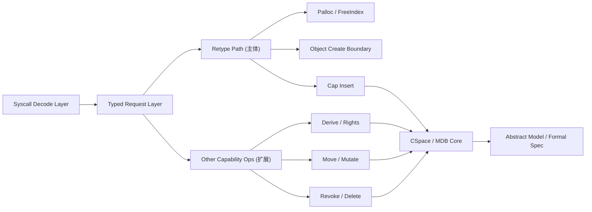
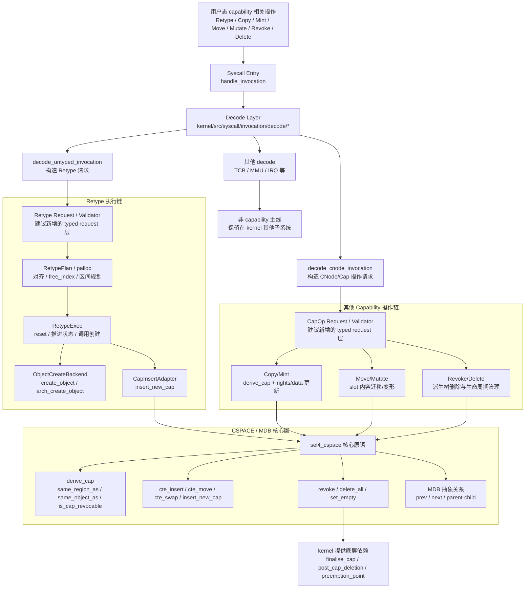

```mermaid
flowchart LR
    A["Syscall Decode Layer"] --> B["Typed Request Layer"]
    B --> C["Retype Path (主体)"]
    B --> D["Other Capability Ops (扩展)"]

    C --> C1["Palloc / FreeIndex"]
    C --> C2["Object Create Boundary"]
    C --> C3["Cap Insert"]

    D --> D1["Derive / Rights"]
    D --> D2["Move / Mutate"]
    D --> D3["Revoke / Delete"]

    C3 --> E["CSpace / MDB Core"]
    D1 --> E
    D2 --> E
    D3 --> E

    E --> F["Abstract Model / Formal Spec"]
```

```mermaid
flowchart TD
    U["用户态 capability 相关操作
Retype / Copy / Mint / Move / Mutate / Revoke / Delete"] --> S["Syscall Entry
handle_invocation"]

    S --> D["Decode Layer
kernel/src/syscall/invocation/decode/*"]

    D --> DU["decode_untyped_invocation
构造 Retype 请求"]
    D --> DC["decode_cnode_invocation
构造 CNode/Cap 操作请求"]
    D --> DT["其他 decode
TCB / MMU / IRQ 等"]

    DU --> R0["Retype Request / Validator
建议新增的 typed request 层"]
    DC --> C0["CapOp Request / Validator
建议新增的 typed request 层"]

    subgraph RETYPE["Retype 执行链"]
        R0 --> R1["RetypePlan / palloc
对齐 / free_index / 区间规划"]
        R1 --> R2["RetypeExec
reset / 推进状态 / 调用创建"]
        R2 --> R3["ObjectCreateBackend
create_object / arch_create_object"]
        R2 --> R4["CapInsertAdapter
insert_new_cap"]
    end

    subgraph CAPOPS["其他 Capability 操作链"]
        C0 --> C1["Copy/Mint
derive_cap + rights/data 更新"]
        C0 --> C2["Move/Mutate
slot 内容迁移/变形"]
        C0 --> C3["Revoke/Delete
派生树删除与生命周期管理"]
    end

    R4 --> CS["sel4_cspace 核心原语"]
    C1 --> CS
    C2 --> CS
    C3 --> CS

    subgraph CSPACE["CSPACE / MDB 核心层"]
        CS --> P1["derive_cap
same_region_as / same_object_as / is_cap_revocable"]
        CS --> P2["cte_insert / cte_move / cte_swap / insert_new_cap"]
        CS --> P3["revoke / delete_all / set_empty"]
        CS --> P4["MDB 抽象关系
prev / next / parent-child"]
    end

    P3 --> DEP["kernel 提供底层依赖
finalise_cap / post_cap_deletion / preemption_point"]

    DT --> O["非 capability 主线
保留在 kernel 其他子系统"]

```