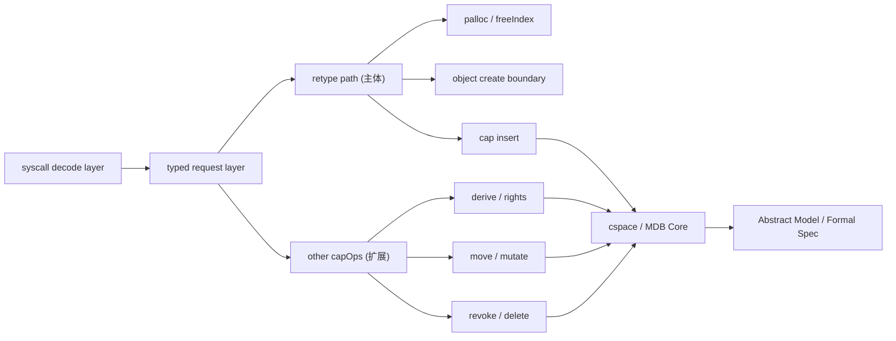

# 开题报告提纲

## 一、课题背景与研究意义

### 1. 微内核与形式化验证背景

+ 微内核因为代码规模相对更小，一般更容易讨论安全性、可靠性和可验证性
+ seL4 是这方面比较典型的工作，也是后面做相关研究时经常会参考的对象
+ Rust 这几年在系统编程里的使用越来越多，所以基于 Rust 去讨论形式化验证，也有比较现实的背景

### 2. reL4 与 Untyped `retype` 调用路径

+ reL4 是 Rust 对微内核实现的一种尝试
+ capability 相关操作（下文简称 capOps）在对象管理和能力管理里都比较核心
+ Untyped Retype 这条路比较重要，因为它一头连着 untyped memory，另一头又连着后续对象创建和 capability 的派生

### 3. 本课题的研究意义

+ 先把 capOps 的整体结构理清楚
+ 直接去处理整个 capOps 子系统，范围太大，也不太适合在开题时展开，所以只先抓住 Untyped Retype 这条主线，把能做扎实的部分先做出来
+ 另外，我也想借这个过程试一下，在现有代码结构下，模块怎么划分会更适合后续规约和证明

## 二、国内外研究现状

### 1. 微内核形式化验证研究现状

+ seL4 说明了微内核关键路径做高强度形式化验证是可行的
+ 这一类工作多数还是以 Isabelle/HOL 这样的交互式证明路线为主
+ 这条路线的优点很明显，但证明量和维护成本也都比较高

### 2. Rust 程序验证研究现状

+ Rust 相关的验证工具这几年也在逐渐发展
+ Verus 是其中比较有代表性的一个，它的特点是规约和证明可以放得离实现比较近
+ 这一点对做局部路径验证比较有帮助，因为不用把实现和证明拆得特别开

### 3. 当前问题与研究前景

+ 和 seL4 相比，ReL4 目前更明显的是实现语言层面的变化，在形式化验证上还没有形成比较成熟的结果
+ 也就是说，现在还很难像 seL4 那样，直接给出比较强的形式化保证
+ 在这种情况下，Untyped Retype 是一个比较合适的入口：它不算太散，但又能联系到 capOps 中比较关键的几个环节
+ mdb / revoke 这种部分，关系比较复杂，实现级证明工作量过大，所以现在更适合先做抽象建模

## 三、研究目标、研究对象与核心问题

### 1. 研究目标

+ 梳理 capOps 的整体结构
+ 重点分析 Untyped Retype 这条路径内部怎么分层比较合适
+ 对其中边界比较清楚的部分开展形式化验证
+ 对 mdb 和 revoke 做必要的抽象建模，补上相关语义

### 2. 研究对象

+ capOps 的整体结构
+ Untyped Retype 的调用路径
+ mdb(cspace) 与 revoke 中和 retype 直接相关的部分

### 3. 核心问题

+ 在现有 `kernel -> sel4_cspace -> common` 结构下，怎么做局部划分比较合适
+ Untyped Retype 这条路径怎么拆，才更适合写规约和做机检
+ mdb / revoke 该做到什么程度，既能把问题说明白，又不至于把范围拉得太大

## 四、研究内容

### 1. capOps 的粗粒度模块划分

- 先从整体上看 capOps 由哪些部分组成
- 目前初步考虑分成下面几块：

  1. Syscall Frontend / Decode
  1. Typed Request / Validator
  1. Untyped Retype Path
  1. Other Capability Invocation Paths
  1. CSpace / MDB Core
- 和当前仓库结构大致对应起来：

  1. `kernel` 里主要是 syscall 前端和 decode 相关逻辑
  1. `sel4_cspace` 里主要是 capability、CTE、MDB 等基础操作
  1. 先不改变 `kernel -> sel4_cspace -> common` 这条基本依赖关系

 这里的重点不是把整个 capOps 全部“重做”一遍，而是先把大框架理出来，搞清楚 Untyped Retype 在里面到底处在什么位置

### 2. Untyped Retype 调用路径的细粒度模块划分

- 在整体结构基础上，再往下看 Untyped Retype 这条路径本身，当前比较关注的调用链节点包括：
  - syscall 入口
  - `decode_untyped_invocation`
  - `invoke_untyped_retype`
  - `create_new_objects`
  - `insert_new_cap`

#### 1, Decode / Request Construction

- 从 syscall 参数里整理出后续执行需要的信息
- 形成一个比较明确的 request 表示
- 这一层最重要的是：decode 成功以后，后面到底可以依赖哪些前提

#### 2, Allocation Abstraction

- 处理 retype 里的空间规划问题，主要包括：
  - `capFreeIndex`
  - `alignUp`
  - 区间起点计算
  - 区间合法性判断
  - 新 `free_index` 的计算

这一层相对独立，也是目前看起来最适合优先做验证的一层

#### 3, Retype Driver

- 负责承接前面已经建立好的条件，进入实际执行，主要包括：
  - reset
  - create loop
  - state update

这里第一阶段不准备把所有对象构造分支都完全展开证明，先把接口边界弄清楚更重要

#### 4, Cap Insert / MDB (cspace)

+ 负责 capability 插入，以及和 mdb 局部关系维护之间的衔接
+ 这里打算只关注接口语义和局部约束，不准备直接覆盖整个 mdb

### 3. 各层职责边界

- Decode 层负责建立前提
- Alloc 层负责处理对齐、边界、区间和推进问题
- retype driver 层负责承接执行过程
- Cap Insert / MDB 负责 capability 插入以及相关关系维护接口

### 4. 研究范围界定

#### 拟开展的内容

- capOps 的粗粒度模块划分
- Untyped Retype 调用路径的细粒度模块划分
- decode 层和 retype 空间规划层的主要验证工作
- mdb 和 revoke 的抽象建模与规约描述

#### 不做的有

- 整个 capability 子系统的实现级充分证明
- mdb 底层 unsafe 实现的完整证明
- 所有 capability invocation 路径的统一强度验证
- 对所有对象创建分支逐个展开的完整机检

## 五、研究方案与技术路线
TODO

## 六、预期成果

### 1. 工程成果

+ capOps 的粗粒度模块视图
+ Untyped Retype 调用路径的局部模块划分方案
+ 与现有代码布局相对应的边界整理结果

### 2. 验证成果

+ decode 健全性的机检结果
+ retype 空间规划层安全性的机检结果
+ 相关的关键规约、辅助引理和循环不变式

### 3. 建模成果

+ mdb 的局部关系模型
+ revoke 的语义模型与形式化规约

### 4. 文档成果

+ 开题报告
+ 毕业论文
+ 答辩 PPT
+ 演示材料

## 七、可行性分析、风险与应对

TODO

## 八、进度安排

0. 阅读 Untyped Retype 调用链
0. 建立 capOps 总体结构视图
0. 跑通最小 Verus 样例

0. 梳理 capOps 边界
0. 明确 Untyped Retype 的细粒度分层
0. 形成初步规约草案

0. 建立 typed request 相关语义
0. 完成 decode 健全性证明

0. 抽象 retype 空间规划层
0. 完成边界、对齐、不相交和单调推进等性质证明

0. 建立 mdb 局部关系模型
0. 完成 revoke 语义规约

0. 完成论文撰写
0. 整理图表和说明材料
0. 准备 PPT 与演示内容
