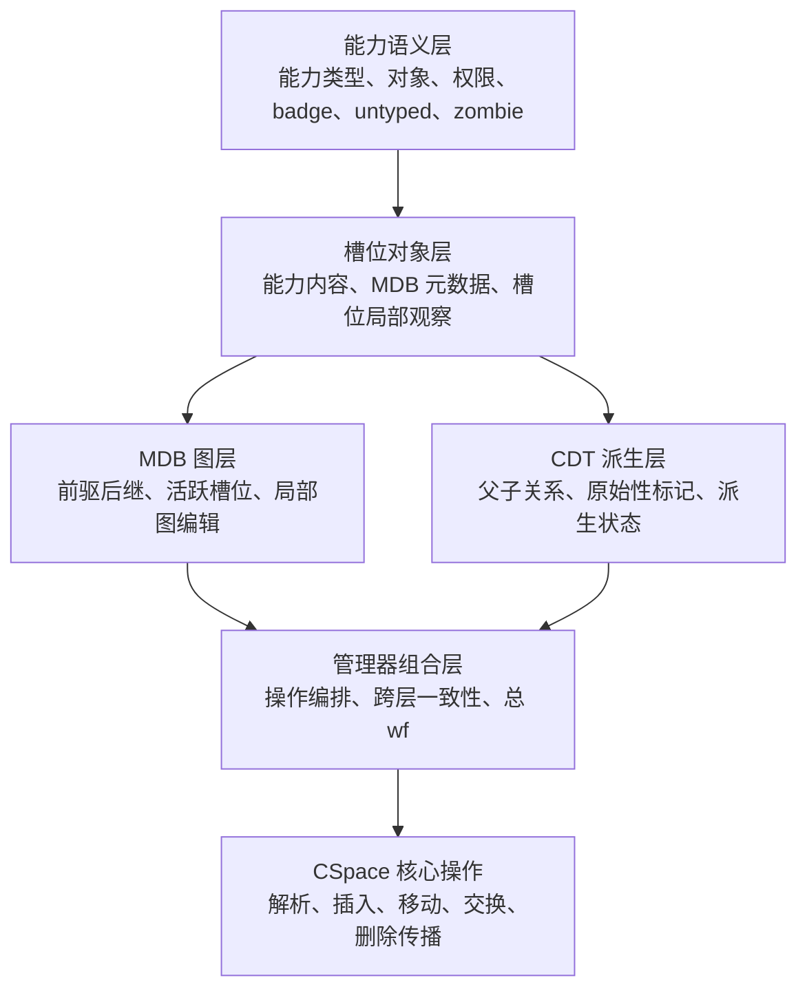

# 基于 Verus 的 reL4 能力空间核心层形式化验证研究

## 摘要

微内核将更多服务移交给用户态组件，因而具有更清晰的结构边界和更小的可信计算基，也更适合作为高可信论证对象。对 seL4/reL4 这类能力系统微内核而言，能力空间（Capability Space，CSpace）并不是普通的表结构：它既管理能力槽位中的内容，也维护派生关系、路径解析以及删除回收等关键行为。一旦该模块出现错误，访问控制语义就可能被直接破坏。基于这一考虑，本文选取 reL4 的 CSpace 模块作为研究对象，讨论如何用 Verus 验证这类局部改动会牵动全局约束的核心操作。

本文在 seL4 能力语义与 Verus 系统验证方法的基础上，构建由能力语义、槽位对象、MDB 图关系、能力派生树和管理器组合层构成的抽象模型，设计覆盖能力内容、前驱后继一致性、派生关系、badge 语义、untyped 子约束和 zombie 约束的不变量体系，并采用分层后状态方法组织核心操作证明。

本文得到的主要结果集中在 CSpace 管理器核心层。目前，路径解析、局部更新与删除传播三条核心操作线已经可以放在同一套分层证明框架下讨论。以 `resolve_address_bits` 为代表的解析路径，以及以插入、移动、交换为代表的局部更新路径，已经形成覆盖槽位语义、MDB 图后状态、CDT 派生状态和管理器层良构性恢复的机械化结果；围绕单步删除、传播删除和撤销操作的删除传播路径，也已经形成以阶段化契约、部分正确性和良构性保持为中心的证明结果。全文还结合代码规模统计、与 l4v 的规模参照、运行时形态观察以及 `spike` 平台上的验证与测试结果，对这些成果作了评估。本文有意将结论边界收在管理器核心层，不把公共封装接口、系统调用级行为和整内核端到端验证一并计入既有结论。

关键词：形式化验证；微内核；能力空间；Verus

## ABSTRACT

Microkernels are suitable for high-assurance system construction because of their clear protection boundaries and relatively small trusted computing base. In a capability-based microkernel, the Capability Space (CSpace) manages capability slots, derivation relations, path resolution, deletion, and revocation. Its correctness directly affects access-control semantics. Since CSpace operations usually perform local slot mutations while preserving global properties such as MDB consistency, derivation-tree structure, badge rules, untyped-child constraints, and zombie invariants, testing alone is insufficient to explain their correctness.

This thesis studies the CSpace component of the reL4 kernel and develops a Verus-based method for modeling and verifying its manager-level core. The work constructs a layered abstract model around capability semantics, slot objects, MDB graph relations, capability derivation trees, and manager-level composition. It also defines invariants for capability contents, predecessor-successor consistency, derivation relations, badge semantics, untyped constraints, and zombie-related conditions. Based on these definitions, the thesis organizes proofs with a layered post-state method.

The result is a substantial verification artifact for the reL4 CSpace manager-level core. Path resolution, local updates, and deletion propagation are brought into one layered proof framework. The resolution, local-update, and deletion lines already have mechanical results for slot-local semantics, MDB graph postconditions, CDT derivation-state postconditions, staged contracts, and manager-level `wf` recovery. The thesis further evaluates the artifact through code-size statistics, a size reference against extracted l4v CSpace materials, proof-erasure-oriented runtime-shape analysis, and verification and testing results on `spike`. The claim is bounded to the CSpace manager-level core, rather than all public wrappers, syscall-level behavior, or whole-kernel end-to-end properties.

KEY WORDS: Formal Verification; Microkernel; Capability Space; Verus

## 目录

摘要

ABSTRACT

1 绪论

1.1 研究背景与意义

1.2 相关研究现状

1.3 本文要解决的问题

1.4 论文结构安排

2 背景与相关技术基础

2.1 微内核、seL4 与 capability 机制基础

2.2 l4v 与 seL4 形式化验证传统

2.3 Rust 验证现状

2.4 Verus 平台与系统验证特点

2.5 本章小结

3 研究对象、范围与关键问题

3.1 验证对象与模块职责

3.2 研究范围与分析对象

3.3 能力空间验证的关键问题

3.4 本文方案与研究边界

4 形式化方法设计

4.1 总体验证思路

4.2 分层抽象模型

4.3 管理器状态表示

4.4 不变量体系

4.5 证明义务分解

4.6 循环与帧条件处理

4.7 边界建模与桥接策略

5 验证实现

5.1 实现对象与组织方式

5.2 路径解析验证实现

5.3 局部更新操作验证实现

5.4 删除传播操作验证实现

5.5 本章小结

6 验证结果、分析与讨论

6.1 评估目标与指标

6.2 代码与证明规模统计

6.3 与 l4v 的规模参照

6.4 运行时形态观察

6.5 构建、验证与测试结果

6.6 结果分析

6.7 结论边界

6.8 接口与系统级扩展

6.9 研究局限

6.10 后续展望

结论

致谢

参考文献

附录

## 1 绪论

### 1.1 研究背景与意义

徐家乐等在讨论操作系统内核验证时指出，内核提供的是最基本的系统功能，“任何一个小的错误都可能造成整个上层软件系统的崩塌”[1]。这一判断与中文综述文献的归纳基本一致：文献[2]从验证理论、语言和工具三个方面梳理操作系统形式化验证，并指出“验证成本高、验证工具局限性”仍是制约该方向推进的重要因素；文献[3]则把相关研究概括为围绕形式化设计、规格描述和验证方法展开的持续积累。国际上，seL4 系列工作把这种需求进一步落实为可操作的证明目标：SOSP 2009 给出从抽象规范到 C 实现的机器检查功能正确性证明[4]，TOCS 2014 又继续报告访问控制、二进制语义保持和时序分析等更完整的系统级结果[5]。因此，内核之所以长期成为形式化方法的重要应用对象，并不只是因为它“足够关键”，也因为已有研究已经证明，内核可以被分层建模、分层证明，并逐步向系统级性质推进。

把视角进一步缩小到能力系统后，问题会更加集中。徐家乐等把权能访问控制称为“基于权能的细粒度访问控制”，其目的在于“防止未经授权的用户访问系统内核资源和服务”[1]。From L3 to seL4 对 L4 二十年演进的总结也反复强调，最小化原则和关键路径性能始终在塑造微内核的实现边界[6]。落实到 seL4 手册中的定义，capability 被表述为引用特定内核对象并携带访问权限的不可伪造令牌，概念上驻留在 capability space 的某个 slot 中；整个 CSpace 又由内核管理的 CNode 组成有向图结构[7]。因此，CSpace 处理的并不只是“对象名字放在哪里”的问题，而是对象引用、权限约束和派生传播如何在同一结构中被组织起来；其正确性既关系到对象能否被正确找到，也关系到权限是否会沿错误路径被复制、移动或保留。

仅从功能正确性主线出发，能力系统的重要性已经十分明显；而 seL4 关于完整性和授权封闭性的进一步结果[8]又说明，能力机制并非只是实现访问控制时附带使用的一组数据结构，而是高层安全语义能够成立的关键前提。与此同时，将证明继续向编译后程序推进的工作[9]也表明，源代码层面的结论并不足以自动外推到更低层实现，不同层之间的连接关系同样需要被显式论证。综合这两类工作可以得到一个更清楚的判断：CSpace 并不是适合停留在局部函数层面讨论的边缘模块，而是微内核可信论证中的核心组成部分。

与此同时，系统软件的实现语言也在变化。Rust 确实在内存安全和底层控制之间提供了比 C/C++ 更有吸引力的平衡，但这并不等于“换成 Rust 之后，功能正确性问题就自动消失”。RustBelt 的开篇就明确指出，Rust 的安全承诺尚需形式语义来支撑，尤其是标准库和底层库广泛使用 `unsafe` 这一点，使“语言表面安全”与“实际系统正确性”之间不能简单画等号[10]。对本文更直接的启发来自 Verus：OOPSLA 2023 和 SOSP 2024 两篇代表性工作都把重点放在同一套 Rust 环境中同时表达代码、规格和证明[11][12]。这意味着，像 CSpace 这样既有真实运行时代码、又带有复杂全局约束的模块，可以不经由另一套专用规范语言，而是直接围绕现有 Rust 实现组织验证。

reL4 正是在这样的背景下出现的。它延续 seL4 传统，同时将微内核与高可信系统研究主线带入 Rust 语言环境。围绕语义负载较重的 CSpace 子系统建立一套 Verus 形式化建模与验证框架，能够检验 seL4/l4v 语义经验在 Rust/Verus 生态中的迁移可行性，也为内核 Rust 重写过程中从“代码安全”走向“行为可信”提供方法支点。进一步向系统调用级和更广义系统层验证扩展所需的结构基础，也可以在这一过程中同步准备。

### 1.2 相关研究现状

围绕高可信内核与系统验证，现有文献大致形成了五条彼此关联的研究主线：微内核功能正确性与安全性质验证、跨层语义连接与实现保持、Rust 语言语义基础、Verus 平台及其系统化案例，以及权能访问控制的直接验证工作。下面按照这一脉络分别加以梳理。

第一条主线是以 seL4 为代表的微内核功能正确性与安全性质验证。SOSP 2009 的 seL4 工作把研究目标明确为抽象规范到 C 实现的功能正确性证明[4]，TOCS 2014 又把功能正确性、访问控制、二进制语义保持和系统初始化等结果并置到同一套系统级论证中[5]。From L3 to seL4 对 L4 系列发展的回顾则强调，最小化、性能和可验证性并不是彼此孤立的追求，而是共同塑造内核边界的设计驱动[6]。在这一基础上，seL4 Enforces Integrity 进一步把能力系统与完整性和授权封闭性联系起来，说明能力机制并不只是内核中的一种实现细节，而是安全性质得以成立的结构前提[8]。中文综述文献对这一方向的归纳也指出，微内核和安全内核一直是操作系统形式化验证最集中的对象之一[2][3]。因此，现有研究实际上已经给出了一个比较清楚的共识：能力系统是值得做强语义验证的微内核核心部分。

第二条主线关注的是“高层证明如何继续向下连接”。Translation validation for a verified OS kernel[9]虽然不直接讨论能力空间本身，但它提醒研究者：即便抽象规范和源代码层的语义关系已经建立，编译、链接以及更底层实现过程仍然可能成为结论外推时的薄弱环节。与这一点相呼应，两篇中文综述[2][3]也都把验证层次、适用边界和工具条件看作必须单独说明的问题。因此，文献中关于“已验证”的表述，通常都不是不加区分的总括判断，而是要明确说明结论停留在哪一层。

第三条主线是 Rust 系统验证与 Verus 工具生态。就语言背景而言，RustBelt 从形式语义角度讨论了 Rust 的安全主张、所有权类型系统以及 `unsafe` 库实现的验证前提[10]，说明语言层安全承诺并不能自动推出模块级功能正确性。中文文献虽然大多还不直接讨论 Verus，但王阳等[13]已经把形式化验证方法概括为“最有潜力确保操作系统安全可信的方法”，并尝试按单元、模块和系统三个层次组织验证过程。对本文更直接相关的，则是 Verus 的代表性工作：它把重点放在工具平台上，即如何在同一套 Rust 语法环境里同时书写执行代码、规格和证明，并通过 SMT、ghost 状态和线性资源机制承载更复杂的程序性质[11][12]。因此，Rust 相关研究在这里形成了一个比较自然的分工：RustBelt 更多回答语言基础问题，Verus 更直接支撑贴近真实代码的验证实施。

第四条主线是 Verus 生态下的大规模系统化案例。Hance 的博士论文[14]讨论了并发系统代码验证的组织方法；IronFleet[15]虽然早于 Verus，但其“状态机精化 + 程序逻辑”的结合方式深刻影响了后来的系统验证实践。随后，IronSync[16]、PoWER[17]、CortenMM[18]、Atmosphere[19][20]以及 VeriSMo[21]分别在并发推理、崩溃一致性、内存管理、Rust 内核和安全模块等方向展示了统一验证平台的工程潜力。就本文的问题意识而言，这一系列工作最重要的启示不是某篇论文中的局部技巧，而是一个更稳定的判断：Verus 已经开始具备支撑中大规模系统子模块验证的现实条件[22][23]。因此，在 Rust/Verus 生态中讨论 reL4 CSpace，不再只是方法上的试探，而是可以嵌入现有系统验证主线的研究选择。

第五条主线是与权能访问控制直接相关的验证工作。在中文研究语境中，徐家乐等人把操作系统正确性表述为 API 函数具体实现与抽象规范之间的精化关系，并据此对某微内核权能访问控制模块开展 Coq/CSL-R 验证[1]。同一工作还特别强调，权能访问控制实现中不仅“所有任务的权能空间构成多个树结构”，而且其中广泛存在访问、修改和“(递归) 删除”等操作[1]。与此相邻的国内研究还从更一般的操作系统语义建模角度提出了 OSOSM 一类对象语义模型，试图以分层方式描述系统调用语义、安全属性与状态保持[24]。这两类工作合在一起说明，权能访问控制既可以作为独立验证对象来研究，也可以放到更广义的操作系统对象语义框架中讨论。对本文而言，最直接的启发正是：树结构维护、复杂嵌套数据结构、一致性不变式和递归删除路径，确实构成了这一问题域中的共性难点。

表 1-1 相关工作与本文定位比较

| 工作方向 | 主要对象 | 工具或框架 | 是否直接覆盖 CSpace 核心操作 | 是否讨论删除传播/可信边界 | 本文相对该方向的新增点 |
| --- | --- | --- | --- | --- | --- |
| seL4/l4v 功能正确性与安全性质[4][5][8] | 微内核抽象规范、C 实现与安全性质 | Isabelle/HOL 及相关证明体系 | 从系统语义上覆盖能力系统，但不面向 reL4 的 Rust 实现直接展开 | 是 | 将其能力语义强度与边界口径迁移到 reL4 的 Rust/Verus 实现环境 |
| translation validation[9] | 已验证内核的编译后程序连接 | HOL4/二进制验证路线 | 不以 CSpace 为中心 | 强调实现连接边界 | 将“边界必须显式说明”的原则落到 CSpace 核心层的论文口径与评估设计 |
| Rust 验证现状与 Verus 工具生态[10][11][12] | Rust 语言语义背景与系统代码验证平台 | RustBelt、Verus | 不直接给出 CSpace 级案例 | 主要提供工具与逻辑能力 | 把通用 Rust/Verus 验证能力收束到能力空间这一高语义密度内核子系统 |
| Verus 系统案例[16][17][18][19][20] | 并发、存储、内存管理、Rust 内核 | Verus 生态 | 一般不直接覆盖 reL4 CSpace | 较多讨论模块化组织与可信边界 | 给出面向 CSpace 的分层后状态组织、边界控制和评估证据组合方式 |
| 权能访问控制中文相关工作[1] | 微内核权能访问控制模块、API 规范与精化关系 | Coq、CSL-R | 是，但对象和验证层次不同 | 是 | 从 Rust/Verus 实现环境出发，将论证重点转到管理器核心层的分层后状态与核心操作组织 |
| 本文 | reL4 能力空间管理器核心层 | Rust + Verus，语义校准参照 seL4/l4v | 是 | 是 | 在真实 reL4 实现中同时回答验证边界、证明组织与评估证据三类问题 |

综合前述文献可以看到，现有研究已经分别回答了几个关键问题：为什么能力系统值得验证[4][5][8][1]，验证结论应当如何分层表述[5][9][2][3]，Rust/Verus 是否能够承载系统代码验证[11][12][13]，以及权能访问控制验证通常会在哪些位置遇到困难[1][24]。不过，就已有中文文献来看，相关成果更多仍集中在综述、对象语义模型、需求层或嵌入式系统验证方案等方向[2][3][24][13]；而在 reL4 这样的 Rust 微内核实现中，针对 CSpace 核心层的专门研究仍然较少。本文的工作正是沿着这一空缺展开：在不脱离现有 Rust 实现的前提下，把解析、局部更新和删除传播几类核心操作放进同一套 Verus 证明框架中讨论，并把最强结论明确限定在管理器核心层。

### 1.3 本文要解决的问题

基于上述缺口，本文将研究问题具体化为如下判断：在 Rust/Verus 生态下，reL4 的 CSpace 核心操作究竟能够验证到何种程度，以及需要采用怎样的证明组织方式，才能既保持 seL4 语义上的强度，又不脱离当前 Rust 代码的真实结构。围绕这一判断，全文进一步展开四个彼此相关的具体问题。

1. 验证对象应限定在 reL4 CSpace 的哪一层，最强结论的边界应如何划定。
2. 能力语义、槽位语义、MDB 图语义、CDT 派生语义和管理器组合语义，应如何组织成统一的分层模型。
3. `resolve_address_bits` 代表的路径解析、`cte_insert`/`cte_move`/`cte_swap` 代表的局部更新，以及删除传播这三类差异较大的操作，能否纳入同一套证明框架。
4. 最终得到的结果具有什么证明强度，需要付出多大实现与证明代价，运行时代码形态和系统兼容性又应如何评估。

之所以把问题集中在这四点，是因为能力空间验证同时面临四类困难：一是能力槽位既承载内容语义，又通过 MDB 和派生关系与其他槽位紧密耦合，局部更新很容易牵动全局约束；二是解析、插入、交换、删除等路径在控制流和后置条件上差异明显，不能简单套用同一模板；三是异常值、位域视图和运行时桥接等低层表示问题始终存在，必须明确可信边界；四是本科论文还需要把方法、实现、结果和评估组织成清楚的整体叙述。

### 1.4 论文结构安排

全文共六章。第 1 章说明研究背景、相关工作并提出本文要解决的问题。第 2 章介绍能力系统、seL4/reL4、Rust 验证现状与 Verus 等技术基础。第 3 章开始进入本文工作，界定验证对象、研究范围与关键问题，并说明后文讨论所采用的边界。第 4 章说明本文采用的形式化方法设计，包括分层抽象模型、不变量体系和证明组织方式。第 5 章介绍路径解析、局部更新和删除传播三类操作的验证实现。第 6 章集中给出机械化验证结果、规模统计、运行时形态观察、测试结果，以及相应的结果分析、结论边界、研究局限和后续展望。

## 2 背景与相关技术基础

### 2.1 微内核、seL4 与 capability 机制基础

微内核的基本思路，是把必须在特权态完成的最小机制保留在内核内，把更多策略和服务移交给用户态组件。中文综述通常把这种结构理解为一种有利于隔离、验证和可信构造的内核组织方式[2][3]；From L3 to seL4 对 L4 系列经验的总结则进一步表明，这种做法并不是一般意义上的“模块拆分”，而是长期围绕最小化原则和关键路径性能形成的设计选择[6]。seL4 正是在这条技术线上发展出来的代表性能力系统微内核：它提供进程间通信、线程、虚拟内存、访问控制和中断控制等最小核心机制，同时把访问控制建立在 capability 机制之上[5][7][8]。

在这样的系统中，capability 机制承担了对象引用、访问控制和权限传播的统一表达。徐家乐等将权能访问控制描述为一种“细粒度的访问控制机制”，强调它把访问权限直接与对象和操作绑定[1]；seL4 手册则从系统接口角度说明，只有持有足够访问权限的 capability，主体才能请求相应的内核服务[7]。换句话说，线程是否能够访问某个对象，并不是靠全局名字表来决定，而是取决于其是否持有相应能力。

seL4 中的 capability space 由 CNode 递归组织而成。手册对这一点的说明非常具体：capability 在概念上位于 capability space 的某个 slot 中，而 capability space 则由内核管理的 CNode 构成有向图结构；能力地址由路径上各级 CNode 的 slot index 串接而成[7]。因此，CSpace 既是能力的存放结构，也是线程进行对象访问时的寻址结构。徐家乐等人的中文相关工作也从实现角度说明，权能空间并不是简单数组，而是由多个树结构和嵌套数据结构共同构成[1]。

从基本操作看，seL4 手册把能力管理主要归入 CNode 方法之中，包括 `Mint`、`Copy`、`Move`、`Mutate`、`Rotate`、`Delete`、`Revoke` 和 `SaveCaller` 等[7]。其中，`Mint` 和 `Copy` 用于从已有能力产生新能力，`Move` 和 `Rotate` 用于调整槽位中的能力位置，`Delete` 用于删除指定槽位中的能力，而 `Revoke` 则会递归删除由某个能力派生出的子能力[7]。这些操作共同构成了能力系统最基本的管理接口，也决定了后续能力解析、派生维护和删除传播等问题会以什么形式出现。

从研究对象角度看，能力系统之所以长期被单独讨论，正是因为它把对象引用、权限传播和回收控制集中到了同一套结构中。对微内核来说，这套结构既是访问控制机制，也是许多内核对象生命周期管理的入口。因此，围绕 capability、CNode、CSpace 地址和 CNode 方法建立清楚的概念基础，是后续讨论能力空间语义与验证问题的前提。

### 2.2 l4v 与 seL4 形式化验证传统

l4v 与 seL4 相关文献已经把能力空间放进一套较清楚的形式化验证分层之中。SOSP 2009 首先给出的是从抽象规范到 C 实现的功能正确性证明[4]；TOCS 2014 在此基础上继续汇总访问控制、二进制语义保持、初始化和时序分析等结果[5]。因此，在 seL4 的研究传统里，能力空间并不只是内核中的一组实现数据结构，而是抽象规范、执行语义、安全性质和下层保持关系共同涉及的正式验证对象[4][5][2][3]。

就能力空间本身而言，seL4 手册和 l4v 抽象规范已经给出了比较完整的语义描述。手册说明，线程的 CSpace 可以理解为从根 CNode 开始可达的一部分有向图；能力地址是由路径上各级 CNode 的 slot index 拼接而成，解析时需要逐步消耗 guard 和 radix 所对应的位串[7]。因此，能力查找并不是固定深度的数组索引，而是一个沿 CNode 递归下降的路径解析过程。手册给出的例图和 `seL4_CNode_*` 系列接口说明，实际上已经把 CSpace 组织、寻址方式和操作入口一并交代清楚[7]。

l4v 中对应的抽象规范把这套语义进一步程序化。相关理论首先把 capability space 描述为从线程 CSpace 根开始、由多个 CNode 构成的有向图，并在这一抽象上定义 capability 查找、复制、插入、移动、交换、删除、`finalise_cap` 与 `cap_revoke` 等核心操作。以 `resolve_address_bits` 为例，抽象规范把它写成沿多个 CNode 递归下降的查找过程：如果当前能力是 CNode 能力且位串尚未耗尽，就继续按 guard 和 radix 规则向下解析；否则返回当前槽位或相应异常情形。这样一来，路径解析、能力转移和删除传播都不再只是“实现代码怎么写”，而被提升成了抽象状态上的语义操作。

在这套抽象语义里，能力派生树和删除回收又是另一条核心主线。SOSP 2009 在讨论能力销毁时已经说明，seL4 用 capability derivation tree 追踪对象能力的来源关系，并通过 zombie capability 表达删除过程中的中间状态[4]。手册则把 `Revoke` 解释为递归删除派生子能力，把 `Delete` 解释为删除指定槽位中的能力[7]。在 l4v 中，这些内容进一步落实为 `cap_revoke`、`delete`、`finalise_cap` 和相关不变量证明。与 `resolve_address_bits` 一样，它们共同构成了 CSpace 语义传统中最重要的几条操作线。

l4v 的不变量证明部分则继续说明这些抽象操作的保持性质，例如 `resolve_address_bits` 的返回槽位满足相应存在性条件，能力更新不会破坏抽象对象和 CNode 结构要求等。也就是说，在 l4v/seL4 的形式化验证传统里，能力空间一直不是单纯的函数库，而是“抽象操作定义 + 不变量保持证明”同时存在的对象。后续在 Rust 环境中讨论 reL4 的能力空间验证时，最直接的语义参照仍然是 seL4 手册和 l4v 已经建立起来的这一套框架。

### 2.3 Rust 验证现状

Rust 之所以受到系统软件研究关注，在于它同时提供低级控制能力和相对强的静态安全保障。所有权、借用、生命周期以及对数据竞争的静态约束，使 Rust 在很多场景中比 C/C++ 更适合作为高可信系统软件实现语言；然而，这些机制主要保证的是内存与借用安全，并不能自动导出“某个算法满足抽象规范”或“某个状态机保持全局不变量”之类更强的功能正确性结论。正因如此，围绕 Rust 的系统验证研究，关注点并不只在语言本身，还在于如何为真实系统代码提供可落地的规格与证明工具。

现有 Rust 验证研究大致可以分成两类。第一类是语言基础工作，以 RustBelt[10]为代表，主要回答 Rust 的安全承诺在形式语义上依赖什么前提。RustBelt 明确指出，Rust 的所有权类型系统虽然提供了很强的安全保证，但标准库和底层库内部广泛使用 `unsafe` 特性，因此“Rust 是安全的”并不能被简单视作语言表面的直接结论，而需要进一步说明这些 `unsafe` 扩展在语义上为什么仍然是健全的[10]。这一类工作主要讨论的是语言与库层面的 soundness 问题。

第二类则是面向程序和系统代码的验证工作，重点不再是解释 Rust 为何安全，而是如何给现有 Rust 代码附加规格、组织证明以及处理共享状态、不变量和资源约束。国内近年的相关工作虽然大多还不直接使用 Verus，但已经开始从嵌入式操作系统、需求层和分层验证方案等角度讨论如何把形式化方法落到真实 OS 工程中。例如，王阳等[13]把验证过程区分为单元、模块和系统三个层次；徐家乐等[1]也表明，当验证对象换成权能访问控制模块之后，复杂共享数据结构、树结构维护和递归删除会迅速成为主要难点。由此可以看出，Rust 进入系统软件之后，真正困难的问题已经不再是“能不能写出安全代码”，而是“怎样证明这份系统代码满足更强的行为规范”。

因此，Rust 验证现状并没有停留在“语言本身更安全”这一层，而是逐渐形成了从语义基础到程序验证平台再到系统案例的连续研究路线。对后续工具平台的讨论，也正是在这一现状基础上展开的。

### 2.4 Verus 平台与系统验证特点

Verus 是面向 Rust 代码的 SMT 验证平台。OOPSLA 2023 的论文把它概括为一种在 Rust 语言内部同时书写执行代码、规格和证明的工具，并通过线性 ghost type、borrow checking 和 SMT 求解来支撑对资源、指针和并发相关性质的推理[11]。与许多“程序一份、规格另一份”的工具不同，Verus 的基本思路是让规格、证明和可执行代码尽量共处于同一语言环境中：规格函数仍然写成 Rust 风格的函数，函数契约主要通过 `requires` 和 `ensures` 表达，证明则写成 `proof` 代码或引理函数附着在相邻实现附近。

从机制上看，Verus 至少包含几个对系统验证很关键的组成部分。第一，它区分 `spec`、`proof` 和 `exec` 等不同模式，用来约束哪些代码参与运行、哪些代码只服务于证明[11]。第二，它允许使用 ghost 变量、tracked 资源和线性权限来表达“这个值只在证明里存在，但必须被严格使用”的对象，从而支持对指针、共享状态和抽象资源的推理[11]。第三，它依赖 SMT 求解器自动处理大量一阶逻辑与代数条件，同时允许程序员通过引理、递归证明、`decreases` 子句和触发器选择来补充自动化不足的部分[11]。第四，Verus 在验证完成后会擦除 ghost 代码与证明代码，因此这些部分不会进入最终机器代码[11]。这些机制合在一起，构成了 Verus 与普通 Rust 静态检查或单纯定理证明脚本之间最明显的区别。

SOSP 2024 和后续系统案例则说明，Verus 已经开始从“小型示例可证”走向“系统代码可证”[12]。相关工作已经把它用于并发系统、崩溃一致性、内存管理、Rust 内核和安全模块等方向[12][16][17][18][19][20][21]。这些案例并不直接给出能力空间验证的现成答案，但它们至少表明，Verus 已经可以承载较复杂的数据结构、不变量和模块化证明组织。就平台现状而言，它已经不只是一个验证算法的小工具，而是一个可以进入系统软件研究主线的 Rust 验证平台。

### 2.5 本章小结

本章分别介绍了微内核与能力系统基础、seL4/reL4 的能力空间语义传统、Rust 验证现状以及 Verus 平台特点。前两节给出了能力空间作为研究对象的基本概念与既有语义来源，后两节则说明了 Rust 系统代码验证所处的工具背景。基于这些背景，后文将进一步转入本文的验证对象、研究范围和方法设计。

## 3 研究对象、范围与关键问题

### 3.1 验证对象与模块职责

本章据此界定 reL4 中 CSpace 的验证对象、研究范围和成果边界。

本文的直接验证对象是 reL4 中负责能力空间管理的核心模块。这里所说的“验证对象”并不只是一个代码目录，而是指围绕能力空间核心操作建立起来的一组相互配合的执行路径、抽象状态和证明义务。为降低单层证明结构带来的复杂度，本文将该模块组织为更明确的分层结构：能力语义层负责能力自身语义，链接节点层负责最底层链字段表示，槽位对象层负责槽位及其局部观察与局部操作语义，MDB 层负责图关系和相关全局语义，CDT 层负责能力派生树与原始性状态，能力空间管理器则负责在这些层之上组合出最终的能力空间操作和总的良构性条件。这种组织不仅调整了实现结构，也重分配了证明责任：各层分别承担自身语义，管理器层负责最终组合，从而避免所有语义细节都被压回单一证明层。

如果只从实现分工看，这一部分像是在处理一批能力相关函数；但从内核职责看，它承担的事情要重得多。一方面，能力的创建、复制、移动、交换和删除都要经过这里，相应的槽位内容、链接关系和派生语义也都在这里被维护。另一方面，更高层对象管理和系统调用路径又要依赖这里完成能力查找与地址解析。也就是说，能力空间管理部分既是一个持续修改内部结构的模块，又是访问控制语义向上衔接的枢纽。

如果把 reL4 放在一个更大的验证图景中来看，能力空间管理部分恰好落在一个很适合切入的位置。再往下走，会很快进入位域表示、底层读写和体系结构细节；再往上走，则会直接碰到系统调用入口、长期状态演化和更复杂的接口责任。相比之下，这一部分离抽象系统语义已经足够近，同时边界还没有扩散到难以控制的程度。本文选择它，不只是因为这里“重要”，更因为这里能够把真实内核机制、明确边界和可推进的证明工作放在同一处展开。

### 3.2 研究范围与分析对象

本文从“分层对象”“证明层次”和“操作类型”三个维度界定研究范围。分层对象用于说明能力语义、槽位对象、MDB 图结构、CDT 派生关系和管理器组合语义分别落在哪些语义模块中；证明层次用于区分管理器核心层结论、对外封装层结论和更高层系统结论；操作类型用于说明哪些代表性行为已被纳入本文分析。这样的范围界定方式，既对应了本文在工程实现中的模块组织，也对应了后文在论文写作中的论证层次：先明确研究对象，再明确最强结论的边界，最后说明哪些操作足以代表本文所关心的方法问题。

表 3-1 验证层次、对象与结论口径总览

| 层次 | 主要对象 | 本文中的位置 | 可支撑的结论口径 |
| --- | --- | --- | --- |
| 能力语义层 | capability 自身语义、对象/权限/badge/untyped/zombie 信息 | 能力语义基础层 | 已存在稳定抽象，但仍与上层操作语义耦合 |
| 槽位对象层 | 槽位对象、槽位局部观察、局部方法 | 新架构下的重要承载层 | 已具备独立语义角色，不再只是兼容封装接口 |
| MDB 图层 | MDB 图结构、线性次序摘要、活跃槽位摘要 | 新架构下的独立结构证明层 | 分层边界已形成，并可支撑核心更新操作后的全局良构性证明 |
| CDT 派生层 | 派生树父子关系、原始性标记、派生状态转移 | 新架构下的独立派生语义层 | 状态转移责任已显式化 |
| 管理器组合层 | 核心操作编排、总 `wf` 组合器 | 本文主体论证层次 | 是核心层结论边界 |
| 对外接口层 | 公共封装接口、CNode 相关系统调用入口 | 与核心层相关，但不作为本文主结论层 | 仍需后续继续对齐与扩展 |

在操作类型上，本文仍将能力空间核心行为划分为四组。第一组是能力基础关系与查询操作，包括区域等价、对象等价、可回收性、最终能力判断等，它们为更复杂操作提供判定基础。第二组是查找与解析操作，以 `resolve_address_bits` 为代表，这一组决定能力路径如何被解释以及错误如何产生。第三组是局部更新操作族，包括 `cte_insert`、`insert_new_cap`、`cte_move` 和 `cte_swap`，它们代表能力空间中最典型的局部结构编辑。第四组是删除与回收操作族，包括 `delete_one`、`delete_all`、`set_empty`、`reduce_zombie` 和 `revoke`，它们共同构成能力清理、传播删除和派生树收缩的复杂路径。

本文在后文出现 `cte_insert`、`insert_new_cap`、`cte_move` 和 `cte_swap` 时，若未特别标注，主要指管理器核心层中的对应操作。与之相连的内核转发入口和兼容封装层在运行时上保持关联，但证明强度不同：本文主结论落在管理器核心层，不把外层封装自动视为已完成验证的对外接口。

表 3-2 将论文中的抽象层次与当前实现分工对应起来，使各层的位置、职责与结论口径可以直接追踪。

表 3-2 论文抽象层与现有工程模块对应关系

| 论文层次 | 当前实现分工 | 主要职责 | 可支撑的结论口径 |
| --- | --- | --- | --- |
| 能力语义层 | 能力种类与权限语义部分 | 能力种类、对象、权限、badge、untyped 与 zombie 语义投影 | 作为 CSpace 证明的能力语义基础，仍含底层视图可信边界 |
| 槽位对象层 | 槽位语义与局部操作部分 | 能力内容与局部链接元数据的槽位视图、局部派生、最终能力和子节点判断 | 已成为独立槽位对象层，承担槽位局部规格与桥接义务 |
| MDB 图层 | 邻接关系与图结构部分 | 活跃槽位摘要、前驱后继关系以及插入、删除、移动、交换等图原语 | 是局部更新证明的主要结构层，已拥有独立状态与证明职责 |
| CDT 派生层 | 派生关系部分 | 父子关系、原始性状态、派生树结构与操作后状态 | 插入、移动、交换、删除的派生树保持义务已显式化 |
| 管理器规格层 | 管理器抽象规格部分 | 总良构性、跨层语义、操作关系、删除相关规格 | 承担 CSpace 管理器核心层主结论的规格定义 |
| 管理器执行层 | 管理器核心执行部分 | 插入、移动、交换、删除、撤销等核心执行路径 | 执行代码与证明代码贴近组织，作为核心操作载体 |
| 管理器证明层 | 管理器组合证明部分 | 分层恢复、MDB/CDT 分阶段恢复、管理器组合证明 | 支撑管理器层良构性恢复和操作后语义组合 |
| 解析层 | 能力解析部分 | 路径解析、抽象解析规格、故障分支对应 | 目前最完整的查找/循环型证明路线 |
| 内核连接层 | 面向内核的封装与连接部分 | 管理器实例化、内核入口连接与兼容封装 | 与核心层相连，但不作为本文最强结论层 |

### 3.3 能力空间验证的关键问题

CSpace 相比普通数据结构更难验证，根本原因在于它同时承载对象语义、授权语义和拓扑语义。

首先，能力内容本身具有细粒度语义。不同能力种类指向不同对象，带有不同权限位、badge 信息和对象相关参数；有些能力之间可以看作同一区域的不同视图，有些能力则在 `same_object_as` 下等价但在授权传播上又存在差异。验证时需要判断的不只是“能力是否被复制到了某处”，还包括复制、移动或删除之后，关于区域、对象、badge 与可撤销标记的语义是否仍然成立。

其次，槽位间结构约束高度紧耦合。MDB 的前驱与后继关系、派生父子关系以及原始/可撤销之类的附加标记，使得单个槽位的正确性无法脱离邻接槽位来说明。一次 `cte_move` 看上去只是把能力从源槽位挪到目标槽位，但如果旧邻居、目标槽位原状态或来源父子关系处理不当，整个派生链就会失真。`cte_swap` 更是把这种复杂度提升到两个局部子图同时更新的程度。

第三个难点集中在删除路径。和插入、移动相比，删除相关操作很少是“一步做完”的：`delete_one` 往往要先空槽化，再进入 `finalise`、zombie 约简和子节点处理；`delete_all` 与 `revoke` 更进一步，会把这种分阶段处理放进循环里，连续作用在一批相关槽位上。于是，证明的压力就不再只是比较操作前后两个状态，而是必须说明阶段推进过程中哪些语义已经回收、哪些部分仍待后续处理。徐家乐等人的工作也把递归删除、树结构维护和全局一致性看作权能访问控制验证中的主要难点[1]，这一点与本文在删除传播线上遇到的问题基本一致。

最后还有一个很现实的问题：证明里使用的抽象状态，并不会天然等于运行时代码里的具体表示。异常值怎么映射，底层读到的局部信息怎样提升成抽象槽位视图，体系结构相关能力哪些需要纳入逻辑边界，这些地方如果处理得太粗，可信边界就会被放大；如果处理得太细，证明又会被大量表示细节拖住。本文后面专门区分桥接层和核心语义层，主要就是为了把这些缝隙控制在一个能说明、也能继续收缩的范围里。

### 3.4 本文方案与研究边界

基于上述问题，本文把研究范围明确限定在“reL4 CSpace 分层重构后的核心操作层”。这里的“核心操作层”主要指能力空间内部的查询、解析、局部编辑和删除传播路径；后文的论述重点放在管理器核心层内部的语义组织，并结合槽位对象层、MDB 层、CDT 层与管理器层之间的分工展开分析。之所以作出这一限定，是因为在当前阶段直接追求系统调用级或整内核级结论，会使证明复杂度迅速转移到接口桥接、长期状态一致性和体系结构相关细节上，从而削弱对 CSpace 核心语义本身的观察能力。

具体来说，本文主要把 `resolve_address_bits`、`cte_insert`、`insert_new_cap`、`cte_move`、`cte_swap`、`delete_one`、`delete_all`、`set_empty`、`reduce_zombie` 和 `revoke` 作为核心分析对象。这些操作构成能力空间中典型的读、写、交换和删除行为，也是后文方法设计、验证实现和结果评估的主要承载对象。

在这一范围内，本文所说的“管理器核心层结论”，仅指能力空间管理器内部、以统一良构性条件为核心组织的分析和证明结果。面向内核的封装层、兼容入口，以及长期管理器视角与真实运行时状态的一致性，不自动计入本文的最强结论，而是作为后续扩展时需要继续处理的问题。与文献[1]中以 API 抽象规范和精化关系为主的验证边界相比，本文把边界进一步收敛到管理器核心层内部，以换取对分层语义组织和核心操作证明结构的更细致刻画。

表 3-3 概括本文后文讨论所采用的研究边界。

表 3-3 本文讨论范围、依赖前提与超出范围

| 本文后文主要讨论的范围 | 依赖前提 | 超出范围 |
| --- | --- | --- |
| 管理器核心层内部的路径解析、局部更新与删除核心路径，以及与之直接相关的方法设计、实现和评估 | 低层运行时观察、局部桥接结点、面向内核的封装层语义，以及长期管理器与真实运行时状态的一致性仍作为明确边界保留 | 对外封装层强契约、系统调用级连接、整内核端到端论证 |

据此，本文将后文重点放在核心层内部的方法设计、验证实现和结果评估上；对外封装层强契约、系统调用级连接以及更长期的一致性问题，则留作后续继续扩展的方向。

## 4 形式化方法设计

### 4.1 总体验证思路

在前述范围界定基础上，本章进一步建立统一的 Verus 分层模型，用于组织能力语义、槽位语义、MDB 图语义、CDT 派生语义和管理器组合语义。本章的核心任务不是再次罗列工程模块，而是说明本文为什么采用当前的验证结构，以及这一结构怎样把研究问题转化为可执行的规格与证明义务。

reL4 CSpace 的复杂度并不来自单个字段读写，而来自能力内容、图结构、派生关系和删除生命周期同时存在。若把这些语义全部压到单一管理器层，证明结构会迅速失去可复用性，局部更新、图恢复和派生树恢复之间的责任界线也会变得模糊；若直接追求整内核端到端证明，核心问题又会被接口桥接、体系结构差异和长期运行时一致性细节淹没。基于这一判断，本文采用分层验证架构组织 CSpace 核心层，并把“在正确语义层支付复杂度”作为方法设计的基本原则。

该架构遵循四项相互配合的设计原则。第一，语义和契约强度仍以 seL4/l4v 为校准基线，因此能力关系、删除语义和不变量强度不能为了适应工具而被明显削弱。第二，证明组织不机械复刻 Isabelle/HOL 的 monadic 外形，而是利用 Verus 在 Rust 环境中表达执行代码、规格与证明的能力，以贴近当前 reL4 代码结构。第三，验证对象收束于 CSpace 管理器核心层，从而把公共封装层和系统调用层留在清晰的外推范围内。第四，复杂状态按语义归属拆分到槽位对象层、MDB 图层、CDT 层和管理器组合层，使帧条件和局部变化邻域只承担辅助说明，而不再充当整条证明主叙事。

从方法论上看，这一选择既不同于把所有语义都收敛到单层状态机中的写法，也不同于先建立完整 refinement tower 再回看核心操作的路线。本文更关心的是：在当前 Rust/Verus 工程条件下，如何先把解析、局部更新和删除传播这三类核心行为稳定放进同一证明框架，并为后续接口级外推保留清楚的结构接口。因此，本章后续的抽象模型、不变量体系和证明义务分解，都服务于这一更具体的方法目标。

表 4-1 本文 CSpace 验证架构层次总览

| 架构层次 | 主要语义责任 | 在论文中的作用 |
| --- | --- | --- |
| 能力语义层 | 能力类型、对象、权限、badge、untyped 与 zombie 相关信息 | 为所有操作提供语义基准 |
| 槽位对象层 | 单个槽位的能力内容、局部元数据和局部观察 | 承担槽位局部后状态说明 |
| MDB 图层 | 前驱后继、活跃槽位、局部图编辑与结构恢复 | 承担拓扑结构恢复和图良构性 |
| CDT 派生层 | 父子派生关系、原始性标记和派生状态转移 | 承担能力派生树语义 |
| 管理器组合层 | 操作编排、跨层一致性和总 `wf` 恢复 | 构成本文核心层主结论边界 |

下图展示了本文采用的 CSpace 分层验证结构。图中下层负责解释具体能力和槽位关系，中间层分别处理 MDB 图结构与 CDT 派生关系，管理器层则把这些局部结论组合为能力空间核心操作的整体结论。

图 4-1 CSpace 分层验证结构



### 4.2 分层抽象模型

要验证能力空间，首先必须回答“系统状态在逻辑上是什么”。如果直接围绕运行时结构逐字段证明，很快就会陷入位域、指针和表示细节；如果抽象得过于粗糙，又无法表达派生关系、相邻链接和删除阶段语义。本文因此采用分层抽象思路，将能力空间状态划分为能力语义层、链接节点层、槽位对象层、MDB 层、CDT 层和管理器层等相互关联的抽象层。

在能力抽象层，本文保留对语义有决定作用的信息，如能力种类、对象标识、region、权限、badge、CNode 参数和 untyped 相关字段等，而不展开所有机器级表示。这样做的目的，是把“能力在系统语义上代表什么”从具体位布局中分离出来。对于很多证明目标而言，核心问题是能力的对象指向和派生属性，底层编码细节则进入可信边界或后续细化工作。

在链接节点层与槽位对象层，本文把能力内容与前驱、后继、可撤销性和首个带 badge 标记等元数据组合起来，形成可直接用于推理的槽位对象抽象。本文强调槽位对象层的语义地位：它承载局部观察、派生、子节点检查和最终能力判断等槽位局部方法，是分层验证架构中证明责任重新分配的关键承载层。

在 MDB 层与 CDT 层，本文分别把 MDB 图语义与能力派生树语义从单一管理器叙事中抽出。MDB 层负责解释能力槽位之间的前驱后继关系、线性遍历次序、活跃槽位集合以及局部编辑后的图结构恢复。CDT 层负责解释能力派生树中的父子关系、原始性标记以及操作后的派生状态变化。这种拆分使“链接结构”和“派生树关系”以显式语义层形式出现在正文里，也使管理器不必再承担全部局部结构恢复工作。

在全局管理器抽象层，本文仍用统一的能力空间管理器状态聚合整个 CSpace 的槽位权限、zombie 集合以及总的良构性组合语义，但不再把它写成所有语义细节的唯一承载者。它负责的主要是组合：底层运行时执行先在各语义层建立后状态，再由管理器层恢复总的能力空间良构性。分层语义与整体正确性之间的关系，也因此集中在这一层表达。

### 4.3 管理器状态表示

能力空间管理器的核心作用，是为能力空间建立一个便于说明“整体正确性”的视角。每个槽位的能力内容与链接信息、派生关系和邻接修补，最终都在管理器层的状态与谓词中重新汇合。

在本文的分层架构中，管理器层仍是核心层结论的默认边界，但它并不直接拥有所有局部语义。管理器负责聚合槽位权限、派生树状态、删除相关状态以及总的良构性组合结构；MDB 和 CDT 等下层语义对象分别保存自己的抽象状态；管理器只对最终组合和操作编排负责，避免重新承担所有下层后状态推理。

统一状态表示带来两点直接收益。第一，它避免了为每个操作单独发明一套局部语义。无论是 `resolve_address_bits` 的路径解析、`cte_move` 的槽位编辑，还是 `revoke` 的删除传播，都可以在同一个状态空间内讨论。第二，它使证明目标更加明确：每次操作开始于一个满足若干前提和 `wf` 的管理器状态，执行后先得到若干分层局部后状态，再通过管理器组合恢复总 `wf`。相比只看函数前后某两个变量是否相等，这种组织更能回答“全局结构是否保持一致”的问题，也更贴近现有代码的真实分工。

管理器层也不要求穷举所有内部定义。本文更强调抽象组织思想：通过统一状态对象和显式分层状态，把能力空间的内容语义、拓扑语义和删除语义一起纳入可推理空间，从而集中呈现模型作用和验证效果，而不必把注意力过度分散到某一版辅助证明函数的细节排列上。

### 4.4 不变量体系

本文并没有把 CSpace 的良构性压成一个无法拆开的单一前提，而是把它分成若干可以分别讨论、最后再组合起来的结构性与语义性约束。文中记作 `wf` 的总条件，实际对应的是槽位权限、槽位域基础条件、MDB 结构性约束、CDT 结构性约束、空槽与活跃槽位对应、语义边约束、跨层一致性约束以及非 MDB 帧条件等几部分共同成立。

先看最基础的一类约束，也就是空槽和非空槽怎样被区分。这里并不是简单地把“有没有能力”当成唯一标准；空槽还要求链接信息和附加状态保持相容，非空槽则要和具体能力类型对应起来。插入、移动和删除之所以能谈“目标位置可写”“当前位置应清理”，依赖的正是这组最基础的区分条件。

另一组关键约束来自 MDB 链接一致性。前驱与后继关系决定了派生相关槽位如何被遍历和修补，因此必须满足基本互指一致、边界合理以及局部邻接关系正确等条件。本文采用的架构把这些性质集中到 MDB 图结构层：该层维护线性顺序摘要、活跃槽位摘要、前后继互指关系以及非活跃槽位的分离约束。许多局部更新证明先由 MDB 层说明局部图编辑后的结构仍然良构，再由管理器把这一结构结论纳入总 `wf`，从而避免逐字段恢复全部链接事实。

与之并行的，是父子派生与权限传播相关不变量。插入、复制和 `revoke` 类操作不仅改变槽位内容，还改变能力之间的派生语义。因而，验证必须显式说明哪些槽位在操作后形成新的父子关系，哪些槽位保持原始标记，哪些 badge 或可撤销状态应被设置或保留。本文将这一部分明确归入 CDT 层，使派生树状态、原始性标记和操作后的派生关系变化都拥有独立的语义承载位置，而不再隐含在单一管理器幽灵状态中。

还有一组不能忽略的约束，来自 badge、untyped 和 zombie。只要这些性质还在场，能力空间就不能被当成普通引用图来处理，因为这里已经掺进了对象生命周期和特殊资源语义。特别是在删除线上，zombie 处理方式会直接影响阶段推进是否还能保持安全。本文没有把这部分模糊带过，而是把 badge 与 untyped 通过语义边和跨层条件纳入管理器组合层，再把 zombie 相关的删除收尾语义单独放进核心层验证框架中。

在本文的工程组织中，这些约束最终都通过统一的 `wf` 谓词被汇合起来。这里的 `wf` 并不是把全部条件机械堆叠到一起的总标签，而是分层结果重新闭合时的组合入口：MDB 层负责链接结构，CDT 层负责派生关系，其余跨层一致性和帧保持条件补足层与层之间的连接。于是，在证明管理器层中的具体操作时，证明过程可以先分别恢复各层局部性质，再把这些局部结论收束为新的 `wf`，而不必在每个操作上反复重建整套全局语义。

### 4.5 证明义务分解

本文使用 Verus 时，采用的仍然是前置条件、后置条件和循环不变式这一套程序验证框架。这里真正需要说明的，不是 Hoare 形式本身，而是 CSpace 这种状态复杂的模块怎样把一次操作后的语义拆开，交给不同层次分别恢复。

设 `M` 表示操作前的抽象能力空间状态，`M'` 表示操作后的状态，`op` 表示某个能力空间操作。本文将 CSpace 更新类操作的总体契约抽象为：

```text
{ wf(M) ∧ pre_op(M) }
    op
{ wf(M') ∧ post_op(M, M') }
```

其中 `wf(M)` 表示操作前能力空间满足全局良构性，`pre_op(M)` 表示该操作自身的调用前提，`post_op(M, M')` 描述操作后状态与操作前状态之间的关系。对于普通算法验证来说，`post_op` 往往只需要描述返回值或少量字段变化；但对于 CSpace，`post_op` 必须同时说明槽位内容、MDB 图结构、CDT 派生树以及跨层语义的一致性。因此，本文进一步将 `post_op` 分解为以下几类证明义务：

```text
post_op(M, M') =
    slot_post(op, M, M')
  ∧ mdb_post(op, M, M')
  ∧ cdt_post(op, M, M')
  ∧ cross_layer_ok(M')
  ∧ frame_ok(op, M, M')
```

表 4-2 CSpace 证明义务与 Verus 机制对应关系

| 证明义务 | 对应 Verus 机制 | CSpace 中的含义 |
| --- | --- | --- |
| 槽位后状态条件 `slot_post` | `ensures`、规格函数、证明引理 | 描述受影响槽位中的能力内容、空槽状态和局部元数据如何变化 |
| MDB 后状态条件 `mdb_post` | ghost/tracked 状态、图结构规格、证明引理 | 描述 MDB 前驱后继、局部邻域修补、活跃槽位和图良构性恢复 |
| CDT 后状态条件 `cdt_post` | ghost 状态、派生树规格、证明引理 | 描述父子派生关系、原始性标记和删除传播后的派生树状态 |
| 跨层一致性条件 `cross_layer_ok` | 管理器层 `ensures` 与组合引理 | 描述槽位内容、MDB 边、CDT 父子关系、badge/untyped/zombie 约束之间的一致性 |
| 帧保持条件 `frame_ok` | 不变性条件、有限变化邻域、循环不变式 | 描述未被操作影响的槽位、边和派生关系保持不变 |

下图进一步说明了这些证明义务之间的组合关系。局部操作首先产生操作后状态，随后分别落到槽位、MDB 图和 CDT 派生树三个语义层；跨层一致性与帧条件用于连接这些局部结论，最终恢复管理器层的全局良构性。

图 4-2 CSpace 更新类操作证明义务分解

```mermaid
flowchart LR
    A[操作前状态<br/>wf(M) 与调用前提]
    B[运行时操作执行]
    C[槽位后状态<br/>slot_post]
    D[MDB 图后状态<br/>mdb_post]
    E[CDT 派生树后状态<br/>cdt_post]
    F[跨层一致性<br/>cross_layer_ok]
    G[帧条件<br/>frame_ok]
    H[操作后状态<br/>wf(M') 与 post_op]

    A --> B
    B --> C
    B --> D
    B --> E
    C --> F
    D --> F
    E --> F
    F --> H
    G --> H
```

上式给出了 Verus 规格写法在本文中的抽象形态。对应到 Verus 中，`wf(M)` 和 `pre_op(M)` 通常出现在 `requires` 中，`wf(M')` 和各类后状态关系通常出现在 `ensures` 中，而槽位后状态条件 `slot_post`、MDB 后状态条件 `mdb_post`、CDT 后状态条件 `cdt_post` 等则由不同语义层的规格函数和证明引理承担。本文真正关心的，是这种分层后置条件如何稳定承载 CSpace 证明，而不是重复解释一般性的程序逻辑规则。

上述分解体现了本文对 Verus 逻辑基础的使用方式：底层仍是 Hoare 风格的前后置条件和循环不变式，但 CSpace 的后置条件由多个语义层共同构成。对于插入、移动和交换等局部更新操作，槽位后状态条件 `slot_post` 说明源槽、目标槽及相关槽位的局部状态变化；MDB 后状态条件 `mdb_post` 说明前驱后继和局部邻域图结构如何被修补；CDT 后状态条件 `cdt_post` 说明父子派生关系与原始性标记如何变化；帧保持条件 `frame_ok` 则说明有限变化邻域外的状态保持不变。最后，管理器层再通过跨层一致性条件 `cross_layer_ok` 和总 `wf` 组合规则，把这些局部结论重新汇合为完整的 CSpace 良构性。

以 `lemma_insert_preserves_manager_semantics_wf` 为例，其核心结构可以概括为：前提中同时要求旧管理器的 `wf`、新 MDB/CDT 的局部结构良构性以及新旧状态满足 `cte_insert_rel`；结论则要求恢复整个 `new_mgr.wf()`。证明主体再把恢复过程分配给 MDB 层恢复阶段、CDT 层恢复阶段和管理器层组合阶段。第 4 章中的槽位后状态条件、MDB 后状态条件、CDT 后状态条件与跨层一致性条件，与此形成一一对应的抽象层次。

在局部更新操作中，`insert` 最清楚地体现了上述分层形态：操作后状态先落到槽位局部语义，再落到 MDB 图结构后状态和 CDT 派生树后状态，最后由管理器层组合得到新的 `wf`。移动和交换操作在语义上属于同一类局部更新问题，但交换涉及两个非空槽位同时互换，需要处理更多点对点映射和相邻关系变化；因此，`insert` 最能代表该证明方法。

对于查找类操作，证明义务的形态有所不同。以 `resolve_address_bits` 为例，该操作不修改能力空间状态，其核心 Hoare 契约关注返回结果是否符合抽象查找语义，而非更新后 `wf` 恢复。可抽象为：

```text
{ wf(M) ∧ lookup_pre(M, root, path) }
    resolve_address_bits
{ result_matches_lookup_spec(M, root, path, result) }
```

由于 `resolve_address_bits` 包含循环，Verus 还需要循环不变式说明每次迭代时“已解析前缀、当前能力、剩余位数和抽象路径语义”之间的对应关系。查找类操作主要依赖 Hoare 风格的循环不变式，更新类操作则主要依赖 Hoare 风格后置条件的分层拆解。

对于删除和 `revoke` 类操作，证明义务同时包含更新类和循环类的特征。它们既要像局部更新操作一样说明槽位空槽化、MDB 修补和 CDT 收缩，也要像循环操作一样说明每一步删除传播都保持阶段性不变式。因此，删除核心路径的验证可写为：

```text
{ wf(M) ∧ delete_pre(M) }
    delete/revoke
{ wf(M') ∧ delete_post(M, M') }
```

其中 `delete_post` 进一步包含空槽化结果、zombie 约简结果、子树收缩结果以及未处理区域的帧保持条件。这样的表述既符合 Verus 的契约式验证方式，也能体现 CSpace 删除语义本身的复杂性。

本文的证明表达以 Verus 的 Hoare 风格契约为基础：`requires` 对应前置条件，`ensures` 对应后置条件，循环不变式处理迭代过程，proof 函数和 ghost/tracked 状态用于补充自动化证明。本文的工作重点，是将 CSpace 的复杂后置条件系统地分解为槽位层、MDB 层、CDT 层、跨层一致性和帧条件五类证明义务，并在管理器层组合恢复总 `wf`；新的程序逻辑规则并不在本文范围内。

### 4.6 循环与帧条件处理

本文在处理循环与帧条件时，没有把“变化集合”作为唯一叙事中心，而是先按语义层次刻画操作后状态，再用帧条件说明未受影响部分保持不变。对 CSpace 而言，这一点尤其重要，因为一次看似局部的修改往往同时牵涉槽位内容、MDB 邻接关系和派生树状态；如果仍把主要证明责任压在统一的变化区域描述上，管理器层很容易重新退回到混合讨论所有细节的写法。

以插入、移动和交换这三类局部更新操作为例，它们的后状态分别落在三个语义层上：槽位对象层负责解释源槽和目标槽的局部条目状态，MDB 层负责解释有限邻域内前驱后继关系如何被修补，CDT 层负责解释父子关系和原始性状态如何变化。这样处理之后，帧条件的职责就变得明确了：它不再承担主要语义恢复任务，而只是保证未落入局部变化邻域的部分保持原状。

这也解释了局部变化区域概念为何仍然需要保留。对于局部更新操作，有限邻域仍是 MDB 图层恢复结构性质时不可缺少的观察范围；只是本文把这一范围吸收到图层后状态语义内部，而不再让它单独主导整条证明链。

循环型和阶段型操作更能体现这种安排。`resolve_address_bits` 的证明重点在于维持“当前节点、剩余位数与已解析前缀”之间的对应关系；`delete_all` 和 `revoke` 的证明重点则在于维持删除推进过程中的阶段状态，即哪些槽位已经处理、哪些槽位仍待后续步骤处理。这里仍然需要 `unchanged` 一类帧条件来守住未修改区域，但真正决定证明能否成立的，是对循环推进关系和阶段语义本身的刻画，而不是单独列出一份全局未变集合。

### 4.7 边界建模与桥接策略

任何现实系统验证工作都必须处理可信边界问题。seL4 的经典成果并未否认编译器、汇编与硬件假设[4][5]；同样，本文也不回避能力空间验证中仍存在的底层边界。本节关注的不是这些边界会带来哪些局限，而是说明在方法设计中如何对它们进行建模和桥接；具体限制及其对结论外推的影响放到第 6.9 节集中讨论。

本文中的边界建模主要包括四类内容：少量底层运行时观察与值构造，例如异常状态映射、地址或槽位相关视图提取；槽位局部语义中的少量底层辅助结点；管理器组合层中的剩余桥接结点；以及体系结构相关或删除收尾相关细节。这些桥接的共同作用，是把运行时表示提升到抽象逻辑，同时避免高层 CSpace 语义直接依赖大块黑盒。

表 4-3 对本文保留的主要边界建模方式作出归纳。

表 4-3 边界类别与桥接处理方式

| 边界类别 | 典型内容 | 处理方式 | 对正文主结论的影响 |
| --- | --- | --- | --- |
| 运行时观察边界 | 少量槽位视图提取、异常状态读取、值构造 | 作为桥接层输入进入抽象逻辑 | 不替代高层证明，只负责连接表示与语义 |
| 槽位局部边界 | 派生、子节点检查、最终能力判定等局部语义结点 | 以局部契约显式保留 | 说明槽位对象层已成形，但仍有进一步细化空间 |
| 管理器组合边界 | 删除侧桥接、跨层组合、少量局部语义桥接 | 以分层后状态或局部契约形式保留 | 核心层结果已可支撑管理器层良构性保持证明，进一步限制主要来自接口级连接和桥接结点减少 |
| 体系结构/删除收尾边界 | 少量能力低层判定、特定架构细节、删除收尾桥接 | 暂保留为显式边界 | 不改变本文管理器层结论，但限制整内核级表述 |

这样安排桥接层，不是为了把麻烦问题藏起来，恰恰相反，是为了把它们限制在可以点名说明的位置上。核心证明责任始终放在管理器层和各条核心操作线上；桥接层只负责把具体表示接到抽象语义上，而不代替高层能力空间逻辑本身给出结论。

如果从方法来源上看，本文一头连着 seL4/l4v 的传统，一头连着 Verus 的系统验证实践。前者给本文提供的是语义强度上的参照，哪些能力关系要保住、查找和删除语义要精确到什么程度、不变量该怎样分类，这些都不能随意放松；后者给本文提供的则是工程组织方式，即如何围绕管理器状态、分层后状态、帧条件和直接执行式证明来落地这些要求。

表 4-4 列出本文使用 l4v 的主要校准点。本文主要借助 l4v 中的能力空间抽象规范与不变量证明来校准能力语义、操作情形和不变量强度，更完整的 l4v 式逐层精化体系不属于本文结论范围。

表 4-4 l4v 语义校准点与本文对应关系

| 校准对象 | l4v 侧主要作用 | 本文中的对应位置 | 本文未主张的层次 |
| --- | --- | --- | --- |
| CSpace 查找与解析 | 校准 CNode 查找、guard/radix、lookup fault 情形 | 路径解析规格、分支证明与循环不变式设计 | 不主张从 Isabelle 抽象规范到 Rust 实现的完整逐层精化体系 |
| capability 关系 | 校准对象等价、区域等价、可撤销性、badge 等能力关系 | 能力关系规格与管理器公共语义条件 | 不主张覆盖所有架构能力的端到端位级证明 |
| 插入、移动与交换 | 校准槽位写入、MDB 邻接修补、派生关系与原始性状态 | 局部更新操作的执行、后状态与组合证明 | 不主张对外封装层已全部对齐 |
| 删除与撤销 | 校准删除传播、finalise、zombie 和子派生链处理语义 | 删除传播、收尾语义与阶段化契约证明 | 不主张删除与撤销在系统调用级的完整终止与进展证明 |

这套方法和 Verus 生态里已有的系统工作也有相通之处。IronFleet[15]、IronSync[16]、PoWER[17]、CortenMM[18] 和 Atmosphere[19][20] 的对象并不相同，但它们都没有试图用一个单层大规格把全部问题一口吞下，而是先找到合适的状态划分，再把局部证明重新组合成整体结论。本文在能力空间上的做法，基本也是沿着这个方向往前走。

这些抽象规则最重要的作用，不是要求后续实现永远固定成当前这套层次，而是先把 CSpace 核心语义从单层叙事里拆出来。只要槽位对象、MDB 图结构、派生树和管理器组合层的责任已经被分清，后面的桥接收缩、接口外推和系统集成就还有继续推进的结构基础。

## 5 验证实现

### 5.1 实现对象与组织方式

本章围绕三类代表性路径说明验证实现：`resolve_address_bits` 对应路径解析与循环不变式，`insert` 对应局部更新操作中的分层证明，删除核心路径对应阶段化契约与生命周期收尾语义。之所以可以用这三类案例代表本文所讨论的核心操作，是因为 `move` 与 `swap` 复用 `insert` 所代表的局部更新证明骨架，删除路径在此基础上进一步引入阶段划分与循环推进，而 `resolve_address_bits` 则补足了只读循环与故障分支对应这一类完全不同的证明义务。三者合在一起，正好覆盖循环解析、局部结构编辑和传播式删除三种主要证明形态。以下实现说明均在第 3.4 节界定的管理器核心层范围内展开。

图 5-1 给出了 CSpace 验证实现的整体组织与代表性入口。路径解析、局部更新和删除传播相关实现已经形成明确的模块划分。

（此处插入图 5-1）

图 5-1 CSpace 验证实现组织与代表性入口截图

表 5-1 概括核心操作与旧版参考实现之间的语义连续性；这里的“对照”主要指控制流、关键检查和关键修改顺序在 helper 展开后保持同一意图。

表 5-1 核心操作语义对照摘要

| 操作 | 在本文中的角色 | 与旧版实现保持一致的关键意图 | 主要限制 |
| --- | --- | --- | --- |
| `cte_insert` | 局部更新代表案例 | 空目标槽检查、目标槽写入、插入到源槽之后、修补相邻 MDB 关系 | 对外封装入口仍经兼容封装层桥接 |
| `insert_new_cap` | 插入线补充操作 | 读取 parent next、写入新能力、维护 parent/next 邻接关系 | 管理器实例化过程与对外封装契约未作为主结论 |
| `cte_move` | 带源槽清空的局部更新 | 目标槽继承源信息、源槽清空、邻居重定向到目标槽 | 结论限定在管理器层 `wf` 保持 |
| `cte_swap` | 双槽互换更新 | 双槽能力互换、双方邻居分别改指向新位置 | 相邻槽等复杂情形仍依赖下层图原语与组合证明 |
| `delete_all/delete_one/revoke` | 生命周期与传播删除路径 | `finalise` 后空槽化、删除槽时修补邻接关系、zombie 约简、对子派生链反复删除 | finalise/preemption/zombie 编码与循环终止性仍作为显式边界 |

表 5-2 进一步概括各操作在当前实现中的覆盖范围及其适用边界。

表 5-2 核心操作实现覆盖范围与适用边界

| 操作族 | 当前实现覆盖范围 | 主要依赖语义层 | 显式边界或未主张部分 |
| --- | --- | --- | --- |
| `resolve_address_bits` | 成功、提前停止与故障分支均已和抽象解析规格建立对应关系 | `resolve`、capability、管理器层 | 仍依赖 CNode 运行时视图、异常值构造和底层读取桥接 |
| `cte_insert` / `insert_new_cap` | 已形成操作后关系与管理器层 `wf` 保持 | `cte_t`、`mdb`、`cdt`、管理器层 | 不主张对外封装层已完成强契约对齐 |
| `cte_move` / `cte_swap` | 已形成局部更新后的管理器层 `wf` 保持 | `cte_t`、`mdb`、`cdt`、管理器层 | 相邻特例和接口级行为仍通过下层图原语与组合证明支撑 |
| `delete_one` / `set_empty` | 已形成单步删除后的安全性与管理器层 `wf` 保持 | 管理器层、`mdb` remove、删除契约 | `finalise` 与对象生命周期收尾仍含显式边界 |
| `delete_all` / `reduce_zombie` / `revoke` | 已形成阶段化契约、安全性与管理器层 `wf` 保持的机械化结果 | 管理器删除传播层、`cdt`/`mdb` 协同 | 不主张完整终止性、全局进展或系统调用级 `revoke` 正确性 |

### 5.2 路径解析验证实现

`resolve_address_bits` 是本文最具有“查找代表性”的案例。它负责沿能力指向的 CNode 结构解析地址位串，并根据 guard、radix 和剩余位数决定继续下降、成功返回还是产生故障。对这一路径的验证，关键不在于证明循环安全结束，而在于同时说明执行循环与抽象解析语义保持一致。为此，本文围绕该操作建立了显式规约、循环不变式、终止性约束以及成功/故障分支对应关系；循环不变式既刻画当前索引、剩余位数和中间能力状态，也刻画当前运行时位置与抽象解析前缀之间的关系。

在此基础上，`resolve_address_bits` 已经承载了强于普通安全条件的语义证明。围绕它组织的一组 refinement lemma 分别对应 guard 过深、guard 不匹配、level 无效、首轮下降条件、当前节点到根节点语义提升、精确成功返回和提前停止返回等关键情形，因此 `resolve` 线的目标并不只是“函数能够返回”，而是不同分支上的返回值都与抽象解析规格一致。

下文表 5-3 总结 `resolve_address_bits` 的主要证明义务。

表 5-3 `resolve_address_bits` 证明义务摘要

| 证明义务 | 代表性代码产物 | 说明 |
| --- | --- | --- |
| 初始根能力合法性 | `resolve_invalid_root_case`、`resolve_invalid_root_result` | 非 CNode 根能力进入故障分支 |
| guard 过深 | `lemma_root_guard_too_deep_contradiction`、`resolve_guard_too_deep_result` | 保证 guard size 与剩余位数关系被正确处理 |
| guard 不匹配 | `lemma_root_guard_mismatch_contradiction`、`resolve_guard_mismatch_result` | 保证查找失败被映射为 lookup fault |
| level/radix 无效 | `lemma_root_level_invalid_contradiction`、`resolve_level_invalid_result` | 保证 radix 与剩余位数不合法时不会产生伪成功 |
| 精确成功 | `lemma_exact_success_current_refines` | 返回槽位和剩余 bits 与抽象解析结果一致 |
| 提前停止 | `lemma_early_stop_current_refines` | 非精确但合法停止时保持抽象语义一致 |
| 当前节点到根节点提升 | `lemma_current_refinement_lifts_to_root` | 将循环中间状态的正确性提升为根调用的最终正确性 |

把这些义务放在一起看，就能更直观地看到 `resolve_address_bits` 这条证明线是怎么推进的。首先要排除那些表面上能继续执行、实际上不应落入成功分支的情况；接下来在循环中持续维持“当前节点与已解析前缀相互对应”的关系；等走到精确成功或提前停止这两个关键分支时，再分别落到对应的 refinement lemma 上，最后把循环中间得到的局部结果提升为根调用层面的整体结论。这样一来，证明的重点就不只是“循环没有出错”，而是每一种返回情形都能对上抽象解析语义。

图 5-2 给出了 `resolve_address_bits` 的实现位置及其对应证明条目。运行时代码主体与关键 lemma 的并列呈现，说明路径解析这条验证线已经形成完整的实现与证明对应关系。

（此处插入图 5-2）

图 5-2 `resolve_address_bits` 实现与证明对应截图

### 5.3 局部更新操作验证实现

除 `resolve_address_bits` 这一代表性查找案例外，局部更新操作的验证实现依赖一个更基础的事实：`cte_t`、`mdb` 与 `cdt` 三层已经真正落到代码组织和证明责任上。能力空间操作不再依赖“管理器一层从头解释到尾”的大证明，而是先在对应语义层恢复局部语义，再由管理器组合总 `wf`。其中，`cte_t` 承担槽位对象层语义，`mdb` 负责图结构恢复，`cdt` 负责派生树状态转移；局部状态恢复、图结构恢复、派生关系恢复和总 `wf` 恢复因而具有清晰分工，这也是局部更新与删除路径能够共用同一证明骨架的前提。

从实现结构看，本文并不是把三类核心操作分散处理，而是通过统一的分层框架承接不同操作类型。图 5-3 给出了局部更新路径中实现文件与证明文件之间的对应关系。

（此处插入图 5-3）

图 5-3 局部更新实现与证明文件对应截图

局部更新线目前已经覆盖插入、移动和交换三类典型操作。若只选一个最能说明分层结构的例子，`insert` 会比另外两个更合适：执行时先发生目标槽写入和 MDB 邻接修补，抽象上则先形成 `cte_insert_rel` 这一类新旧状态关系；在此之后，槽位层、MDB 层和 CDT 层各自把自己的局部恢复责任接住，最后再由管理器层把这些局部结果收回到总 `wf`。`move` 与 `swap` 不是另起一套证明方式，而是在这条主线上分别增加源槽清空、目标槽继承、双向映射和复杂邻接关系等额外义务。

若把这一过程再展开一层，可以看到本文所谓“分层后状态”并不是抽象口号，而是一条可执行的证明链。以 `insert` 为例，证明首先从旧管理器满足 `wf` 和插入前提开始，执行后建立新旧状态满足 `cte_insert_rel`；随后，槽位层给出目标槽内容与源槽保持条件，MDB 层说明新节点插入后局部邻接关系仍然自洽，CDT 层说明 parent/original 关系按预期更新；最后，管理器组合引理再把这三类局部结论汇合为新的 `wf`。这一顺序也解释了为什么 `move` 与 `swap` 能够复用同一骨架：它们改变的是局部后状态的具体形状，而不是“槽位后状态 - 图后状态 - 派生后状态 - 管理器收口”这一基本组织方式。

概括而言，`cte_insert`、`insert_new_cap`、`cte_move` 与 `cte_swap` 通过管理器层 `wf` 恢复引理、MDB 图原语以及 CDT 引理，把目标槽写入、parent/original 更新、MDB 邻接修补、源槽清空或双向互换等义务提升为管理器层 `wf` 保持。删除传播路径的实现组织则留待 5.4 节集中说明。

### 5.4 删除传播操作验证实现

删除传播路径在实现组织上与 `insert`、`move` 和 `swap` 有所不同：它不是把全部恢复义务压缩为一次性的单一后状态，而是把删除后的语义保持组织成单步删除、传播删除、zombie 收缩和 `revoke` 收尾几个可衔接阶段。这一区别首先体现在实现和证明组织方式上，即删除线需要显式描述阶段推进，而不是一次性写出全部后状态。

具体地，`set_empty` 负责建立空槽化、局部链路修补和基础 parent 语义保持；`delete_one` 负责把单步删除后的安全性、可接纳条件和管理器层 `wf` 保持连接起来；`delete_all` 负责组织“已处理区域”与“待处理区域”之间的阶段关系；`reduce_zombie` 负责 zombie slot number 更新及其分支行为；`revoke` 则给出对子派生链反复删除后的关键后置条件。合起来看，删除传播路径已经形成覆盖阶段化契约、部分正确性和管理器层 `wf` 保持的机械化结果，其完成口径与第 5.3 节中的 `insert` 线保持一致。

与局部更新类似，删除传播路径的实现结构也需要单独呈现。图 5-4 给出了删除相关实现与证明条目的分布情况。

（此处插入图 5-4）

图 5-4 删除传播实现与证明文件对应截图

从证明骨架看，删除线与插入线并不是两套彼此独立的方法。`insert` 通过一次局部更新直接得到单一后状态，然后交给 `cte_t`、`mdb`、`cdt` 和管理器层组合；删除传播则把同样的恢复责任拆成若干阶段后状态，再分别交由空槽化、MDB remove、CDT 协同和管理器层契约去承接。也就是说，二者共享的是同一套分层恢复逻辑，区别只在于删除线需要显式记述“已处理/待处理”区域与生命周期阶段。其适用边界仍以第 3.4 节和第 6.9 节为准。

与这些删除操作并行的，还有删除过程中所依赖的 MDB 图删除原语。它负责前向链、局部对称性和非活跃分离等结构恢复，但并不直接承担 `finalise` 或对象生命周期语义。这样的分工说明，删除传播的机械化结果并不是依赖单一大函数黑盒给出，而是由空槽化、删除传播、zombie 收缩和 MDB 图删除等几个层次协同形成。

因此，删除核心路径并不是局部更新证明之外的例外实现，而是同一分层方法在阶段型操作上的展开形式。它表明分层后状态方法不仅能够处理局部结构编辑，也能够承载具有阶段推进特征的复杂生命周期语义。

### 5.5 本章小结

本章介绍了 `resolve_address_bits`、局部更新操作族和删除核心路径的验证实现方式，说明解析、局部更新和删除传播三类核心行为如何落到同一套分层证明框架中。其适用边界见第 3.4 节，相关局限见第 6.9 节。

## 6 验证结果、分析与讨论

### 6.1 评估目标与指标

围绕本文成果的证明强度、实现代价、运行时代码保持性以及系统级兼容性，本章从四个角度给出评估：静态规模、`l4v` 规模参照、与证明擦除相关的运行时形态，以及构建与运行观察。

统计对象以 reL4 中 CSpace 相关实现为主，行数按非空非注释行统计；证明函数、规格函数、显式外部体声明以及未解释规格函数通过文本检索获得，用于观察证明产物分布与可信边界规模。文件数和核心实现行数聚焦 CSpace 主体实现，而证明函数、规格函数和边界条目的检索范围覆盖相关源码目录，因此两类数字不直接作比例比较。参照对象选择 l4v 中最直接对应能力空间抽象规范与不变量证明的材料；验证与运行命令见附录 D。

为避免混淆，本章将使用三类证明力不同的证据。Verus 全包验证属于机械化成立证据，可直接支撑已证明结论；局部模块验证可作为复现时对代表性证明路径的辅助重检，但不单独用作 `insert`、删除传播等不同操作线完成度的横向比较指标；行数、规格函数和桥接计数属于规模与结构证据，用于说明工作量与边界分布；`sel4test` 运行结果则属于运行旁证，用于提供外部兼容性证据，而不替代形式化证明。

### 6.2 代码与证明规模统计

本节统计覆盖 reL4 中与 CSpace 相关的实现，并同时记录证明函数、规格函数、显式外部体声明和未解释规格函数的出现次数。其作用在于说明实现规模与证明产物分布，而不替代 Verus 机械检查日志。

表 6-1 CSpace 核心层规模统计

| 统计项 | 数值 |
| --- | ---: |
| CSpace 核心实现 Rust 文件数 | 43 |
| CSpace 核心实现非空非注释行数 | 15802 |
| 证明函数静态检索数 | 191 |
| 规格函数静态检索数 | 235 |
| 普通与证明相关函数总检索数 | 521 |
| 显式外部体声明静态检索数 | 135 |
| 未解释规格函数静态检索数 | 22 |

图 6-1 给出了相关统计命令及其输出结果，对应表 6-1 中的规模数据来源。

（此处插入图 6-1）

图 6-1 CSpace 规模统计命令与输出截图

单看这些数字，至少可以排除一种误解：本文做的并不是给少量函数零散补几条规格，而是已经围绕 CSpace 组织出一套有规模的验证子系统。与此同时，显式外部体声明和未解释规格函数也提醒读者，现有结论仍然建立在明确保留的边界之内，不能顺势外推到更宽的层次。

不过，总数本身还不够说明问题。仅知道有 135 个显式外部体声明和 22 个未解释规格函数，并不能判断这些边界到底压在哪些位置，也看不出真正影响主结论的是哪一类条目。出于这个原因，本文继续按职责把这些桥接条目归类到表 6-2 中。这里统计的是条目出现次数，用来观察风险分布，不等同于对每一条语义假设完成逐条审查。

表 6-2 可信边界分布与对主结论的影响

| 边界类别 | 数量（条目数） | 是否语义关键 | 对主结论的影响 |
| --- | ---: | --- | --- |
| 运行时表示与观察桥接 | 123 | 否，主要负责表示提升 | 若出现问题，首先影响位级/视图级解释，但不直接把高层 CSpace 语义整体黑盒化 |
| 槽位局部语义桥接 | 12 | 中等关键 | 影响 `cte_t` 层的 derive/children/final 等局部前提，因此关系到局部更新与删除证明的输入强度 |
| 管理器组合与跨层桥接 | 12 | 是 | 直接影响管理器层 `wf` 收口与跨层组合，是本文主结论最应继续收缩的边界部分 |
| 体系结构与删除收尾桥接 | 10 | 是，但作用范围局部 | 主要限制 delete/finalise 生命周期收尾及体系结构相关外推，不改变管理器核心层已成立结论 |

可以看到，数量上最多的仍是表示/观察层桥接，而真正直接作用于管理器结论收口的桥接条目规模更小且位置集中。这解释了为什么本文可以较有把握地声称“管理器核心层结果已经成立”，同时又必须谨慎拒绝把结论直接外推到公共封装层、系统调用层或整内核端到端验证。

从分布看，第一类主要集中在原始表示到抽象视图的桥接位置；其余三类则主要分布在槽位语义、管理器组合、zombie 处理以及体系结构相关部分。这也说明本文当前最大的边界数量并不位于高层 CSpace 语义本身，而主要位于表示提升与局部桥接处。

### 6.3 与 l4v 的规模参照

仅给出项目自身规模，还不足以说明本文工作的量级。为此，本文选取 l4v 中与 CSpace 最直接相关的能力空间抽象规范和不变量证明材料作为参照。这一比较的目的，是为熟悉 seL4 传统的读者提供外部坐标，而不是宣称两者已处在同一证明层次。

表 6-3 与 l4v 能力空间相关材料的规模参照

| 材料 | 行数 |
| --- | ---: |
| 本文 CSpace 核心实现非空非注释行数 | 15802 |
| l4v 能力空间抽象规范 | 853 |
| l4v 能力空间不变量证明 | 4743 |

把本文结果拿来和 `l4v` 做规模参照，目的只是给出一个量级坐标，而不是暗示两者已经处在同一证明层次。`l4v` 的 CSpace 结果本来就嵌在更大的 refinement 体系中；本文目前能够主张的，仍然是 reL4 CSpace 管理器核心层的建模方式、证明组织和已经得到的主要结果。

### 6.4 运行时形态观察

只看规模还不够，本文还关心另一个更工程化的问题：在引入规格、幽灵状态和证明函数之后，运行时代码的主体结构有没有被彻底打散。这里本文没有直接给出二进制级擦除证明，而是先用代码结构和构建配置去观察一个更中间层的现象。

从正文关心的高层现象看，兼容入口层已经显著变薄，运行时主体逻辑主要被重组到分层模块之中；相关静态数值见表 6-4 与附录 D。

表 6-4 运行时结构保持性的观察指标

| 指标 | 结果 |
| --- | ---: |
| 幽灵保留开关静态检索数 | 126 |
| 兼容入口行数 | 43 |
| 旧版参考实现对应入口行数 | 537 |
| 入口层结构对比结果 | 26 插入，520 删除 |

从这个角度看，分层重构至少没有把证明负担原样塞回旧兼容入口；运行时主体结构已经被重新组织出来。但这些观察还不足以支持“证明擦除后几乎与原实现完全一致”这样的强说法，所以本文只把它作为结构保持性的旁证，而不把它抬成更强结论。

### 6.5 构建、验证与测试结果

本节汇总 Verus 检查结果和 `spike` 平台上的运行观察，具体命令见附录 D。除全包验证和 `sel4test` 的总体结果外，正文还列出几个与前文分析直接对应的代表函数结果，用以对应路径解析、局部更新以及删除传播等具体实现对象。

图 6-2 给出 `resolve_address_bits` 的函数级验证结果。该函数对应第 5.2 节的路径解析代表案例。

（此处插入图 6-2）

图 6-2 `resolve_address_bits` 函数验证结果截图

图 6-3 给出 `cte_insert` 的函数级验证结果。该函数对应第 5.3 节讨论的局部更新证明骨架。

（此处插入图 6-3）

图 6-3 `cte_insert` 函数验证结果截图

图 6-4 给出删除传播代表函数的验证结果，对应第 5.4 节讨论的阶段化删除路径。

（此处插入图 6-4）

图 6-4 删除传播代表函数验证结果截图

在代表函数结果之后，图 6-5 给出 CSpace 相关工件整体通过 Verus 检查的结果。

（此处插入图 6-5）

图 6-5 Verus 全包验证结果截图

除机械化验证之外，图 6-6 还给出了 `sel4test` 的汇总输出，用作实现可运行性的外部旁证。

（此处插入图 6-6）

图 6-6 kernel/sel4test 运行结果截图

表 6-5 构建、验证与运行结果汇总

| 检查项 | 结果 | 对应的证据类型 |
| --- | --- | --- |
| CSpace 全包验证 | 成功，以图 6-5 所示终端 summary 为准 | 机械化证明成立证据 |
| Kernel/sel4test 运行 | 成功，`112 tests passed, 51 tests disabled` | 运行旁证 |

附录 D 仍列出局部函数或模块验证命令，供读者在复现时对代表性证明路径进行抽样重验；但这类结果只覆盖个别函数或模块，不适合作为 `insert`、删除传播等不同操作线完成度的横向比较指标，因此不纳入表 6-5 的主证据汇总。

`sel4test` 日志中存在少量资源分配失败或辅助库打印信息，但测试框架最终汇总为 `passed`，因此本文将汇总结果作为兼容性运行旁证。这里提供的是外部运行证据，而不是替代形式化证明的直接证据。

### 6.6 结果分析

综合本章结果，机械化验证证据、规模统计、运行时形态观察和测试结果共同构成了对“结果有多强、代价如何、是否还能保持可运行性”这一问题的回答。其中，机械化验证直接回答“哪些结论已经成立”；规模统计说明这些结果是在怎样的工程体量和可信边界条件下获得的；运行时形态观察与 `sel4test` 运行结果则提供了关于代码保持性和外部兼容性的旁证。也正因为这些证据的证明力不同，本文才需要把“已证明的结论”和“支持性观察”区分开来讨论，从而在不扩大主张范围的前提下，对本文工作的证明强度、实现代价和可运行性给出较为审慎的分析。

在上述结果分析基础上，后文继续讨论这些结果的结论边界、局限以及进一步外推所需的条件。

### 6.7 结论边界

表 3-3 已概括本文最强结论的统一口径。本文把结论边界限定在管理器核心层，并不是任意收缩范围，而是因为这一层同时具备三个特点：对下已经吸收槽位对象、MDB 图和 CDT 派生三类关键语义责任；对上又能够作为接口和系统调用层继续继承的语义基础；对横向不同操作而言，还能通过统一的 `wf` 组合点复用证明骨架。正因为如此，`resolve`、局部更新和删除传播这三类形态不同的操作，才可以在同一结论口径下讨论，而可信边界也能够被定位到更具体的桥接环节，而不是笼统地停留在“管理器内部细节”。

### 6.8 接口与系统级扩展

若要将本文结论进一步外推到更高层接口，关键并不在于重复证明核心操作本身，而在于补足从管理器核心层到对外接口之间的契约继承关系。本文之所以先在管理器核心层收敛证明责任，是因为这一层的前提更稳定、不变量更集中，也更有利于让局部更新与删除路径共享统一证明骨架；相应的代价，则是接口级语义和长期运行时一致性需要在后续阶段单独接续。进一步扩展时，至少还需要完成对外封装层与管理器层的契约对齐、面向内核的封装入口语义说明，以及长期管理器视角与真实运行时 CSpace 状态的一致性证明。从这一点看，本文与文献[1]并非简单重复，而是位于权能访问控制验证链条中的不同层次：后者强调 API 规范与精化，本文强调核心操作层的分层语义恢复。

### 6.9 研究局限

本文目前的限制主要落在四个地方。首先，表示层到语义层的桥接并没有完全消失，因此部分结论还不能继续下沉到位级和表示级。其次，`resolve_address_bits` 这条线仍依赖底层读取和异常表示相关桥接，所以它的结论首先成立在当前抽象语义层上。再次，对外封装层、kernel 入口封装以及长期管理器状态连接还没有全部并入主结论，因此结果不能直接外推到公共接口或系统调用级入口。最后，删除传播仍保留少量跨子系统桥接，所以本文没有把完整终止性、全局进展或系统调用级 `revoke` 正确性算进既有结果。换句话说，局限并不在于核心层内部没有形成结果，而在于这些结果还需要被严格限制在已经说明的边界之内。

### 6.10 后续展望

如果继续往后做，本文最有用的地方并不是它让 CSpace 看起来“离整内核完成又近了一步”，而是它先把这一块整理成了还能继续长的中间层结构。现在 `resolve`、局部更新和删除传播已经不再是三摊彼此分开的证明代码，它们至少开始共享同一套语义组织方式。后续要推进的工作，也就比较清楚了：继续把对外封装层和管理器层接上，引入更多能力类型，收缩桥接边界，再逐步向更完整的系统级语义连接。

## 结论

本文围绕 reL4 中的能力空间管理部分，形成了面向能力空间管理器核心层的分层建模、验证实现与结果评估方案。全文的主要结论如下。

1. 本文把最强结论边界限定在管理器核心层，并清楚区分了核心层结论与对外封装层、系统调用级连接及整内核端到端论证之间的范围差异。
2. 本文构建了由能力语义层、槽位对象层、MDB 图层、CDT 派生层和管理器组合层构成的分层框架，使路径解析、局部更新和删除传播三类核心操作能够在同一套方法下展开分析与验证实现。
3. 本文通过机械化验证结果、规模统计、运行时形态观察和测试结果，给出了关于证明强度、实现代价和外部兼容性的综合评估。

总体而言，本文已经为 reL4 CSpace 管理器核心层建立了可继续扩展的形式化验证基础，也为更广义的 Rust 微内核验证提供了一个可复用的能力系统验证样例。

## 致谢

在本课题完成过程中，首先要感谢指导教师在选题、技术路线和论文写作方面给予的持续指导。能力系统、微内核验证与 Verus 工具链都具有较高门槛，许多关键判断都离不开老师在研究方向和论文规范上的帮助。

同时，感谢相关开源社区和前人研究成果提供的基础。seL4、l4v 以及 Verus 生态中的工作，使本文不是从零开始摸索能力空间验证，而是能够在已有结果之上继续推进，也让在 Rust 环境中讨论这类内核验证问题真正具备了可操作性。

最后，感谢在毕业设计阶段给予帮助和支持的同学、朋友与家人。正是这些鼓励与协作，使得本论文能够从最初的验证设想逐步发展为一份具有完整结构的研究论文。

## 参考文献

[1] 徐家乐, 王淑灵, 李黎明, 詹博华, 吕毅, 代艺博, 崔舍承, 吴鹏, 谭宇, 张学军, 詹乃军. 操作系统内核权能访问控制的形式验证[J]. 软件学报, 2025, 36(8): 3570-3586.

[2] 钱汉伟, 王承毅. 操作系统形式化验证综述[J]. 河海大学学报(自然科学版), 2021, 49(5): 473-481.

[3] 钱振江, 刘苇, 黄皓. 操作系统形式化设计与验证综述[J]. 计算机工程, 2012, 38(11): 234-238.

[4] Klein G, Elphinstone K, Heiser G, 等. seL4: Formal Verification of an OS Kernel[A]. Proceedings of the ACM SIGOPS 22nd Symposium on Operating Systems Principles[C]. New York: ACM, 2009: 207-220.

[5] Klein G, Andronick J, Elphinstone K, 等. Comprehensive Formal Verification of an OS Microkernel[J]. ACM Transactions on Computer Systems, 2014, 32(1): 2:1-2:70.

[6] Elphinstone K, Heiser G. From L3 to seL4: What Have We Learnt in 20 Years of L4 Microkernels?[A]. Proceedings of the 24th ACM Symposium on Operating Systems Principles[C]. New York: ACM, 2013: 133-150.

[7] seL4 Foundation. seL4 Manual (latest version)[EB/OL]. https://sel4.com/Info/Docs/seL4-manual-latest.pdf, 2026-03-31/2026-05-11.

[8] Sewell T, Winwood S, Gammie P, 等. seL4 Enforces Integrity[A]. Interactive Theorem Proving[C]. Berlin: Springer, 2011: 325-340.

[9] Sewell T A L, Myreen M O, Klein G. Translation Validation for a Verified OS Kernel[A]. Proceedings of the 34th ACM SIGPLAN Conference on Programming Language Design and Implementation[C]. New York: ACM, 2013: 471-482.

[10] Jung R, Jourdan J H, Krebbers R, 等. RustBelt: Securing the Foundations of the Rust Programming Language[J]. Proceedings of the ACM on Programming Languages, 2018, 2(POPL): 66:1-66:34.

[11] Lattuada A, Hance T, Cho C, 等. Verus: Verifying Rust Programs using Linear Ghost Types[J]. Proceedings of the ACM on Programming Languages, 2023, 7(OOPSLA1): 85:1-85:30.

[12] Lattuada A, Hance T, Bosamiya J, 等. Verus: A Practical Foundation for Systems Verification[A]. Proceedings of the ACM Symposium on Operating Systems Principles[C]. New York: ACM, 2024: 438-454.

[13] 王阳, 方竟成, 蔡雄, 张志鹏, 蔡喁, 缪炜恺. 一种面向嵌入式操作系统的形式化验证方法[J]. 华东师范大学学报(自然科学版), 2024(4): 1-17.

[14] Hance T. Verifying Concurrent Systems Code[D]. Pittsburgh: Carnegie Mellon University, 2024.

[15] Hawblitzel C, Howell J, Kapritsos M, 等. IronFleet: Proving Practical Distributed Systems Correct[A]. Proceedings of the ACM Symposium on Operating Systems Principles[C]. New York: ACM, 2015: 1-17.

[16] Hance T, Zhou Y, Lattuada A, 等. Sharding the State Machine: Automated Modular Reasoning for Complex Concurrent Systems[A]. Proceedings of the 17th USENIX Symposium on Operating Systems Design and Implementation[C]. Berkeley: USENIX Association, 2023: 911-929.

[17] LeBlanc H, Lorch J R, Hawblitzel C, 等. PoWER Never Corrupts: Tool-Agnostic Verification of Crash Consistency and Corruption Detection[A]. Proceedings of the 19th USENIX Symposium on Operating Systems Design and Implementation[C]. Berkeley: USENIX Association, 2025: 839-857.

[18] Zhang J, Xu X, Zou Y, 等. CortenMM: Efficient Memory Management with Strong Correctness Guarantees[A]. Proceedings of the ACM Symposium on Operating Systems Principles[C]. New York: ACM, 2025: 1082-1098.

[19] Chen X, Li Z, Mesicek L, 等. Atmosphere: Towards Practical Verified Kernels in Rust[A]. Proceedings of the 1st Workshop on Kernel Isolation, Safety and Verification[C]. New York: ACM, 2023: 9-17.

[20] Chen X, Li Z, Zhang J, 等. Atmosphere: Practical Verified Kernels with Rust and Verus[A]. Proceedings of the ACM Symposium on Operating Systems Principles[C]. New York: ACM, 2025: 752-767.

[21] Zhou Z, Anjali, Chen W, 等. VeriSMo: A Verified Security Module for Confidential VMs[A]. Proceedings of the USENIX Symposium on Operating Systems Design and Implementation[C]. Berkeley: USENIX Association, 2024: 599-614.

[22] Hance T, Elbeheiry L, Matsushita Y, 等. VerusBelt: A Semantic Foundation for Verus's Proof-Oriented Extensions to the Rust Type System[J]. Proceedings of the ACM on Programming Languages, 2026, 10(PLDI): 247:1-247:25.

[23] Verus Team. Verus Publications and Projects[EB/OL]. https://verus-lang.github.io/verus/publications-and-projects/, 2026-05-11/2026-05-11.

[24] 钱振江, 刘苇, 黄皓. 操作系统对象语义模型(OSOSM)及形式化验证[J]. 计算机研究与发展, 2012, 49(12): 2702-2712.

## 附录

### 附录 A 关键术语说明

1. **能力（Capability）**：对内核对象及其权限的受控引用，是能力系统微内核访问控制的基本单位。

2. **能力空间（CSpace）**：Capability Space 的简称，用于组织能力槽位、维护派生关系并支撑对象访问路径解析。

3. **CNode**：能力空间中的节点对象，可视为能力表的层次化容器。

4. **CTE**：能力表项（Capability Table Entry），即单个槽位条目，既包含能力内容，也包含派生与链接元数据。

5. **MDB**：能力派生关系维护中使用的双向链接结构，用于维护相邻槽位之间的派生次序与邻接关系。

6. **路径解析（resolve）**：能力路径解析过程，典型代表操作为 `resolve_address_bits`。

7. **删除核心路径**：本文用于指代 `delete_one`、`delete_all`、`set_empty`、`reduce_zombie` 与 `revoke` 等围绕删除传播与收尾语义展开的能力空间核心删除操作集合，在论文中主要对应删除传播与收尾语义的分阶段论证对象。

8. **可信边界**：本文中显式保留为可信前提而不完全展开证明的低层桥接层、运行时观察和体系结构相关边界。

9. **帧条件**：用于说明某次操作只影响有限局部区域、其余无关部分保持不变的逻辑条件，英文通常对应 `Frame condition`。在本文架构中，它主要作为辅助工具，与分层局部后状态配合使用。

10. **`wf`**：本文用以表达能力空间全局健康状态的一组不变量总称。

11. **局部变化邻域**：用于描述某次能力空间操作直接影响的有限槽位区域。在本文架构中，它主要被吸收到 `mdb` 图后状态与帧条件语义中，而不再单独充当整条更新证明的主骨架。

12. **Hoare 风格契约**：以 `{P} C {Q}` 的形式描述程序执行前条件与执行后条件之间的关系，在 Verus 中主要对应 `requires` 与 `ensures`。

### 附录 B CSpace 证明义务分解

第 4.5 节已经给出本文使用的核心证明义务分解公式，本附录不再重复展开。相关符号及其含义见第 4.5 节正文与附录 C。

### 附录 C 主要符号说明

1. `M`：能力空间操作执行前的抽象状态。

2. `M'`：能力空间操作执行后的抽象状态。

3. `op`：能力空间中的某个核心操作，可代表路径解析、插入、移动、交换或删除传播等行为。

4. `wf(M)`：状态 `M` 满足能力空间全局良构性，包括槽位内容、MDB 图结构、CDT 派生关系以及跨层一致性等条件。

5. `pre_op(M)`：操作 `op` 在状态 `M` 上执行前需要满足的调用前提。

6. `post_op(M, M')`：操作执行后，新旧状态之间应满足的总体后置关系。

7. `frame_ok(op, M, M')`：操作未影响区域保持不变的帧条件。

### 附录 D 评估指标与复现实验口径说明

本附录服务于第 6 章的评估复现，用于补充说明统计口径与代表性实验命令，不直接参与正文主结论的证明力判断。第 6 章中的代码规模与可信边界统计均为静态统计，不等同于 Verus 验证日志；非空非注释行数采用“去除空行和以 `//` 开头的行”的简单口径。

代表性统计命令如下：

```bash
find sel4_cspace/src/cspace -name '*.rs' | sort | wc -l
find sel4_cspace/src/cspace -maxdepth 3 -type f | sort
rg -n '#\\[verifier::external_body\\]|uninterp spec fn|assume\\(|admit\\(' sel4_cspace/src -g '*.rs'
rg -n '\\bproof\\s+fn\\b|\\bspec\\s+fn\\b|\\bfn\\s+[A-Za-z_]' sel4_cspace/src/cspace -g '*.rs'
```

这些命令只用于复现正文中的规模统计，不作为严格的证明边界判定依据。

正文第 6 章所依据的代表性验证与运行命令列于下，以便复现实验环境。其中，局部函数验证命令仅用于复现时对代表性证明路径的辅助抽样重验，不单独作为跨操作完成度比较指标。

```bash
cargo xtask bootstrap-verus
cargo xtask verify --package sel4_cspace --features ''
cargo xtask verify --package sel4_cspace --features '' -- --verify-only-module cspace::resolve::exec --verify-function resolve_address_bits
cargo xtask verify --package sel4_cspace --features '' -- --verify-only-module cspace::manager::impl_insert --verify-function CSpaceManager::cte_insert
cargo xtask verify --package sel4_cspace --features '' -- --verify-only-module cspace::manager::impl_delete --verify-function delete_all
cargo xtask run -p spike
```
